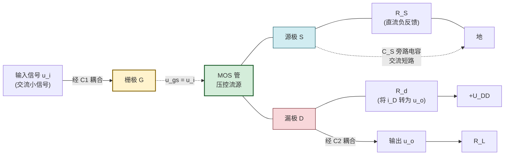
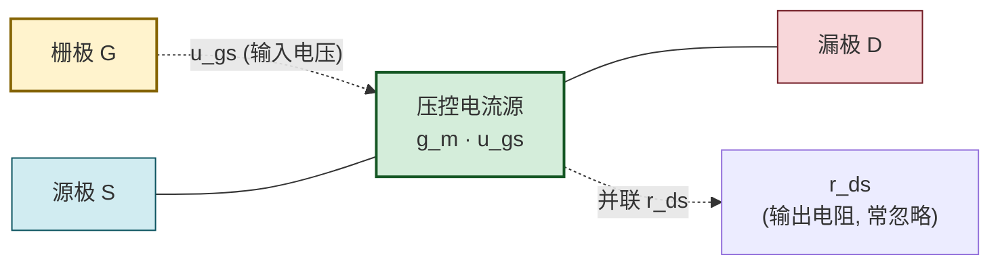

# 6.4 FET 共源放大电路分析

> [!info] 本节定位
> 本节是 FET 章节的**电路分析落点**，要回答的核心问题是：**如何把场效应管的"压控流"特性转化为电压放大？共源放大电路的三大指标 $A_u$、$R_i$、$R_o$ 如何计算，又与 [[MOC - 第5章|第5章]] BJT 共射电路有何异同？** 本节是 [[6.1 MOS 管结构、转移特性、输出特性|6.1]]–[[6.3 场效应管偏置电路|6.3]] 的综合应用——Q 点确定 $g_m$，微变等效给出指标，电路对照体现两类器件的本质区别。
>
> 本节强调 FET 输入阻抗高（优点）但跨导 $g_m$ 较小（电压增益低于共射）这一权衡，并区分**理想模型**（$r_{ds}\to\infty$）与**实际模型**（含 $r_{ds}$ 与频率效应）的适用边界。

## 一、共源放大电路结构

> [!definition] 共源放大电路
> **共源放大电路（common-source amplifier）**是以场效应管栅极为信号输入端、漏极为输出端、源极为输入输出公共端的放大电路，是 FET 放大电路中**电压增益最高、应用最广**的基本组态，对应 [[MOC - 第5章|第5章]] BJT 的共射放大电路。

> [!note] 共源电路的三个组成
> 1. **偏置网络**：[[6.3 场效应管偏置电路|6.3]] 中的分压式偏置（$R_{g1}$、$R_{g2}$、$R_S$）建立静态工作点 Q；为保持高输入阻抗常加串联大电阻 $R_g$。
> 2. **耦合电容 $C_1$、$C_2$**：隔直通交，使信号源与负载不影响 Q 点；中频段容抗近似为零。
> 3. **源极旁路电容 $C_S$**：在交流通路中将 $R_S$ 短路，避免 $R_S$ 引入交流电流负反馈降低增益（无 $C_S$ 时增益将减小为 $A_u=-g_m R_L'/(1+g_m R_S)$）。

## 二、场效应管微变等效电路

> [!theorem] FET 微变等效模型
> 在静态工作点 Q 附近的小信号范围内，场效应管可线性化为**电压控制电流源**模型：
> - 输入端（G-S）：因 $i_G\approx0$，栅源间开路（输入电阻视为无穷大）；
> - 输出端（D-S）：等效为受控电流源 $g_m\dot{U}_{gs}$ 并联输出电阻 $r_{ds}$：
>   - **$g_m$（跨导）**：$\left.\dfrac{\partial i_D}{\partial u_{GS}}\right|_Q$，单位 S（西门子）；
>   - **$r_{ds}$（漏源输出电阻）**：$\left.\dfrac{\partial u_{DS}}{\partial i_D}\right|_Q=\dfrac{1}{\lambda I_{DQ}}$，反映沟道长度调制效应，通常 $r_{ds}\gg R_d$，工程上常忽略。

> [!theorem] 跨导 $g_m$ 的三种计算式
> 由 [[6.1 MOS 管结构、转移特性、输出特性|6.1]] 转移特性方程导出（增强型 MOS 管）：
> $$g_m=\dfrac{2I_{DO}}{U_{GS(th)}}\left(\dfrac{U_{GSQ}}{U_{GS(th)}}-1\right)=\dfrac{2}{U_{GS(th)}}\sqrt{I_{DO}\cdot I_{DQ}}\quad(\text{S})$$
> 耗尽型：
> $$g_m=\dfrac{2I_{DSS}}{|U_{GS(off)}|}\left(1-\dfrac{U_{GSQ}}{U_{GS(off)}}\right)=\dfrac{2}{|U_{GS(off)}|}\sqrt{I_{DSS}\cdot I_{DQ}}\quad(\text{S})$$
> 注意 $g_m$ 与工作点 $I_{DQ}$ 的平方根成正比，故 Q 点偏置电流越大，跨导与增益越高（但功耗也增大）。

> [!warning] 微变等效的适用条件
> 1. **小信号**：输入信号幅度足够小，使工作点在 Q 附近"线性区"摆动，避免进入可变电阻区或截止区产生非线性失真。常用判据是 $\hat{u}_{gs}\ll 2(U_{GSQ}-U_{GS(th)})$；
> 2. **低频**：忽略栅极电容、密勒电容等频率效应，本节公式仅在中频段（通带内）成立；
> 3. **$r_{ds}\gg R_d\parallel R_L$**：若不满足（如 MOS 管短沟道工艺 $r_{ds}$ 较小），需保留 $r_{ds}$ 参与并联。

## 三、电压放大倍数 $A_u$

> [!theorem] 共源放大电路电压放大倍数
> 交流等效电路中，输入 $\dot{U}_i=\dot{U}_{gs}$（$R_g$ 上电流为零故无压降）；输出端 $R_d$、$R_L$、$r_{ds}$ 三者并联，等效负载 $R_L'=r_{ds}\parallel R_d\parallel R_L\approx R_d\parallel R_L$（$r_{ds}$ 视为开路）。受控电流源 $g_m\dot{U}_{gs}$ 由 D 流向 S，在 $R_L'$ 上产生的压降方向由 D 指向 S（即输出端 D 相对地为负），故：
> $$\boxed{\,A_u=\dfrac{\dot{U}_o}{\dot{U}_i}=-g_m R_L'\,}\quad(\text{无量纲})$$
> 负号表示输出与输入反相，与 BJT 共射电路一致。

> [!proof] 公式推导
> 输出电压 $\dot{U}_o=-g_m\dot{U}_{gs}\cdot R_L'$（负号源于电流源方向：电流自 D 流出，在 $R_L'$ 上压降方向使 D 端电位降低）。又 $\dot{U}_i=\dot{U}_{gs}$，故 $A_u=\dot{U}_o/\dot{U}_i=-g_m R_L'$。

> [!note] 增大 $A_u$ 的途径
> - 提高 $g_m$：增大 $I_{DQ}$（但功耗上升、$U_{DSQ}$ 动态范围减小）；
> - 增大 $R_L'$：增大 $R_d$ 或提高 $R_L$，但 $R_d$ 过大会使 $U_{DSQ}$ 过低、可能脱离恒流区；
> - 实际共源放大电路单级电压增益典型 $5\sim50$ 倍，远低于 BJT 共射的 $100\sim1000$ 倍，因 FET 的 $g_m$ 比 BJT 小一个数量级。

## 四、输入电阻 $R_i$ 与输出电阻 $R_o$

> [!theorem] 输入电阻
> FET 栅极输入阻抗 $R_{GS}$ 极高（MOS 管 $\sim10^{15}\,\Omega$），故输入电阻由栅极偏置网络决定：
> - 分压式偏置加 $R_g$ 串联：$R_i=R_g+\dfrac{R_{g1}R_{g2}}{R_{g1}+R_{g2}}\approx R_g$；
> - 自给偏压（无 $R_g$ 时）：$R_i=R_g$（$R_g$ 即栅极到地的偏置电阻，常取 MΩ 级）。
>
> $$\boxed{\,R_i\approx R_g\,}\quad(\Omega)$$
> 典型值 $1\sim10\,\text{M}\Omega$，远高于 BJT 共射电路（$\sim$ kΩ 量级），是 FET 放大电路的突出优点。

> [!theorem] 输出电阻
> 输出电阻定义为输入信号源短路（保留其内阻）、负载开路时，从输出端看进去的等效电阻。受控电流源 $g_m\dot{U}_{gs}$ 在 $\dot{U}_i=0$ 即 $\dot{U}_{gs}=0$ 时相当于开路，故从 D 看进去只剩 $R_d\parallel r_{ds}$：
> $$\boxed{\,R_o=R_d\parallel r_{ds}\approx R_d\,}\quad(\Omega)$$
> 典型值 $R_d$ 取数 kΩ 至数十 kΩ。

> [!warning] $R_o$ 计算中受控源的处理
> 求输出电阻时受控源不能"直接短路"——必须令控制量 $\dot{U}_{gs}=0$（即输入信号源短路且信号源内阻上无电流），此时压控电流源 $g_m\dot{U}_{gs}=0$ 才等效为开路。若信号源有内阻 $R_S$，需将 $R_S$ 与输入回路一并考虑。

## 五、与 BJT 共射放大电路对比

> [!summary] FET 共源 vs BJT 共射
> | 对比项 | FET 共源放大电路 | BJT 共射放大电路 |
> | ------ | ---------------- | ---------------- |
> | 控制方式 | 电压控制（$u_{GS}$ 控制 $i_D$） | 电流控制（$i_B$ 控制 $i_C$） |
> | 微变等效 | 压控流源 $g_m u_{gs}$ | 流控流源 $\beta i_b$（或 $g_m u_{be}$） |
> | 输入电阻 | $R_i\approx R_g$（MΩ 级） | $R_i\approx r_{be}\parallel R_b$（kΩ 级） |
> | 跨导 | $g_m=2\sqrt{I_{DO}\cdot I_{DQ}}/U_{GS(th)}$，$\sim$ mS | $g_m=I_{CQ}/U_T\approx I_{CQ}/26\,\text{mV}$，$\sim$ 几十 mS |
> | 电压放大倍数 | $A_u=-g_m R_L'$，典型 $5\sim50$ | $A_u=-g_m R_L'\cdot\dfrac{r_{be}}{r_{be}+R_s}$，典型 $100\sim1000$ |
> | 输出电阻 | $R_o\approx R_d$ | $R_o\approx R_c$ |
> | 相位关系 | 反相 | 反相 |
> | 噪声 | 较低（少子不参与导电） | 较高（shot 噪声） |
> | 热稳定性 | 好（少子不参与，$U_{GS(th)}$ 温漂小） | 较差（$I_{CBO}$、$\beta$、$U_{BE}$ 均随温度变化） |
> | 工艺面积 | 小（CMOS 主流） | 较大 |
>
> **核心权衡**：FET 牺牲了电压增益，换取了极高的输入阻抗、低噪声与高集成度；BJT 则以低输入阻抗换取了高增益与高跨导。模拟前端常将 FET 用作输入级（取高阻低噪）、BJT 用作主放大级（取高增益）。

## 六、典型例题

### 例题 1：共源放大电路完整分析

> [!example] 题目
> N 沟道增强型 MOS 管共源放大电路，$U_{GS(th)}=2\,\text{V}$，$I_{DO}=4\,\text{mA}$，工作点 $U_{GSQ}=3\,\text{V}$，$I_{DQ}=1\,\text{mA}$。$R_d=10\,\text{k}\Omega$，$R_L=10\,\text{k}\Omega$，$R_g=1\,\text{M}\Omega$，$r_{ds}$ 忽略。求 $g_m$、$A_u$、$R_i$、$R_o$。

**解**：
- 跨导：
$$g_m=\dfrac{2I_{DO}}{U_{GS(th)}}\left(\dfrac{U_{GSQ}}{U_{GS(th)}}-1\right)=\dfrac{2\times4\,\text{mA}}{2\,\text{V}}\times\left(\dfrac{3}{2}-1\right)=\dfrac{8}{2}\times0.5=2\,\text{mS}$$
- 等效负载：
$$R_L'=R_d\parallel R_L=\dfrac{10\times10}{10+10}=5\,\text{k}\Omega$$
- 电压放大倍数：
$$A_u=-g_m R_L'=-2\times10^{-3}\times5\times10^3=-10$$
- 输入电阻：$R_i\approx R_g=1\,\text{M}\Omega$。
- 输出电阻：$R_o\approx R_d=10\,\text{k}\Omega$。

**单位检验**：$g_m R_L'$ 为 $\text{S}\cdot\Omega$ 无量纲，正确；$R_i$、$R_o$ 单位 Ω，正确。

### 例题 2：无 $C_S$ 旁路电容时的增益

> [!example] 题目
> 上例中若去掉源极旁路电容 $C_S$，源极电阻 $R_S=2\,\text{k}\Omega$ 接入交流通路。重新计算 $A_u$。

**解**：无 $C_S$ 时 $R_S$ 引入交流电流负反馈。交流等效电路中，源极不再接地，$\dot{U}_{gs}=\dot{U}_i-\dot{U}_s$，$\dot{U}_s=g_m\dot{U}_{gs}R_S$（电流源电流流过 $R_S$ 产生压降），即：
$$\dot{U}_i=\dot{U}_{gs}+g_m\dot{U}_{gs}R_S=\dot{U}_{gs}(1+g_m R_S)$$
输出电压：
$$\dot{U}_o=-g_m\dot{U}_{gs}R_L'$$
故：
$$A_u=\dfrac{\dot{U}_o}{\dot{U}_i}=\dfrac{-g_m\dot{U}_{gs}R_L'}{\dot{U}_{gs}(1+g_m R_S)}=\dfrac{-g_m R_L'}{1+g_m R_S}$$
代入数据：
$$A_u=\dfrac{-2\times10^{-3}\times5\times10^3}{1+2\times10^{-3}\times2\times10^3}=\dfrac{-10}{1+4}=-2$$

> [!note] 交流负反馈的影响
> 增益由 $-10$ 降至 $-2$（绝对值降至 1/5），但增益稳定性提高、非线性失真减小、输入电阻增大。这是 [[MOC - 第8章|第8章 负反馈放大电路]] 的器件级体现。工程上常通过部分旁路（$R_S$ 串并联组合）在增益与稳定性间折中。

### 例题 3：FET 与 BJT 增益对比

> [!example] 题目
> FET 共源放大电路 $I_{DQ}=1\,\text{mA}$，$g_m=2\,\text{mS}$；BJT 共射放大电路 $I_{CQ}=1\,\text{mA}$，$\beta=100$，$r_{be}\approx\beta U_T/I_{CQ}=100\times26/1=2.6\,\text{k}\Omega$。设二者 $R_L'=5\,\text{k}\Omega$，比较其跨导与电压增益。

**解**：
- FET：$g_m=2\,\text{mS}$，$A_u=-g_m R_L'=-2\times5=-10$。
- BJT：$g_m=I_{CQ}/U_T=1\,\text{mA}/26\,\text{mV}\approx38.5\,\text{mS}$，约为 FET 的 19 倍；
  若源内阻可忽略，$A_u=-g_m R_L'=-38.5\times5\approx-192$；
  若信号源内阻 $R_s=1\,\text{k}\Omega$，$A_u=-\dfrac{g_m R_L' r_{be}}{r_{be}+R_s}=-\dfrac{38.5\times5\times2.6}{2.6+1}\approx-139$。

> [!note] 物理意义
> 相同偏置电流下 BJT 跨导远高于 FET，故共射增益约为共源的 14~19 倍。但 FET 输入阻抗 $\sim$ MΩ 而 BJT 仅 $\sim$ kΩ。这一对照说明 FET 适用于高阻信号源（如电容传感器、生物电前置放大），BJT 适用于低阻信号源追求高增益的场合。

## 七、易错点

> [!warning] 易错点
> 1. **$A_u$ 公式符号**：$A_u=-g_m R_L'$ 的负号来自受控电流源方向，常被漏掉。负号表示反相，与共射一致。
> 2. **$R_L'$ 漏算 $R_L$ 或多算 $r_{ds}$**：$R_L'=r_{ds}\parallel R_d\parallel R_L$，工程上 $r_{ds}\to\infty$ 故 $R_L'\approx R_d\parallel R_L$；若题目给 $r_{ds}$ 必须参与并联。
> 3. **$g_m$ 计算用错方程**：增强型用 $g_m=\dfrac{2I_{DO}}{U_{GS(th)}}\left(\dfrac{U_{GSQ}}{U_{GS(th)}}-1\right)$，耗尽型用 $g_m=\dfrac{2I_{DSS}}{|U_{GS(off)}|}\left(1-\dfrac{U_{GSQ}}{U_{GS(off)}}\right)$，二者形式相似但参数不同。
> 4. **求 $R_o$ 时受控源直接短路**：受控源不能直接短路，必须令控制量 $\dot{U}_{gs}=0$ 后让 $g_m\dot{U}_{gs}=0$ 自然开路。若误将受控源短路会得到 $R_o=0$ 的荒谬结果。
> 5. **无 $C_S$ 时增益公式误用**：未加 $C_S$ 时 $A_u=-g_m R_L'/(1+g_m R_S)$，分母 $1+g_m R_S$ 来自交流负反馈，初学者常仍按 $-g_m R_L'$ 计算。
> 6. **输入电阻误算为 $R_{GS}$**：FET 自身输入电阻 $R_{GS}$ 极高，但电路输入电阻由偏置网络 $R_g$ 决定（$R_g\ll R_{GS}$），不能写成 $R_i=R_{GS}$。
> 7. **小信号条件被忽略**：$g_m$ 模型仅在小信号下成立，大信号需用图解法或 SPICE 仿真，不能把 $A_u=-g_m R_L'$ 用于大摆幅分析。

## 八、与其他小节的联系

- 本节使用 [[6.1 MOS 管结构、转移特性、输出特性|6.1]] 的跨导 $g_m$ 与恒流区条件；
- 本节需要 [[6.2 增强型、耗尽型 MOS 管区别|6.2]] 区分器件类型以选 $g_m$ 方程；
- 本节的 Q 点来自 [[6.3 场效应管偏置电路|6.3]] 偏置电路；
- 本节与 [[MOC - 第5章|第5章]] BJT 共射放大电路形成方法论对照（同样的"Q 点—微变等效—三大指标"流程，但器件模型不同）；
- 本节中 $R_S$ 交流负反馈是 [[MOC - 第8章|第8章 负反馈放大电路]] 的器件级铺垫；
- 本章 MOC：[[MOC - 第6章]]。

## 章节导航

- 上一级：[[MOC - 第6章]]
- 上一节：[[6.3 场效应管偏置电路]]
- 关联：[[MOC - 第5章]]（BJT 共射放大电路对比）
- 习题：[[MOC - 第6章习题]]
