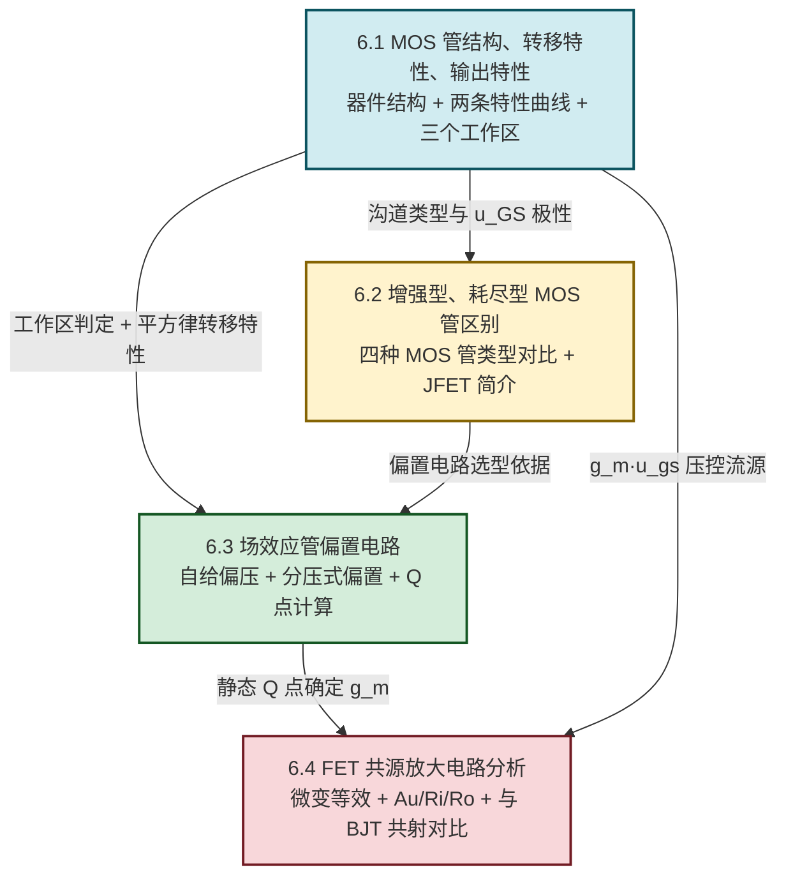

# MOC - 第6章 场效应管与FET放大电路

> [!info] 本章定位
> 场效应管（Field Effect Transistor, FET）是依赖**电场效应**控制沟道导电能力的半导体器件，与 [[MOC - 第5章|第5章]] 依赖电流控制的 BJT 形成对照。本章要回答的核心问题是：**仅靠栅极电压（几乎不取电流）如何控制漏极输出电流，又如何用这种"压控流"特性构成高输入阻抗的放大电路？**
>
> 本章在 [[MOC - 第5章|第5章 BJT 放大电路]]（静态工作点、小信号等效、共射/共集/共基分析方法）基础上展开，把"偏置—微变等效—性能指标"的方法论迁移到 FET。FET 与 BJT 并列为两类核心放大器件：FET 输入阻抗极高、噪声低、功耗小、工艺面积小，是 CMOS 与现代集成电路的主流；BJT 跨导大、高频特性好，二者在模拟前端中常互补使用。
>
> 讨论范围限定于**常温（约 $300\,\text{K}$）、低频小信号**下的硅 MOS 管与基本共源放大电路。高频效应（沟道长度调制、密勒电容、$f_T$）、短沟道效应、亚阈值区与 JFET 详细模型不在本章基本范围。电压单位为伏特（V），电流单位为安培（A），跨导单位为西门子（S）。

## 学习路线图

## 知识点导航

| 小节 | 标题 | 核心内容 | 关键物理量（SI 单位） |
| ---- | ---- | -------- | -------------------- |
| [[6.1 MOS 管结构、转移特性、输出特性\|6.1]] | MOS 管结构、转移特性、输出特性 | MOS 管结构（N/P 沟道，G/S/D 三电极，SiO₂ 绝缘层）、栅压控制沟道、阈值电压 $U_{GS(th)}$、转移特性 $i_D$-$u_{GS}$（恒流区平方律）、输出特性 $i_D$-$u_{DS}$（截止区/可变电阻区/恒流区） | $U_{GS}$、$U_{DS}$、$U_{GS(th)}$（V）；$i_D$（A）；$g_m$（S） |
| [[6.2 增强型、耗尽型 MOS 管区别\|6.2]] | 增强型、耗尽型 MOS 管区别 | 增强型（无沟道，需 $u_{GS}>U_{GS(th)}$）、耗尽型（已具沟道，$u_{GS}=0$ 亦有 $i_D$）、N/P 沟道电源极性相反、四种 MOS 管对比表、JFET 结型场效应管简介 | $U_{GS(off)}$（夹断电压，V）；$I_{DSS}$（饱和漏极电流，A） |
| [[6.3 场效应管偏置电路\|6.3]] | 场效应管偏置电路 | FET 偏置只需栅压不需栅流、自给偏压（仅耗尽型，源极电阻 $R_S$ 产生负偏压）、分压式偏置（适用所有类型，$R_{g1}$、$R_{g2}$ 分压）、Q 点图解法与估算法 | $U_{GSQ}$、$I_{DQ}$、$U_{DSQ}$（V、A、V） |
| [[6.4 FET 共源放大电路分析\|6.4]] | FET 共源放大电路分析 | 共源结构（栅极输入、漏极输出）、FET 微变等效为压控流源 $g_m u_{gs}$、$A_u=-g_m R_L'$、$R_i\approx R_g$（大）、$R_o\approx R_d$、与 BJT 共射电路对比 | $A_u$（无量纲）；$R_i$、$R_o$（Ω）；$g_m$（S） |

## 核心考点

> [!summary] 本章核心考点（7 点）
> 1. **MOS 管结构与栅压控制原理**：栅极 G 经 SiO₂ 绝缘层与衬底隔离，栅源电压 $u_{GS}$ 通过电场感生并调控沟道反型层的载流子浓度，从而控制漏极电流 $i_D$。绝缘层使栅极输入电流近似为零，这是 FET 输入阻抗极高（可达 $10^{10}\sim10^{15}\,\Omega$）的根本原因，与 BJT 依赖基极电流形成本质区别。
> 2. **阈值电压 $U_{GS(th)}$ 与沟道形成**：增强型 MOS 管在 $u_{GS}=0$ 时无沟道；当 $u_{GS}$ 超过阈值电压 $U_{GS(th)}$（N 沟道为正值，典型 $1\sim3\,\text{V}$）后才形成反型层导电沟道。$U_{GS(th)}$ 受衬底掺杂、氧化层厚度、温度影响——温度升高时 $U_{GS(th)}$ 减小（负温度系数）。
> 3. **转移特性（恒流区平方律）**：在恒流区，增强型 N 沟道 MOS 管
> $$i_D=I_{DO}\left(\dfrac{u_{GS}}{U_{GS(th)}}-1\right)^2\quad(u_{GS}>U_{GS(th)})$$
> 其中 $I_{DO}$ 为 $u_{GS}=2U_{GS(th)}$ 时的 $i_D$。耗尽型则用 $i_D=I_{DSS}\left(1-\dfrac{u_{GS}}{U_{GS(off)}}\right)^2$ 描述。该公式仅在小信号模型推导与 Q 点估算中成立，超出恒流区不适用。
> 4. **输出特性三个工作区判定**：① 截止区 $u_{GS}<U_{GS(th)}$，$i_D\approx0$；② 可变电阻区 $u_{GS}>U_{GS(th)}$ 且 $u_{DS}<u_{GS}-U_{GS(th)}$，沟道未夹断，$i_D$ 随 $u_{DS}$ 近似线性增加，D-S 间等效为受控电阻；③ 恒流区（饱和区）$u_{GS}>U_{GS(th)}$ 且 $u_{DS}\ge u_{GS}-U_{GS(th)}$，沟道在漏端夹断，$i_D$ 由 $u_{GS}$ 决定、几乎不随 $u_{DS}$ 变化。放大电路必须工作在恒流区。
> 5. **自给偏压与分压式偏置**：自给偏压利用源极电阻 $R_S$ 上 $I_{DQ}R_S$ 压降提供栅源负偏压 $U_{GSQ}=-I_{DQ}R_S$，**仅适用于耗尽型**（增强型需要正偏压）；分压式偏置由 $R_{g1}$、$R_{g2}$ 分压提供固定栅极电位，加 $R_S$ 负反馈稳定 Q 点，**适用于所有类型**，是工程主流。
> 6. **共源放大电路三大指标**：FET 微变等效为压控流源 $g_m u_{gs}$（输出电流）并联输出电阻 $r_{ds}$（一般很大可忽略）。共源放大电路：
> $$A_u=\dfrac{u_o}{u_i}=-g_m R_L'\quad(R_L'=r_{ds}\parallel R_d\parallel R_L\approx R_d\parallel R_L)$$
> 负号表示反相；$R_i=R_g+(R_{g1}\parallel R_{g2})\approx R_g$（$R_g$ 通常取兆欧级以保持高阻）；$R_o\approx R_d$。
> 7. **FET 与 BJT 对照**：FET 是压控器件（$u_{GS}$ 控制 $i_D$，输入几乎不取电流），BJT 是流控器件（$i_B$ 控制 $i_C$，$\beta$）；FET 输入阻抗远高于 BJT、噪声低、热稳定性好（少子不参与导电），但跨导 $g_m$ 通常小于 BJT（相同偏置电流下 $g_{m,BJT}\approx I_C/26\,\text{mV}$，远大于 FET 的 $g_m\approx 2\sqrt{K I_D}$），故单级共源电压增益通常低于共射。

## 自测题

> [!question]- 自测 1：工作区判定
> N 沟道增强型 MOS 管 $U_{GS(th)}=2\,\text{V}$，测得 $u_{GS}=3\,\text{V}$，$u_{DS}=0.5\,\text{V}$。判断其工作区，并说明理由。
>
> > [!check]- 答案
> > $u_{GS}=3\,\text{V}>U_{GS(th)}=2\,\text{V}$，已形成沟道；预夹断电压 $u_{GS}-U_{GS(th)}=3-2=1\,\text{V}$。因 $u_{DS}=0.5\,\text{V}<1\,\text{V}$，沟道未夹断，工作于**可变电阻区**（亦称线性区），D-S 间等效为受控电阻。

> [!question]- 自测 2：转移特性估算
> N 沟道增强型 MOS 管 $U_{GS(th)}=2\,\text{V}$，$I_{DO}=4\,\text{mA}$（$u_{GS}=2U_{GS(th)}=4\,\text{V}$ 时 $i_D=4\,\text{mA}$）。求 $u_{GS}=3\,\text{V}$（恒流区）时的 $i_D$ 与该工作点跨导 $g_m$。
>
> > [!check]- 答案
> > $i_D=I_{DO}\left(\dfrac{u_{GS}}{U_{GS(th)}}-1\right)^2=4\,\text{mA}\times\left(\dfrac{3}{2}-1\right)^2=4\times0.25=1\,\text{mA}$。
> > 跨导 $g_m=\dfrac{\partial i_D}{\partial u_{GS}}=\dfrac{2I_{DO}}{U_{GS(th)}}\left(\dfrac{u_{GS}}{U_{GS(th)}}-1\right)=\dfrac{2\times4}{2}\times0.5=2\,\text{mS}$。
> > 单位检验：$I_{DO}/U$ 单位为 $\text{A}/\text{V}=\text{S}$，正确。

> [!question]- 自测 3：自给偏压适用范围
> 为什么自给偏压电路只适用于耗尽型 MOS 管或 JFET，而不适用于增强型 MOS 管？
>
> > [!check]- 答案
> > 自给偏压通过源极电阻 $R_S$ 上 $I_{DQ}R_S$ 压降产生栅源负偏压 $U_{GSQ}=-I_{DQ}R_S\le0$。增强型 MOS 管必须 $u_{GS}>U_{GS(th)}>0$ 才能形成沟道，自给偏压给出的负偏压使其始终截止、无法建立 $I_{DQ}$，故不适用。耗尽型与 JFET 在 $u_{GS}=0$ 时已存在沟道（$I_{DSS}$），加负栅压可减小 $i_D$，与自给偏压极性匹配，故可适用。

> [!question]- 自测 4：共源放大电路指标
> 共源放大电路中场效应管工作点跨导 $g_m=2\,\text{mS}$，$R_d=10\,\text{k}\Omega$，负载 $R_L=10\,\text{k}\Omega$，栅极偏置电阻 $R_g=1\,\text{M}\Omega$，$r_{ds}$ 可忽略。求电压放大倍数 $A_u$、输入电阻 $R_i$、输出电阻 $R_o$。
>
> > [!check]- 答案
> > $R_L'=R_d\parallel R_L=\dfrac{10\times10}{10+10}=5\,\text{k}\Omega$。
> > $A_u=-g_m R_L'=-2\times10^{-3}\times5\times10^3=-10$（负号反相）。
> > $R_i\approx R_g=1\,\text{M}\Omega$（FET 栅极输入阻抗远大于 $R_g$）。
> > $R_o\approx R_d=10\,\text{k}\Omega$（恒流源内阻 $r_{ds}$ 视为开路时）。
> > 单位检验：$\text{S}\times\Omega$ 无量纲，与 $A_u$ 一致；$R_i$、$R_o$ 单位 Ω，正确。

## 章节导航

> [!nav] 导航
> 上级：[[MOC - 电路与模拟电子技术|课程总览]]
> 先修：[[MOC - 第5章|第5章 双极型三极管及其放大电路]]（Q 点、微变等效、共射分析方法是本章方法论的来源）
> 关联：[[MOC - 第4章|第4章 半导体二极管与稳压管]]（PN 结是 FET 衬底—沟道结构基础）
> 后续：[[MOC - 第7章|第7章 集成运算放大器基础]]（FET 是运放输入级与 CMOS 工艺基础）
> 配套习题：[[MOC - 第6章习题|第6章 习题]]
