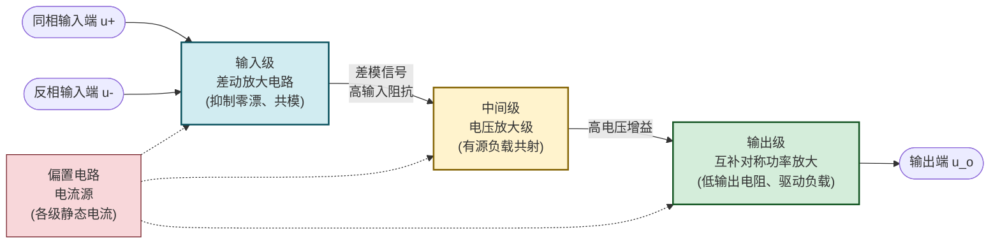
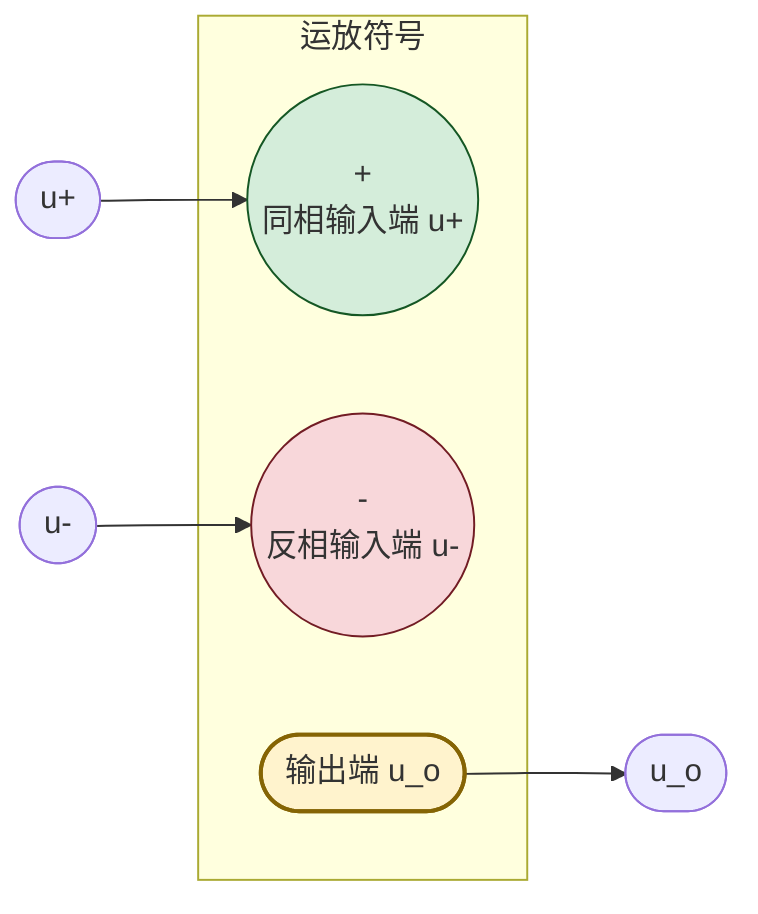

# 7.1 运放理想模型、虚短虚断概念

> [!info] 本节定位
> 本节是整个集成运放应用体系的**逻辑起点**。它要回答的核心问题是：**集成运放内部由哪些功能级组成？在何种近似下可以把它当作"理想器件"，又如何由理想特性推出"虚短"与"虚断"这两条贯穿全章的分析准则？**
>
> 本节建立的"虚短 $u_+=u_-$、虚断 $i_+=i_-=0$"是 [[7.2 反相比例、同相比例运算电路|7.2]]（比例运算）、[[7.3 加法、减法、积分、微分运算电路|7.3]]（加减与积分微分）所有线性运算电路推导的共同工具；而当电路不满足虚短条件（开环或正反馈）时，运放进入非线性区，便过渡到 [[7.4 电压比较器|7.4]] 比较器。理想模型与实际参数的差距则由 [[7.5 运放使用注意事项|7.5]] 修正。

## 一、集成运放的组成

> [!definition] 集成运算放大器
> 集成运算放大器（Integrated Operational Amplifier，Op-Amp）是一个高增益、直接耦合的多级放大集成电路，通过外接反馈网络可实现信号的比例、加减、积分、微分等数学运算及各种信号处理功能。其内部通常由**四个功能级**构成。

> [!theorem] 各级职责
> 1. **输入级（Input Stage）**：采用**差动放大电路**（见 [[MOC - 第5章|第5章]] 差动放大），对差模信号高增益放大、对共模信号强抑制，从而抑制零点漂移与共模干扰；同时提供高输入阻抗。它决定了运放的输入偏置电流、失调、共模抑制比等关键指标。
> 2. **中间级（Intermediate Stage）**：主电压放大级，通常采用有源负载（电流源作集电极负载）的共射放大电路，提供运放大部分开环电压增益 $A_{od}$。
> 3. **输出级（Output Stage）**：采用**互补对称功率放大电路**（OCL 或 OTL 结构，见 [[MOC - 第5章|第5章]] 功率放大），在静态电流近似为零的甲乙类工作状态下，提供低输出电阻、较大输出电流，驱动低阻负载并减小交越失真。
> 4. **偏置电路（Bias Circuit）**：由各种**电流源**（镜像电流源、比例电流源、微电流源，见 [[MOC - 第5章|第5章]]）构成，为各级提供稳定且与温度、电源波动无关的静态工作电流。

> [!note] 集成工艺带来的结构特点
> - 集成工艺难以制造大电容与大电阻，故级间采用**直接耦合**（无耦合电容），这也使低频乃至直流信号可被放大，但带来**零点漂移**问题——这正是输入级必须采用差动结构的原因；
> - 大量使用**有源器件**（BJT、MOS 管）替代电阻作负载，称为"有源负载"，可在芯片面积很小的情况下获得高等效电阻；
> - 内部无法制造大电容，故**补偿电容**常需外接或采用密勒电容结构（见 [[7.5 运放使用注意事项|7.5]] 消振）。

## 二、运放符号与引脚

> [!definition] 运放符号与引脚
> 集成运放作为一个器件，对外暴露的引脚主要是两个输入端与一个输出端（电源端 $+U_{CC}$、$-U_{EE}$ 与调零端等见 [[7.5 运放使用注意事项|7.5]]）。其国标符号如下：

> [!theorem] 输入输出关系（开环）
> 运放只对**两输入端之差**（差模信号）进行放大，输出端相对地的电压为
> $$\boxed{\,u_o=A_{od}\,(u_+-u_-)\,}$$
> 其中 $A_{od}$ 为**开环差模电压放大倍数**（无量纲，实际运放典型值 $10^5\sim10^7$）。当 $u_+>u_-$ 时 $u_o$ 为正，故 $+$ 端称为"同相输入端"；当 $u_->u_+$ 时 $u_o$ 为负，故 $-$ 端称为"反相输入端"。
>
> - $u_+$ 与 $u_-$ 都相对**地**测量；
> - 输出电压受电源电压限制，最大值 $\pm U_{OM}$ 略低于电源（如 $\pm 15\,\text{V}$ 电源下 $U_{OM}\approx\pm13\,\text{V}$）。

> [!warning] "同相""反相"指相位关系而非电位正负
> 同相输入端 $u_+$ 升高时输出 $u_o$ 升高（同相），反相输入端 $u_-$ 升高时输出 $u_o$ 下降（反相）。这不意味着同相端只能接正电压——两输入端的电位可正可负（在电源范围内），符号仅决定输出对输入的响应方向。

## 三、理想运放参数

> [!definition] 理想运放
> 为简化分析，定义满足下列条件的运放为**理想运放**：

| 参数 | 名称 | 理想值 | 实际典型值（如 $\mu$A741） | 物理含义 |
| ---- | ---- | ------ | -------------------------- | -------- |
| $A_{od}$ | 开环差模电压放大倍数 | $\to\infty$ | $\approx2\times10^5$ | 对差模输入的放大能力 |
| $r_{id}$ | 差模输入电阻 | $\to\infty$ | $\approx2\,\text{M}\Omega$ | 两输入端之间的等效电阻 |
| $r_o$ | 输出电阻 | $\to 0$ | $\approx75\,\Omega$ | 输出端戴维南等效电阻 |
| $K_{CMR}$ | 共模抑制比 | $\to\infty$ | $\approx90\,\text{dB}$ | 对共模信号的抑制能力 |
| $BW$ | 开环带宽 | $\to\infty$ | 约 $7\,\text{Hz}$（开环） | 增益随频率下降的边界 |
| $U_{IO},\,I_{IO}$ | 输入失调电压/电流 | $0$ | $1\sim5\,\text{mV}$ / $20\sim200\,\text{nA}$ | 输入为零时的等效误差 |

> [!note] 实际值与理想值的数量级差距
> 实际 $A_{od}\sim10^5$，虽非无穷但已足够大；$r_{id}\sim\text{M}\Omega$ 级，电流可近似为零；$r_o\sim10\sim100\,\Omega$ 远小于通常的反馈电阻。这些"足够大/足够小"正是理想化近似的依据。理想化的代价是**忽略了频率特性、失调、漂移、压摆率**等实际限制（见 [[7.5 运放使用注意事项|7.5]]）。

## 四、虚短与虚断

### 4.1 虚断

> [!theorem] 虚断（Virtual Open）
> 由于理想运放差模输入电阻 $r_{id}\to\infty$，流入两输入端的电流可视为零：
> $$\boxed{\,i_+=i_-=0\,}$$
> 即从外部看，两输入端相当于"断开"，称为**虚断**。

> [!proof] 虚断的成立条件
> 虚断只依赖 $r_{id}\to\infty$ 这一假设，与运放是否工作在线性区无关。因此**无论运放用于线性运算电路还是非线性比较器，只要输入端未接低阻通路使输入电流可忽略，虚断均成立**。

### 4.2 虚短

> [!theorem] 虚短（Virtual Short）
> 当运放工作在**线性区**（输出未饱和）时，由 $u_o=A_{od}(u_+-u_-)$ 且 $u_o$ 为有限值、$A_{od}\to\infty$，必有
> $$\boxed{\,u_+\approx u_-\,}$$
> 即两输入端电位近似相等但并不真正短接（之间无直接导线、且无电流流通），称为**虚短**。

> [!proof] 虚短的推导与边界
> 由开环关系 $u_o=A_{od}(u_+-u_-)$ 解出 $u_+-u_-=u_o/A_{od}$。若 $u_o$ 在线性区取 $|u_o|\le U_{OM}\approx13\,\text{V}$，$A_{od}=2\times10^5$，则
> $$|u_+-u_-|\le\frac{13}{2\times10^5}\approx6.5\times10^{-5}\,\text{V}=65\,\mu\text{V}$$
> 相对通常伏特级信号可忽略，故 $u_+\approx u_-$。
>
> **关键前提**：$u_o$ 必须在线性范围内。若电路开环或正反馈使输出饱和在 $\pm U_{OM}$，则 $u_o$ 不再由 $A_{od}(u_+-u_-)$ 决定，$u_+-u_-$ 可为任意值，**虚短失效**。因此虚短的成立要求运放工作在线性区，工程上即要求**引入负反馈**使输出能自动调节到线性范围内。

> [!warning] 虚短虚断使用条件（核心）
> 1. **必须有负反馈**：只有引入负反馈（输出经反馈网络回到反相输入端），输出才能在线性区内自动调节使 $u_+\approx u_-$ 成立。开环或正反馈下虚短失效。
> 2. **虚断总是成立**（在线性区与非线性区均成立），因 $r_{id}\to\infty$ 与工作区无关。
> 3. **"虚短"不是真短接**：两输入端之间没有导线、电流为零（虚断），只是电位近似相等。不能用导线把两输入端短路来分析。
> 4. **判断步骤**：分析任何运放电路前，先判断反馈类型——若为负反馈且输出未饱和，用虚短 + 虚断；若为开环或正反馈，仅用虚断，输出按饱和值 $\pm U_{OM}$ 处理（见 [[7.4 电压比较器|7.4]]）。

## 五、虚短虚断应用流程

> [!tip] 用虚短虚断分析运放电路的标准步骤
> 1. **判断反馈极性**：用瞬时极性法判断反馈是负反馈还是正反馈。负反馈→可用虚短；正反馈/开环→虚短失效，按比较器处理。
> 2. **应用虚断**：在两输入端节点列 KCL 时令 $i_+=i_-=0$。
> 3. **应用虚短**：若负反馈成立，令 $u_+=u_-$，把未知节点电压与已知电压关联起来。
> 4. **列节点方程求解**：对反相端或同相端节点列 KCL，代入虚短虚断，解出 $u_o$ 与 $u_i$ 的关系。
> 5. **单位检验**：检查输出量纲（V），电阻比值无量纲，电容与时间常数单位为 s。

## 六、典型例题

### 例题 1：判断虚短是否成立

> [!example] 题目
> 判断下列三种电路中"虚短"是否成立，并说明理由：
> (a) 反相比例运算电路（输出经 $R_f$ 接回反相端）；
> (b) 开环过零比较器（同相端接地，输入接反相端，无反馈）；
> (c) 同相比例运算电路（输出经 $R_f$ 接回反相端，输入接同相端）。

**解**：

(a) 反相比例：反馈电阻 $R_f$ 把输出引回反相输入端。设反相端电位瞬时升高，则输出 $u_o=A_{od}(u_+-u_-)$ 下降，经 $R_f$ 把下降的电位反馈回反相端，使其电位回降——这是**负反馈**。故虚短成立，$u_-\approx u_+=0$（反相端为"虚地"）。

(b) 开环过零比较器：无反馈通路。输出饱和在 $\pm U_{OM}$，$u_+-u_-=0-u_i=-u_i$ 不趋于零。**虚短不成立**，只能用虚断（输入端不取电流）。

(c) 同相比例：输出经 $R_f$ 接回反相端。设同相端电位瞬时升高，输出升高，经 $R_f$ 把升高的电位反馈回反相端，使 $u_-$ 跟随 $u_+$ 升高——这是**负反馈**（反馈信号与输入信号同方向变化但作用于反相端，使差模输入减小）。故虚短成立，$u_-\approx u_+$。

> [!note] 判断技巧
> 反馈接到反相端通常是负反馈，接到同相端通常是正反馈——但更可靠的方法是**瞬时极性法**：设某输入端电位升高，沿放大通路推输出极性，再沿反馈通路推回到输入端的极性，若使差模输入减小则为负反馈。

### 例题 2：用虚短虚断推导反相比例关系

> [!example] 题目
> 反相比例电路：输入 $u_i$ 经 $R_1$ 接反相端，反相端经 $R_f$ 接输出，同相端直接接地。用虚短虚断推导 $u_o$ 与 $u_i$ 的关系。

**解**：

1. 反馈为负反馈（见例 1），虚短虚断均成立。
2. 同相端接地：$u_+=0$。由虚短 $u_-=u_+=0$（反相端为"虚地"）。
3. 由虚断，流入反相端的电流为零。对反相端节点列 KCL（设电流 $i_1$ 由 $u_i$ 经 $R_1$ 流向反相端，$i_f$ 由反相端经 $R_f$ 流向输出端）：
   $$i_1=i_f$$
4. 由欧姆定律：
   $$i_1=\frac{u_i-u_-}{R_1}=\frac{u_i-0}{R_1}=\frac{u_i}{R_1}$$
   $$i_f=\frac{u_- - u_o}{R_f}=\frac{0-u_o}{R_f}=-\frac{u_o}{R_f}$$
5. 代入 $i_1=i_f$：
   $$\frac{u_i}{R_1}=-\frac{u_o}{R_f}\quad\Longrightarrow\quad\boxed{\,u_o=-\frac{R_f}{R_1}u_i\,}$$
6. 输出与输入成反相比例关系，比例系数 $-R_f/R_1$。

**单位检验**：$R_f/R_1$ 无量纲，$u_o$ 单位为 V，与 $u_i$ 一致。

### 例题 3：同相端电位计算

> [!example] 题目
> 电路：反相端经 $R_1=10\,\text{k}\Omega$ 接地、经 $R_f=30\,\text{k}\Omega$ 接输出；同相端接输入信号 $u_i=1\,\text{V}$（直流）。求输出 $u_o$ 与反相端电位 $u_-$，并验证虚短。

**解**：

1. 反馈为负反馈（同相比例电路），虚短虚断成立。
2. 虚短：$u_-=u_+=u_i=1\,\text{V}$。
3. 虚断：反相端节点不取电流，故流过 $R_1$ 与 $R_f$ 的电流相等（设由地经 $R_1$ 流向反相端、再由反相端经 $R_f$ 流向输出）：
   $$\frac{0-u_-}{R_1}=\frac{u_--u_o}{R_f}$$
4. 代入 $u_-=1\,\text{V}$：
   $$\frac{-1}{10}=\frac{1-u_o}{30}\quad(\text{单位 kΩ, 电流 mA})$$
   $$1-u_o=\frac{30}{10}\times(-1)=-3\quad\Longrightarrow\quad u_o=1+3=4\,\text{V}$$
5. 用公式 $u_o=\left(1+\dfrac{R_f}{R_1}\right)u_i=\left(1+\dfrac{30}{10}\right)\times1=4\,\text{V}$，一致。
6. 验证虚短：$u_o/A_{od}=4/(2\times10^5)=2\times10^{-5}\,\text{V}=20\,\mu\text{V}\ll1\,\text{V}$，故 $u_-\approx u_+$ 成立。

**单位检验**：电压 V，电阻 kΩ，电流 mA，$u_o=A_{od}(u_+-u_-)$ 中 $A_{od}$ 无量纲，自洽。

## 七、易错点

> [!warning] 易错点
> 1. **混淆虚短与真短路**：虚短仅指电位近似相等，两输入端之间**无电流**（虚断），不能用导线连接两输入端来分析电路。
> 2. **忘记判断负反馈**：一看到运放就用虚短虚断是常见错误。开环或正反馈电路中虚短失效（见 [[7.4 电压比较器|7.4]]），必须先判断反馈极性。
> 3. **虚地≠接地**：反相比例电路中反相端电位为零称为"虚地"，但它不是真正的地——它通过 $R_1$ 接输入、通过 $R_f$ 接输出，只是电位被虚短"钳"到零。若把虚地端直接接地，将破坏电路工作。
> 4. **电流方向与符号**：列 KCL 时电流参考方向一旦设定，代入欧姆定律必须与之一致。如反相比例中若设 $i_f$ 由输出流向反相端，则 $i_f=(u_o-u_-)/R_f$，符号与前文相反，但最终结果一致。
> 5. **理想模型的适用边界**：当信号频率接近或超过运放带宽、输出变化率超过压摆率、输入失调与信号同量级时，理想模型结论失真（见 [[7.5 运放使用注意事项|7.5]]）。
> 6. **输入端不能悬空**：运放两输入端必须有直流路径到地或信号源，否则偏置电流无处泄放导致输出饱和。这是设计实际电路的硬性要求。

## 八、与其他小节的联系

- 本节的虚短虚断是 [[7.2 反相比例、同相比例运算电路|7.2]]、[[7.3 加法、减法、积分、微分运算电路|7.3]] 所有线性运算电路的推导工具；
- 当电路不满足虚短条件（开环或正反馈）时，运放进入非线性区，见 [[7.4 电压比较器|7.4]]；
- 理想模型与实际参数的差距及工程修正见 [[7.5 运放使用注意事项|7.5]]；
- 运放内部输入级差动放大与偏置电流源见 [[MOC - 第5章|第5章]]，MOS 有源负载见 [[MOC - 第6章|第6章]]；
- 本章 MOC：[[MOC - 第7章]]。

## 章节导航

- 上一级：[[MOC - 第7章]]
- 先修：[[MOC - 第5章]]（差动放大、电流源）、[[MOC - 第6章]]（MOS 有源负载）
- 下一节：[[7.2 反相比例、同相比例运算电路]]
- 习题：[[MOC - 第7章习题]]
