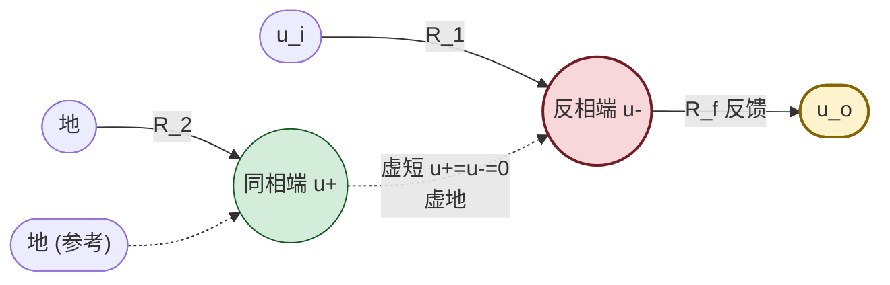
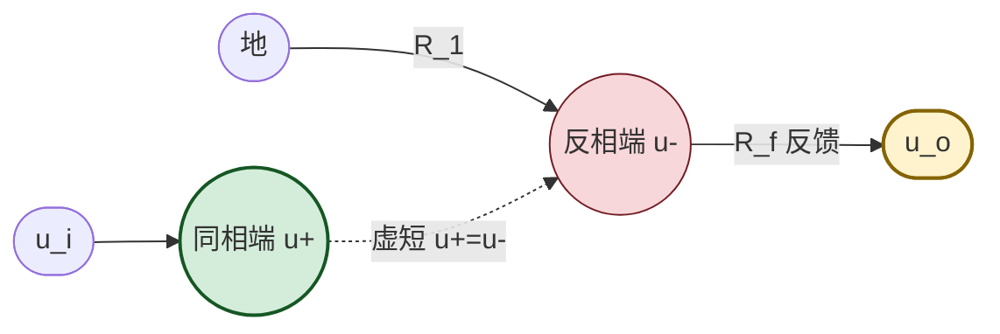

# 7.2 反相比例、同相比例运算电路

> [!info] 本节定位
> 本节是把 [[7.1 运放理想模型、虚短虚断概念|7.1]] 的虚短虚断**第一次落到具体电路**上。它要回答的核心问题是：**如何用一只运放加两只电阻，构成输出与输入成精确比例关系的放大电路？为什么反相比例电路的反相端称为"虚地"？同相比例电路为何输入阻抗高？何时使用电压跟随器？**
>
> 本节建立的比例电路是 [[7.3 加法、减法、积分、微分运算电路|7.3]]（把单输入扩展为多输入、把反馈电阻换成电容）的基础；反相与同相两种组态也是 [[MOC - 第8章|第8章 负反馈放大电路]] 中"电压并联负反馈"与"电压串联负反馈"的典型实例。分析中严格遵守节点、电流方向、极性约定（见物理与电路局部规则）。

## 一、反相比例运算电路

### 1.1 电路结构

> [!definition] 反相比例运算电路
> 输入信号 $u_i$ 经输入电阻 $R_1$ 接到运放**反相输入端**，反馈电阻 $R_f$ 跨接在反相输入端与输出端之间（构成电压并联负反馈），运放**同相输入端**经平衡电阻 $R_2$ 接地。输出 $u_o$ 与输入 $u_i$ 成反相比例关系。

> [!note] 节点与电流方向约定
> - 取**地**为参考节点（电位 $0\,\text{V}$）；
> - 反相端节点记为 $u_-$，同相端节点记为 $u_+$；
> - 设电流 $i_1$ 由 $u_i$ 经 $R_1$ 流入反相端，电流 $i_f$ 由反相端经 $R_f$ 流向输出端；
> - 平衡电阻 $R_2=R_1\parallel R_f$，使两输入端对地直流电阻相等，抵消偏置电流引起的失调（见 [[7.5 运放使用注意事项|7.5]]）。

### 1.2 推导（虚短 + 虚断 + 节点方程）

> [!theorem] 反相比例运算关系
> $$\boxed{\,u_o=-\frac{R_f}{R_1}\,u_i\,}$$
> 电压放大倍数 $A_u=\dfrac{u_o}{u_i}=-\dfrac{R_f}{R_1}$（负号表示反相）。

> [!proof] 推导
> 1. 反馈为电压并联负反馈（输出经 $R_f$ 回到反相端），虚短虚断成立。
> 2. 同相端经 $R_2$ 接地，由虚断 $i_+=0$ 故 $R_2$ 上无压降，$u_+=0$。
> 3. 由虚短 $u_-=u_+=0$，反相端电位为零但并非真正接地，称为**虚地（Virtual Ground）**。
> 4. 由虚断，流入反相端节点的电流为零，对反相端节点列 KCL：
>    $$i_1=i_f$$
> 5. 由欧姆定律（注意电流方向与端电压差）：
>    $$i_1=\frac{u_i-u_-}{R_1}=\frac{u_i-0}{R_1}=\frac{u_i}{R_1}$$
>    $$i_f=\frac{u_- - u_o}{R_f}=\frac{0-u_o}{R_f}=-\frac{u_o}{R_f}$$
> 6. 代入 $i_1=i_f$ 得 $\dfrac{u_i}{R_1}=-\dfrac{u_o}{R_f}$，整理得 $u_o=-\dfrac{R_f}{R_1}u_i$。 ∎

### 1.3 主要特点

> [!abstract] 反相比例电路的特点
> 1. **反相放大**：输出与输入极性相反，放大倍数 $|A_u|=R_f/R_1$ 可大于、等于或小于 1（$R_f=R_1$ 时为反相器 $u_o=-u_i$）；
> 2. **虚地**：反相端电位近似为零，故运放输入端几乎不承受共模电压（$u_+=u_-=0$），对运放共模抑制比要求低；
> 3. **输入电阻小**：从 $u_i$ 看入的输入电阻 $R_{in}=R_1$（因反相端为虚地，输入端等效经 $R_1$ 接地），这是反相比例电路的主要缺点，限制了它在高阻信号源场合的应用；
> 4. **输出电阻小**：电压负反馈使闭环输出电阻 $R_{out}\approx r_o/(1+A_{od}F)\to 0$，带载能力强；
> 5. **平衡电阻**：$R_2=R_1\parallel R_f$，保证两输入端对地直流电阻相等。

## 二、同相比例运算电路

### 2.1 电路结构

> [!definition] 同相比例运算电路
> 输入信号 $u_i$ 直接接到运放**同相输入端**，反相输入端经 $R_1$ 接地、经 $R_f$ 接输出端（构成电压串联负反馈）。输出 $u_o$ 与输入 $u_i$ 成同相比例关系。

### 2.2 推导

> [!theorem] 同相比例运算关系
> $$\boxed{\,u_o=\left(1+\frac{R_f}{R_1}\right)u_i\,}$$
> 电压放大倍数 $A_u=1+\dfrac{R_f}{R_1}\ge 1$（同相，最小为 1）。

> [!proof] 推导
> 1. 反馈为电压串联负反馈，虚短虚断成立。
> 2. 同相端接 $u_i$，由虚断 $i_+=0$，故 $u_+=u_i$。
> 3. 由虚短 $u_-=u_+=u_i$。
> 4. 由虚断，反相端节点不取电流，流过 $R_1$ 与 $R_f$ 的电流相等（设由地经 $R_1$ 流向反相端，再经 $R_f$ 流向输出）：
>    $$\frac{0-u_-}{R_1}=\frac{u_- - u_o}{R_f}$$
> 5. 代入 $u_-=u_i$：
>    $$\frac{-u_i}{R_1}=\frac{u_i-u_o}{R_f}\Rightarrow -\frac{R_f}{R_1}u_i=u_i-u_o\Rightarrow u_o=u_i+\frac{R_f}{R_1}u_i=\left(1+\frac{R_f}{R_1}\right)u_i$$ ∎

### 2.3 主要特点

> [!abstract] 同相比例电路的特点
> 1. **同相放大**：输出与输入同极性，$A_u\ge 1$，不能实现衰减；
> 2. **输入电阻大**：输入信号接到同相端，由虚断 $i_+=0$，输入电阻 $R_{in}\approx A_{od}\cdot r_{id}\to\infty$（实际可达 $10^9\sim10^{12}\,\Omega$），适合高内阻信号源；
> 3. **输出电阻小**：电压负反馈使 $R_{out}\to 0$；
> 4. **存在共模输入**：$u_+=u_-=u_i\ne 0$，运放两输入端承受大小为 $u_i$ 的共模电压，对运放共模抑制比 $K_{CMR}$ 与共模输入范围有要求——这是同相组态与反相组态（虚地、无共模）的关键差别。

## 三、电压跟随器

> [!definition] 电压跟随器
> 令同相比例电路中 $R_f=0$（输出直接连到反相端）、$R_1=\infty$（反相端到地开路），即得**电压跟随器**：
> $$\boxed{\,u_o=u_i\,}$$
> 输出严格跟随输入，$A_u=1$。

> [!proof] 由同相比例公式极限推出
> $$u_o=\left(1+\frac{R_f}{R_1}\right)u_i\xrightarrow{R_f=0,\,R_1\to\infty}u_i$$
> 或直接由虚短：反馈线使 $u_-=u_o$，同相端 $u_+=u_i$，虚短得 $u_o=u_-=u_+=u_i$。 ∎

> [!note] 电压跟随器的工程价值
> - **阻抗变换**：输入电阻极高（同相组态）、输出电阻极低（深度电压负反馈），可作高阻信号源与低阻负载之间的"缓冲器"；
> - **隔离作用**：把前级与后级在直流与交流上隔离（仅传递电压），避免负载效应；
> - 实际应用中常用于：传感器输出缓冲、基准电压源驱动、多级电路级间隔离。

## 四、反相与同相组态对比

| 特性 | 反相比例电路 | 同相比例电路 |
| ---- | ------------ | ------------ |
| 输入端位置 | 反相端（经 $R_1$） | 同相端 |
| 反馈类型 | 电压并联负反馈 | 电压串联负反馈 |
| 闭环放大倍数 | $A_u=-R_f/R_1$（可 $\gtrless 1$） | $A_u=1+R_f/R_1$（$\ge 1$） |
| 反相端电位 | 虚地（$0\,\text{V}$） | 等于 $u_i$ |
| 输入电阻 | $R_1$（小，kΩ 级） | $\to\infty$（极大） |
| 输出电阻 | $\to 0$ | $\to 0$ |
| 共模输入 | $\approx 0$（虚地优势） | $=u_i$（对 $K_{CMR}$ 有要求） |
| 平衡电阻 | $R_2=R_1\parallel R_f$ | 通常取 $R_2=R_1\parallel R_f$ 接同相端到地（或省略） |

## 五、典型例题

### 例题 1：反相比例电路参数设计

> [!example] 题目
> 要求设计反相比例电路，输入信号 $u_i=0.5\,\text{V}$（直流），要求输出 $u_o=-5\,\text{V}$，输入电阻 $R_{in}=10\,\text{k}\Omega$。确定 $R_1$、$R_f$、$R_2$。

**解**：

1. 反相比例电路输入电阻 $R_{in}=R_1$，故 $R_1=10\,\text{k}\Omega$。
2. 电压放大倍数 $A_u=u_o/u_i=-5/0.5=-10$，由 $A_u=-R_f/R_1$：
   $$R_f=|A_u|\cdot R_1=10\times10=100\,\text{k}\Omega$$
3. 平衡电阻 $R_2=R_1\parallel R_f=\dfrac{10\times100}{10+100}\,\text{k}\Omega\approx9.09\,\text{k}\Omega$，取标称值 $9.1\,\text{k}\Omega$ 或 $10\,\text{k}\Omega$。
4. 验证：$u_o=-(100/10)\times0.5=-5.0\,\text{V}$ ✓，输出在线性区（$|u_o|<U_{OM}\approx13\,\text{V}$）。

**单位检验**：电阻 kΩ，电压 V，比值无量纲，自洽。

### 例题 2：同相比例电路计算

> [!example] 题目
> 同相比例电路 $R_1=5\,\text{k}\Omega$、$R_f=45\,\text{k}\Omega$。输入 $u_i=0.3\,\text{V}$（直流）。求 $u_o$、$u_-$、$u_+$ 与输入电流 $i_i$。

**解**：

1. 同相比例 $u_o=\left(1+\dfrac{R_f}{R_1}\right)u_i=\left(1+\dfrac{45}{5}\right)\times0.3=10\times0.3=3.0\,\text{V}$。
2. 由虚短 $u_+=u_-=u_i=0.3\,\text{V}$（同相端直接接 $u_i$）。
3. 由虚断 $i_+=0$，故输入电流 $i_i=0$（理想情况下输入端不取电流）。
4. 验证虚短：$u_o/A_{od}=3/(2\times10^5)=15\,\mu\text{V}\ll0.3\,\text{V}$ ✓。
5. 共模输入 $u_{ic}=u_i=0.3\,\text{V}$，需在运放允许共模范围（通常 $\pm(U_{CC}-1.5\,\text{V})$）内。

**单位检验**：V 与 kΩ 一致，输入电流 $i_i=0$ 与理想运放假设一致。

### 例题 3：电压跟随器隔离负载效应

> [!example] 题目
> 信号源 $u_s=2\,\text{V}$（直流）内阻 $R_s=50\,\text{k}\Omega$，直接驱动负载 $R_L=1\,\text{k}\Omega$ 时负载电压 $u_L$ 为多少？若在源与负载之间插入理想电压跟随器，$u_L$ 又为多少？

**解**：

1. **直接驱动**：源内阻与负载分压
   $$u_L=u_s\cdot\frac{R_L}{R_s+R_L}=2\times\frac{1}{50+1}=\frac{2}{51}\approx0.039\,\text{V}$$
   信号几乎全部降在内阻上，负载电压仅为源电压的 $1/51$——这是高阻源驱动低阻负载的典型问题。
2. **插入电压跟随器**：跟随器输入电阻 $\to\infty$ 不取电流，输入端 $u_+=u_s=2\,\text{V}$（无内阻压降）；输出 $u_o=u_i=2\,\text{V}$，输出电阻 $\to 0$ 带载无压降：
   $$u_L=u_o=2\,\text{V}$$
3. 跟随器把高阻源"变换"为低阻源，使负载获得全部信号电压。

**单位检验**：分压比无量纲，电压 V 一致。

## 六、易错点

> [!warning] 易错点
> 1. **反相比例公式符号**：$u_o=-\dfrac{R_f}{R_1}u_i$，负号来自电流方向约定（$i_f$ 流向输出端时 $u_o$ 为负）。若设电流方向相反，符号会变但推导过程一致，最终结论不变。
> 2. **同相比例公式"1+"**：常误记为 $u_o=\dfrac{R_f}{R_1}u_i$ 而漏掉"1+"。记忆方法：同相比例 $A_u\ge1$，反相比例可任意。
> 3. **平衡电阻不是必需**：$R_2$ 在理想运放分析中不影响输出关系（因 $i_+=0$），仅用于抵消实际偏置电流引起的失调。理想分析时常可省略，但实际电路必须接入。
> 4. **虚地端不可直接接地**：反相端电位为零是虚短的结果，若将其直接接地，则 $R_1$ 与 $R_f$ 短路到地，电路失效。
> 5. **共模输入范围检查**：同相比例电路中两输入端电位等于 $u_i$，必须确保 $u_i$ 在运放允许共模输入范围（CMVR）内，否则运放饱和或损坏。
> 6. **电压跟随器稳定性**：电压跟随器反馈系数 $F=1$ 最深，对运放相位裕度要求最高，部分运放（如未补偿型）在跟随器组态下可能自激振荡（见 [[7.5 运放使用注意事项|7.5]]）。

## 七、与其他小节的联系

- 推导工具虚短虚断来自 [[7.1 运放理想模型、虚短虚断概念|7.1]]；
- 反相比例是 [[7.3 加法、减法、积分、微分运算电路|7.3]] 反相加法器、积分电路、微分电路的母电路；
- 同相比例是同相加法器、电压跟随器应用的基础；
- 反相组态对应 [[MOC - 第8章|第8章]] 电压并联负反馈，同相组态对应电压串联负反馈；
- 实际应用中的失调、稳定性、带宽问题见 [[7.5 运放使用注意事项|7.5]]；
- 本章 MOC：[[MOC - 第7章]]。

## 章节导航

- 上一级：[[MOC - 第7章]]
- 上一节：[[7.1 运放理想模型、虚短虚断概念]]
- 下一节：[[7.3 加法、减法、积分、微分运算电路]]
- 习题：[[MOC - 第7章习题]]
