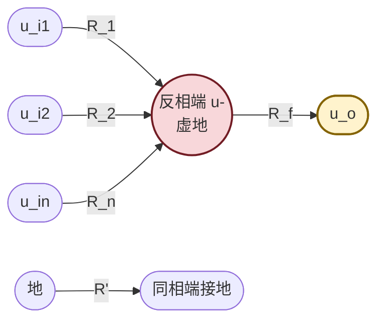
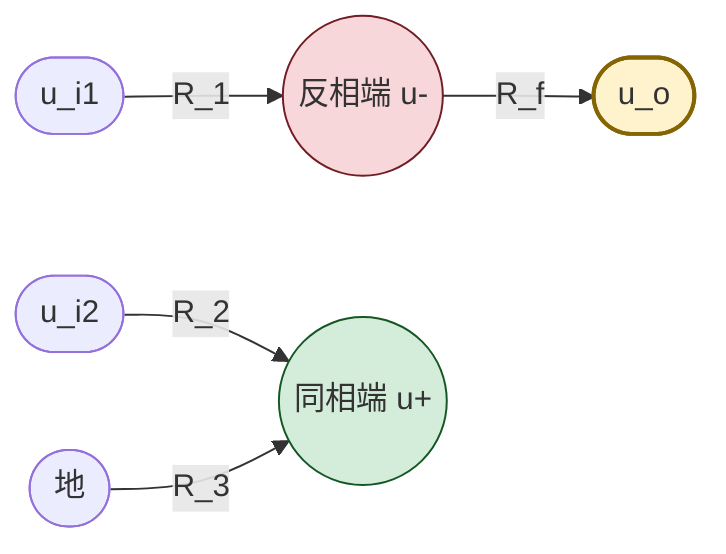

# 7.3 加法、减法、积分、微分运算电路

> [!info] 本节定位
> 本节把 [[7.2 反相比例、同相比例运算电路|7.2]] 的单输入比例电路**扩展为多输入与动态运算**。它要回答的核心问题是：**如何用一只运放实现多路信号的加权求和与差值运算？又如何通过把电阻换成电容，使输出成为输入对时间的积分或微分？**
>
> 本节用到的核心工具仍是 [[7.1 运放理想模型、虚短虚断概念|7.1]] 的虚短虚断与节点 KCL；分析多输入电路时配合**叠加定理**（见 [[2.4 叠加定理、戴维南定理、诺顿定理|2.4]]）。积分与微分电路是 [[MOC - 第9章|第9章 波形产生电路]] 中方波—三角波发生器的核心单元，也是模拟计算机求解微分方程的基础。

## 一、反相加法器

### 1.1 电路结构

> [!definition] 反相加法器
> 多路输入信号 $u_{i1},u_{i2},\dots,u_{in}$ 分别经各自输入电阻 $R_1,R_2,\dots,R_n$ 接到运放**反相输入端**，反馈电阻 $R_f$ 跨接在反相端与输出端之间，同相端经平衡电阻 $R'$ 接地。输出为各输入的加权和（反相）。

### 1.2 推导

> [!theorem] 反相加法器输出关系
> $$\boxed{\,u_o=-\left(\frac{R_f}{R_1}u_{i1}+\frac{R_f}{R_2}u_{i2}+\cdots+\frac{R_f}{R_n}u_{in}\right)\,}$$
> 各路输入按 $R_f/R_k$ 加权后求和并反相。若取 $R_1=R_2=\cdots=R_n=R$，则 $u_o=-\dfrac{R_f}{R}(u_{i1}+u_{i2}+\cdots+u_{in})$，即纯相加再放大。

> [!proof] 推导（用虚地 + 节点 KCL）
> 1. 同相端接地，虚短使反相端为虚地 $u_-=0$。
> 2. 由虚断，反相端节点不取电流，故各输入电流之和等于反馈电流（设各 $i_k$ 由 $u_{ik}$ 流向反相端，$i_f$ 由反相端流向输出）：
>    $$i_1+i_2+\cdots+i_n=i_f$$
> 3. 由欧姆定律（反相端电位为零）：
>    $$i_k=\frac{u_{ik}-0}{R_k}=\frac{u_{ik}}{R_k},\qquad i_f=\frac{0-u_o}{R_f}=-\frac{u_o}{R_f}$$
> 4. 代入：
>    $$\sum_{k=1}^n\frac{u_{ik}}{R_k}=-\frac{u_o}{R_f}\Rightarrow u_o=-R_f\sum_{k=1}^n\frac{u_{ik}}{R_k}=-\sum_{k=1}^n\frac{R_f}{R_k}u_{ik}$$ ∎

> [!note] 叠加定理视角
> 反相加法器也可视为多个反相比例电路的叠加：令 $u_{i2}=\cdots=u_{in}=0$，则这些支路经 $R_k$ 接地（虚地端电位为零，相当于直接到地，不贡献电流），只剩 $u_{i1}$ 单独作用得 $u_{o1}=-\dfrac{R_f}{R_1}u_{i1}$；同理各输入单独作用求和即得总输出。这与节点 KCL 结果一致。

## 二、同相加法器

> [!definition] 同相加法器
> 多路输入经电阻接到运放**同相输入端**，反相端经 $R_1$ 接地、经 $R_f$ 接输出。输出为各输入同相加权求和。

> [!theorem] 同相加法器输出关系（两输入为例）
> 设两输入 $u_{i1}$、$u_{i2}$ 分别经 $R_{a}$、$R_{b}$ 接同相端，同相端经 $R'$ 接地。同相端电位 $u_+$ 由 $R_a$、$R_b$、$R'$ 决定（电阻网络分压），再经同相比例放大：
> $$u_o=\left(1+\frac{R_f}{R_1}\right)u_+$$
> 其中 $u_+$ 可由节点电压法或叠加定理求出（例如 $u_+=\dfrac{R_b\parallel R'}{R_a+R_b\parallel R'}u_{i1}+\dfrac{R_a\parallel R'}{R_b+R_a\parallel R'}u_{i2}$）。

> [!warning] 同相加法器不如反相加法器常用
> - 同相加法器各路权重相互耦合（调节 $R_a$ 会同时影响 $u_{i2}$ 的权重），设计与调试不便；
> - 同相端存在共模电压，对 $K_{CMR}$ 有要求；
> - 实际工程中"加法"多用反相加法器，需要同相输出时再级联一级反相器。

## 三、减法器（差动放大电路）

### 3.1 电路结构

> [!definition] 减法器（差动放大电路）
> 输入 $u_{i1}$ 经 $R_1$ 接反相端，反馈电阻 $R_f$ 跨接在反相端与输出之间；输入 $u_{i2}$ 经 $R_2$ 接同相端，同相端经 $R_3$ 接地。输出正比于两输入之差。当满足匹配条件 $R_2/R_3=R_1/R_f$（常取 $R_1=R_2$、$R_3=R_f$）时为标准减法器。

### 3.2 推导

> [!theorem] 减法器输出关系
> 当匹配条件 $R_1=R_2$、$R_3=R_f$ 时：
> $$\boxed{\,u_o=\frac{R_f}{R_1}(u_{i2}-u_{i1})\,}$$
> 输出正比于两输入之差，比例系数 $R_f/R_1$。

> [!proof] 推导（叠加定理）
> 1. **令 $u_{i2}=0$（同相端经 $R_2$ 接地，与 $R_3$ 并联等效接地）**：电路变为反相比例，$u_{o1}=-\dfrac{R_f}{R_1}u_{i1}$。
> 2. **令 $u_{i1}=0$（反相端经 $R_1$ 接地）**：同相端电位由 $R_2$、$R_3$ 分压：
>    $$u_+=\frac{R_3}{R_2+R_3}u_{i2}$$
>    此为同相比例放大：$u_{o2}=\left(1+\dfrac{R_f}{R_1}\right)u_+=\left(1+\dfrac{R_f}{R_1}\right)\dfrac{R_3}{R_2+R_3}u_{i2}$。
> 3. **叠加**：$u_o=u_{o1}+u_{o2}$。代入匹配条件 $R_1=R_2$、$R_3=R_f$：
>    $$u_{o2}=\left(1+\frac{R_f}{R_1}\right)\frac{R_f}{R_1+R_f}u_{i2}=\frac{R_f}{R_1}u_{i2}$$
>    故 $u_o=-\dfrac{R_f}{R_1}u_{i1}+\dfrac{R_f}{R_1}u_{i2}=\dfrac{R_f}{R_1}(u_{i2}-u_{i1})$。 ∎

> [!note] 减法器的共模抑制
> 减法器输出仅依赖两输入之差（差模），理论上对共模信号 $u_{ic}=(u_{i1}+u_{i2})/2$ 完全抑制。但实际电阻匹配精度有限，共模抑制比由电阻误差决定（见 [[7.5 运放使用注意事项|7.5]]）。这是减法器用作差分信号放大（如电桥测量）的理论基础。

## 四、积分运算电路

### 4.1 电路结构

> [!definition] 积分运算电路
> 将反相比例电路中的反馈电阻 $R_f$ 换成电容 $C$，即得**反相积分电路**：输入 $u_i$ 经 $R$ 接反相端，电容 $C$ 跨接在反相端与输出端之间，同相端接地。

### 4.2 推导

> [!theorem] 积分运算关系
> $$\boxed{\,u_o(t)=-\frac{1}{RC}\int_{0}^{t}u_i(\tau)\,d\tau+u_o(0)\,}$$
> 其中 $u_o(0)$ 为电容初始电压对应的输出（积分常数），$RC$ 为积分时间常数（单位 s）。

> [!proof] 推导
> 1. 同相端接地，虚短使反相端为虚地 $u_-=0$。
> 2. 由虚断，输入电流等于电容电流（设 $i_R$ 由 $u_i$ 经 $R$ 流向反相端，$i_C$ 由反相端流向电容极板）：
>    $$i_R=i_C,\qquad i_R=\frac{u_i-0}{R}=\frac{u_i}{R}$$
> 3. 电容电压电流关系（电流由反相端流向输出端方向，即电容充电电流）：
>    $$i_C=C\frac{d(0-u_o)}{dt}=-C\frac{du_o}{dt}$$
>    （因电容两端电压为 $u_- - u_o=0-u_o=-u_o$。）
> 4. 代入 $i_R=i_C$：$\dfrac{u_i}{R}=-C\dfrac{du_o}{dt}$，整理得
>    $$du_o=-\frac{1}{RC}u_i\,dt\Rightarrow u_o(t)=-\frac{1}{RC}\int_0^t u_i\,d\tau+u_o(0)$$ ∎

> [!note] 积分电路的典型响应
> | 输入 $u_i$ | 输出 $u_o$（设 $u_o(0)=0$） | 物理意义 |
> | --------- | --------------------------- | -------- |
> | 阶跃 $U$（$t\ge0$） | $-\dfrac{U}{RC}t$（斜坡，线性下降） | 恒流充电电容，电压线性变化 |
> | 方波（$\pm U$） | 三角波（分段线性） | 方波积分得三角波 |
> | 正弦 $\sin\omega t$ | $\dfrac{1}{\omega RC}\cos\omega t$（同幅移相） | 积分使相位超前 $90°$ |
> | 直流（含失调） | 线性漂移直至饱和 | 积分"积累"直流误差，需加泄漏电阻 |

### 4.3 实用积分电路改进

> [!warning] 实用积分电路的两个问题
> 1. **直流漂移**：运放输入失调电压与偏置电流相当于一个微小直流输入，被积分后输出持续漂移直至饱和。改进：在电容 $C$ 两端并联大电阻 $R_f$，构成"低频泄漏通路"，使电路在低频退化为反相比例（增益 $-R_f/R$），高频仍为积分器。$R_f$ 取值通常使截止频率 $f_c=1/(2\pi R_f C)$ 远低于工作频率。
> 2. **电容初始电压不确定**：实用电路需设"复位"开关（场效应管并联在电容两端），工作前闭合放电使 $u_o(0)=0$。

## 五、微分运算电路

### 5.1 电路结构

> [!definition] 微分运算电路
> 将反相比例电路中的输入电阻 $R_1$ 换成电容 $C$，反馈电阻为 $R_f$，即得**反相微分电路**：输入 $u_i$ 经电容 $C$ 接反相端，电阻 $R_f$ 跨接在反相端与输出端之间，同相端接地。

### 5.2 推导

> [!theorem] 微分运算关系
> $$\boxed{\,u_o(t)=-RC\,\frac{du_i(t)}{dt}\,}$$
> 输出与输入的导数成正比（反相），时间常数 $RC$ 单位为 s。

> [!proof] 推导
> 1. 反相端为虚地 $u_-=0$。
> 2. 由虚断，电容电流等于电阻电流（设 $i_C$ 由 $u_i$ 经 $C$ 流向反相端，$i_f$ 由反相端经 $R_f$ 流向输出）：
>    $$i_C=i_f$$
> 3. 电容电流（电容两端电压 $u_i-u_-=u_i$）：
>    $$i_C=C\frac{d(u_i-0)}{dt}=C\frac{du_i}{dt}$$
> 4. 反馈电阻电流：$i_f=\dfrac{0-u_o}{R_f}=-\dfrac{u_o}{R_f}$。
> 5. 代入：$C\dfrac{du_i}{dt}=-\dfrac{u_o}{R_f}\Rightarrow u_o=-R_f C\dfrac{du_i}{dt}$。记 $R=R_f$ 即得公式。 ∎

> [!note] 微分电路的典型响应
> - 输入三角波 → 输出方波（斜率恒定，导数为常数）；
> - 输入正弦 $\sin\omega t$ → 输出 $-\omega RC\cos\omega t$（幅值随频率线性增大，相位滞后 $90°$）。

### 5.3 实用微分电路改进

> [!warning] 基本微分电路的高频噪声问题
> 微分电路增益随频率线性增大（$|A|\propto\omega RC$），对高频噪声极为敏感，且高频下反馈系数下降易引起自激振荡。改进措施：
> 1. **输入电容 $C$ 串联小电阻 $R_1$**（通常 $R_1\ll R_f$），高频时限流使增益趋于 $-R_f/R_1$；
> 2. **反馈电阻 $R_f$ 并联小电容 $C_f$**，高频时反馈增强抑制噪声；
> 3. 改进后电路在低频仍为微分器，高频退化为衰减器，截止频率 $f_h=1/(2\pi R_1 C)$ 与 $1/(2\pi R_f C_f)$ 设计在工作频率之上。

## 六、积分与微分的对偶性

| 特性 | 积分电路 | 微分电路 |
| ---- | -------- | -------- |
| 替换元件 | $R_f\to C$ | $R_1\to C$ |
| 输出关系 | $u_o=-\dfrac{1}{RC}\int u_i\,dt$ | $u_o=-RC\dfrac{du_i}{dt}$ |
| 阶跃响应 | 斜坡（线性变化） | 脉冲（瞬时冲激） |
| 方波 → | 三角波 | 方波（双向脉冲） |
| 频率特性 | 增益随 $\omega$ 反比下降 | 增益随 $\omega$ 线性上升 |
| 主要问题 | 直流漂移、饱和 | 高频噪声、自激 |
| 工程改进 | 并联 $R_f$ 泄漏 | 串联 $R_1$ + 并联 $C_f$ |

## 七、典型例题

### 例题 1：反相加法器设计

> [!example] 题目
> 设计反相加法器实现 $u_o=-(2u_{i1}+3u_{i2}+u_{i3})$。取 $R_f=60\,\text{k}\Omega$，求 $R_1$、$R_2$、$R_3$ 与平衡电阻 $R'$。

**解**：

由反相加法公式 $u_o=-\left(\dfrac{R_f}{R_1}u_{i1}+\dfrac{R_f}{R_2}u_{i2}+\dfrac{R_f}{R_3}u_{i3}\right)$，对照系数：
$$\frac{R_f}{R_1}=2\Rightarrow R_1=\frac{60}{2}=30\,\text{k}\Omega$$
$$\frac{R_f}{R_2}=3\Rightarrow R_2=\frac{60}{3}=20\,\text{k}\Omega$$
$$\frac{R_f}{R_3}=1\Rightarrow R_3=\frac{60}{1}=60\,\text{k}\Omega$$
平衡电阻 $R'=R_f\parallel R_1\parallel R_2\parallel R_3$：
$$\frac{1}{R'}=\frac{1}{60}+\frac{1}{30}+\frac{1}{20}+\frac{1}{60}=\frac{1+2+3+1}{60}=\frac{7}{60}\,\text{k}\Omega^{-1}$$
$$R'=\frac{60}{7}\approx8.57\,\text{k}\Omega$$
取标称 $8.6\,\text{k}\Omega$。

**单位检验**：电阻 kΩ，比值无量纲，自洽。

### 例题 2：减法器计算

> [!example] 题目
> 减法器 $R_1=R_2=10\,\text{k}\Omega$、$R_3=R_f=100\,\text{k}\Omega$。$u_{i1}=1.5\,\text{V}$、$u_{i2}=3.5\,\text{V}$。求 $u_o$，并计算共模输入 $u_{ic}$ 与差模输入 $u_{id}$。

**解**：

1. 匹配条件满足，$u_o=\dfrac{R_f}{R_1}(u_{i2}-u_{i1})=\dfrac{100}{10}\times(3.5-1.5)=10\times2.0=20\,\text{V}$。
2. 但需检查输出是否在线性区：若电源 $\pm 15\,\text{V}$，$U_{OM}\approx\pm13\,\text{V}$，$u_o=20\,\text{V}$ 已超过 $U_{OM}$，运放将饱和在约 $+13\,\text{V}$。**理想公式失效**，实际 $u_o\approx+13\,\text{V}$。
3. 若要保持线性，应减小 $R_f/R_1$ 或减小输入差值。例如取 $R_f=50\,\text{k}\Omega$：$u_o=5\times2=10\,\text{V}<13\,\text{V}$ ✓。
4. 共模输入 $u_{ic}=(u_{i1}+u_{i2})/2=(1.5+3.5)/2=2.5\,\text{V}$；差模输入 $u_{id}=u_{i2}-u_{i1}=2.0\,\text{V}$。理想减法器仅放大差模，共模被抑制。

> [!warning] 输出饱和检查
> 运放线性应用电路必须检查输出是否超出 $\pm U_{OM}$，否则公式失效。这是常被忽略的关键步骤。

**单位检验**：电压 V，比值无量纲，自洽。

### 例题 3：积分电路波形计算

> [!example] 题目
> 积分电路 $R=10\,\text{k}\Omega$、$C=0.1\,\mu\text{F}$，$u_o(0)=0$。输入 $u_i=1\,\text{V}$ 阶跃电压（$t<0$ 为 0，$t\ge0$ 为 $1\,\text{V}$）。求 $t=5\,\text{ms}$ 时的 $u_o$，并求输出达到 $-10\,\text{V}$ 所需时间。

**解**：

1. 时间常数 $RC=10\times10^3\times0.1\times10^{-6}=1\times10^{-3}\,\text{s}=1\,\text{ms}$。
2. 阶跃响应 $u_o(t)=-\dfrac{U_i}{RC}t=-\dfrac{1}{1\times10^{-3}}t=-1000\,t$（V，$t$ 单位 s）。
3. $t=5\,\text{ms}=5\times10^{-3}\,\text{s}$：$u_o=-1000\times5\times10^{-3}=-5.0\,\text{V}$。
4. 输出达到 $-10\,\text{V}$：$-1000\,t=-10\Rightarrow t=10\times10^{-3}\,\text{s}=10\,\text{ms}$。
5. 若电源 $\pm 12\,\text{V}$、$U_{OM}\approx\pm10\,\text{V}$，则 $t=10\,\text{ms}$ 时输出正好达到饱和边界，此后积分失效。

**单位检验**：$RC$ 单位 $\Omega\cdot\text{F}=\text{s}$，$U_i/(RC)\cdot t$ 单位 $\text{V/s}\cdot\text{s}=\text{V}$，自洽。

## 八、易错点

> [!warning] 易错点
> 1. **加法器符号**：反相加法器输出带负号；若需要同相加权和，可在反相加法器后级联反相器（$R_f=R_1$ 的反相比例）。
> 2. **减法器电阻匹配**：标准公式 $u_o=\dfrac{R_f}{R_1}(u_{i2}-u_{i1})$ **仅当 $R_1=R_2$ 且 $R_3=R_f$ 时成立**。若电阻不匹配，需用一般公式 $u_o=-\dfrac{R_f}{R_1}u_{i1}+\left(1+\dfrac{R_f}{R_1}\right)\dfrac{R_3}{R_2+R_3}u_{i2}$。
> 3. **积分电容电流方向**：推导时电容两端电压为 $u_- - u_o=-u_o$，故 $i_C=-C\dfrac{du_o}{dt}$（带负号），切勿写成 $+C\dfrac{du_o}{dt}$。
> 4. **微分电路高频发散**：基本微分电路对高频噪声放大，不能直接用于实际电路，必须加改进措施。
> 5. **积分初始条件**：积分电路输出依赖初始值 $u_o(0)$，公式中不可漏写；若电容未放电，结果会与理论值差一个常数。
> 6. **输出饱和检查**：积分电路对直流输入会持续积分直至饱和，分析时务必指出有效时段。

## 九、与其他小节的联系

- 推导工具虚短虚断来自 [[7.1 运放理想模型、虚短虚断概念|7.1]]，比例电路来自 [[7.2 反相比例、同相比例运算电路|7.2]]；
- 叠加定理见 [[2.4 叠加定理、戴维南定理、诺顿定理|2.4]]，节点电压法见 [[2.3 支路电流法、节点电压法|2.3]]；
- 积分与微分电路是 [[MOC - 第9章|第9章]] 方波—三角波发生器、振荡器的核心单元；
- 实际积分漂移、微分自激等工程问题见 [[7.5 运放使用注意事项|7.5]]；
- 本章 MOC：[[MOC - 第7章]]。

## 章节导航

- 上一级：[[MOC - 第7章]]
- 上一节：[[7.2 反相比例、同相比例运算电路]]
- 下一节：[[7.4 电压比较器]]
- 习题：[[MOC - 第7章习题]]
