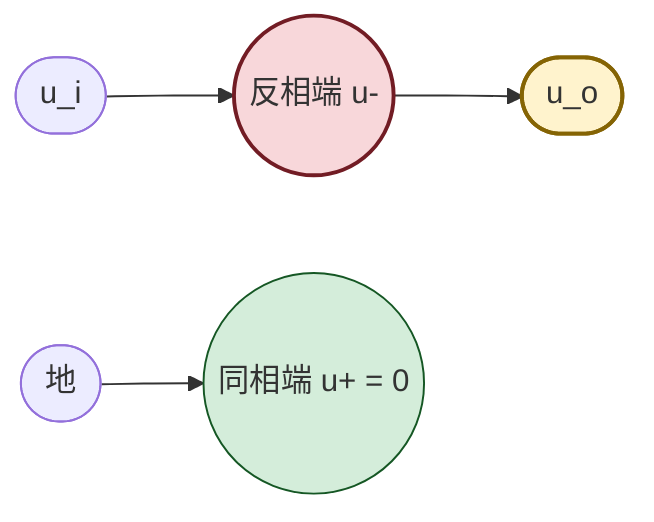
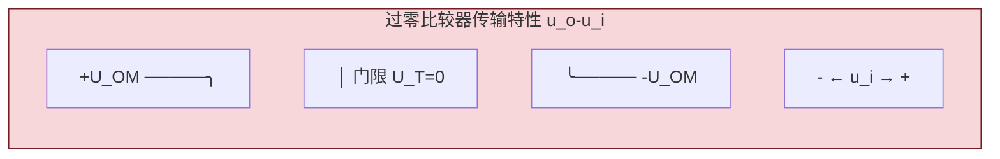
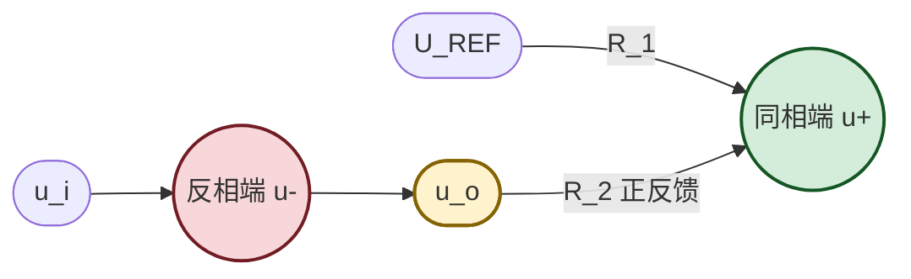
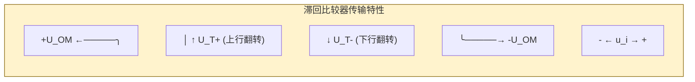
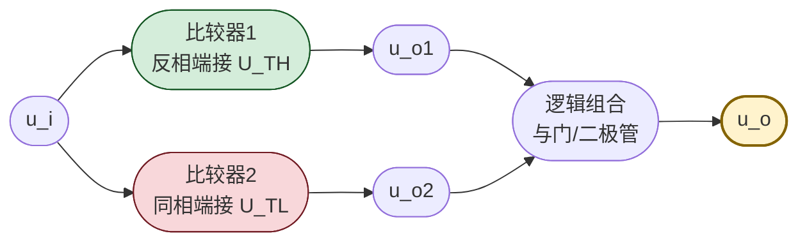

# 7.4 电压比较器

> [!info] 本节定位
> 本节是运放**非线性应用**的核心。它要回答的核心问题是：**当运放不接负反馈（开环）或引入正反馈时，它如何把模拟电压"翻译"为高低电平的数字信号？又如何利用正反馈的滞回特性抵抗噪声干扰？**
>
> 本节与 [[7.1 运放理想模型、虚短虚断概念|7.1]]、[[7.2 反相比例、同相比例运算电路|7.2]]、[[7.3 加法、减法、积分、微分运算电路|7.3]] 形成**鲜明对照**：前几节运放工作在线性区（有负反馈、虚短成立），本节运放工作在**非线性区**（开环或正反馈、虚短失效、仅虚断成立），输出只有两个状态 $\pm U_{OM}$。比较器是 [[MOC - 第9章|第9章 波形产生电路]] 中方波、三角波发生器的基础单元，也是模数转换接口的关键电路。

## 一、电压比较器的基本概念

> [!definition] 电压比较器
> 电压比较器（Voltage Comparator）是一种**对两个输入电压大小进行比较**的电路：当同相端电位高于反相端电位（$u_+>u_-$）时输出高电平 $+U_{OM}$；当同相端电位低于反相端电位（$u_+<u_-$）时输出低电平 $-U_{OM}$。其传输特性为非线性开关特性。

> [!theorem] 比较器与运放的工作区差异
> | 特性 | 运放（线性应用） | 比较器（非线性应用） |
> | ---- | ---------------- | -------------------- |
> | 反馈 | 负反馈 | 开环或正反馈 |
> | 工作区 | 线性区 | 非线性区（饱和） |
> | 虚短 | 成立（$u_+\approx u_-$） | **不成立**（$u_+\ne u_-$） |
> | 虚断 | 成立 | 成立（$i_+=i_-=0$） |
> | 输出 | 连续模拟量 | 仅 $\pm U_{OM}$ 两态 |
> | 用途 | 信号放大与运算 | 电平比较、波形整形 |

> [!warning] 比较器分析的关键
> 分析比较器时**不能使用虚短**（因输出饱和、$A_{od}$ 不再起线性放大作用），只能：
> 1. 用虚断列同相端或反相端节点方程，求门限电压 $U_T$；
> 2. 比较 $u_i$ 与 $U_T$ 的大小判断输出状态；
> 3. 对滞回比较器需分别求"输出为 $+U_{OM}$ 时翻转"与"输出为 $-U_{OM}$ 时翻转"的两个门限。

## 二、过零比较器

### 2.1 电路与原理

> [!definition] 过零比较器
> 参考电压为零（$U_{REF}=0$）的电压比较器。常见结构：输入信号 $u_i$ 接反相端，同相端接地；或输入接同相端，反相端接地。

> [!theorem] 过零比较器输出关系（反相输入接法）
> $$u_o=\begin{cases}+U_{OM}, & u_i<0\\-U_{OM}, & u_i>0\end{cases}$$
> 当 $u_i$ 由负过零变正时，输出由 $+U_{OM}$ 跳变为 $-U_{OM}$；反之亦然。门限电压 $U_T=0$。

### 2.2 传输特性

> [!warning] 过零比较器的抗干扰问题
> 当输入信号 $u_i$ 在零附近因噪声而**反复过零**时，输出会在 $+U_{OM}$ 与 $-U_{OM}$ 之间**频繁抖动**（多次翻转），造成误触发。这是过零比较器的主要缺陷，需用滞回比较器解决。

### 2.3 限幅输出

> [!note] 输出电平的标准化
> 运放饱和输出 $\pm U_{OM}$ 受电源影响且不精确。工程上常用稳压管双向限幅把输出钳位到标准电平（如 $\pm 5\,\text{V}$）：在输出端接反向串联的两只稳压管（或一只双向稳压管 $U_Z$），使 $u_o=\pm U_Z$。详见 [[4.4 稳压二极管工作原理与稳压电路|4.4]]。

## 三、一般电压比较器

> [!definition] 一般电压比较器
> 参考电压 $U_{REF}\ne 0$ 的电压比较器。输入信号 $u_i$ 接反相端，参考电压 $U_{REF}$ 接同相端（或反之）。门限电压 $U_T=U_{REF}$。

> [!theorem] 一般电压比较器输出关系（反相输入接法）
> $$u_o=\begin{cases}+U_{OM}, & u_i<U_{REF}\\-U_{OM}, & u_i>U_{REF}\end{cases}$$
> 门限电压 $U_T=U_{REF}$。当 $u_i$ 越过 $U_{REF}$ 时输出翻转。

> [!example] 应用：电平检测
> 设 $U_{REF}=3\,\text{V}$，输入 $u_i$ 为温度传感器输出。当 $u_i<3\,\text{V}$（温度低于阈值）时 $u_o=+U_{OM}$ 触发加热；当 $u_i>3\,\text{V}$ 时 $u_o=-U_{OM}$ 停止加热。即实现温度开关控制。

## 四、滞回比较器（施密特触发器）

### 4.1 电路结构

> [!definition] 滞回比较器
> 引入**正反馈**的比较器。输出经反馈电阻 $R_2$ 接到同相输入端，同相端经 $R_1$ 接参考电压 $U_{REF}$（或接地），输入信号 $u_i$ 接反相端。正反馈使翻转门限依赖于当前输出状态，形成两个门限，产生滞回特性。

### 4.2 门限电压推导

> [!theorem] 滞回比较器两个门限
> 由虚断，同相端节点 $u_+$ 由 $U_{REF}$（经 $R_1$）与 $u_o$（经 $R_2$）共同决定（叠加定理）：
> $$u_+=\frac{R_2}{R_1+R_2}U_{REF}+\frac{R_1}{R_1+R_2}u_o$$
> 当 $u_o=+U_{OM}$ 时，$u_+$ 取较高值，称为**上门限**：
> $$\boxed{\,U_{T+}=\frac{R_2}{R_1+R_2}U_{REF}+\frac{R_1}{R_1+R_2}(+U_{OM})\,}$$
> 当 $u_o=-U_{OM}$ 时，$u_+$ 取较低值，称为**下门限**：
> $$\boxed{\,U_{T-}=\frac{R_2}{R_1+R_2}U_{REF}+\frac{R_1}{R_1+R_2}(-U_{OM})\,}$$
> **回差电压**（滞回宽度）：
> $$\boxed{\,\Delta U=U_{T+}-U_{T-}=\frac{2R_1}{R_1+R_2}U_{OM}\,}$$

> [!proof] 翻转过程
> 设初始 $u_o=+U_{OM}$，此时同相端电位为 $U_{T+}$。输入 $u_i$ 由小增大：
> - 当 $u_i<U_{T+}$ 时，$u_-<u_+$，输出保持 $+U_{OM}$；
> - 当 $u_i$ 增大到刚超过 $U_{T+}$ 时，$u_->u_+$，输出翻转为 $-U_{OM}$；正反馈使 $u_+$ 立即降为 $U_{T-}$，输出稳定在 $-U_{OM}$。
> 输入 $u_i$ 再由大减小：
> - 当 $u_i>U_{T-}$ 时，$u_->u_+$，输出保持 $-U_{OM}$；
> - 当 $u_i$ 减小到刚低于 $U_{T-}$ 时，$u_-<u_+$，输出翻回 $+U_{OM}$。
> 故"上行翻转"门限为 $U_{T+}$，"下行翻转"门限为 $U_{T-}$，二者不同形成滞回。 ∎

### 4.3 传输特性

> [!note] 滞回特性的抗干扰原理
> 当输入信号在门限附近因噪声波动时，只要噪声幅度小于回差 $\Delta U$，输出就不会反复翻转——因为从 $+U_{OM}$ 翻转到 $-U_{OM}$ 后，门限立即降为 $U_{T-}$，输入需下降 $\Delta U$ 才能翻回。回差越大抗干扰能力越强，但分辨率（灵敏度）越低，需根据噪声幅度折中选择。

### 4.4 同相输入滞回比较器

> [!note] 输入接同相端的情形
> 若把输入 $u_i$ 接同相端、$U_{REF}$ 接反相端（反相端经 $R_1$ 接 $U_{REF}$、经 $R_2$ 接输出，输入接同相端经电阻），门限公式形式不同，需按实际节点重新列方程。一般规律：**正反馈接到哪个输入端，门限就由哪个输入端的节点方程决定**。

## 五、窗口比较器

> [!definition] 窗口比较器
> 由两个电压比较器组合，检测输入是否落在某一带状范围（"窗口"）内。设下门限 $U_{TL}$、上门限 $U_{TH}$（$U_{TH}>U_{TL}$）：
> - 当 $u_i<U_{TL}$ 或 $u_i>U_{TH}$ 时，输出为某一电平（如低电平）；
> - 当 $U_{TL}\le u_i\le U_{TH}$ 时，输出为另一电平（如高电平）。

> [!note] 窗口比较器的应用
> 用于"范围检测"：如电池电压监测（电压在 $[U_{TL},U_{TH}]$ 内为正常，超出则报警）、产品分选（按电压幅值分类）。

## 六、典型例题

### 例题 1：过零比较器波形分析

> [!example] 题目
> 过零比较器（输入接反相端、同相端接地），输出经双向稳压管限幅到 $\pm 6\,\text{V}$。输入 $u_i=5\sin\omega t\,\text{V}$。画出输出 $u_o$ 波形并求输出方波的频率与幅值。

**解**：

1. 当 $u_i>0$（正半周）时 $u_- > u_+=0$，输出 $u_o=-6\,\text{V}$；
2. 当 $u_i<0$（负半周）时 $u_- < u_+=0$，输出 $u_o=+6\,\text{V}$；
3. 输出为与输入同频率的反相方波：正半周输出 $-6\,\text{V}$、负半周输出 $+6\,\text{V}$，在 $u_i$ 过零时翻转。
4. 频率与输入相同 $f=\omega/(2\pi)$；幅值 $\pm 6\,\text{V}$。

> [!note] 此即"正弦波变方波"电路，是波形产生与整形的基础。

### 例题 2：滞回比较器门限计算

> [!example] 题目
> 滞回比较器：$U_{REF}=0$（同相端经 $R_1$ 接地），$R_1=10\,\text{k}\Omega$、$R_2=90\,\text{k}\Omega$，输出经 $R_2$ 反馈到同相端，输入 $u_i$ 接反相端。运放输出饱和 $\pm U_{OM}=\pm 12\,\text{V}$。求 $U_{T+}$、$U_{T-}$、$\Delta U$，并说明抗干扰能力。

**解**：

1. 由公式（$U_{REF}=0$）：
   $$U_{T+}=\frac{R_1}{R_1+R_2}(+U_{OM})=\frac{10}{10+90}\times12=1.2\,\text{V}$$
   $$U_{T-}=\frac{R_1}{R_1+R_2}(-U_{OM})=\frac{10}{100}\times(-12)=-1.2\,\text{V}$$
   $$\Delta U=U_{T+}-U_{T-}=2.4\,\text{V}$$
2. 当输入 $u_i$ 由负向正增大时，超过 $+1.2\,\text{V}$ 输出由 $+12\,\text{V}$ 翻转为 $-12\,\text{V}$；
3. 当输入 $u_i$ 由正向负减小时，低于 $-1.2\,\text{V}$ 输出由 $-12\,\text{V}$ 翻回 $+12\,\text{V}$；
4. 抗干扰能力：噪声幅度小于 $2.4\,\text{V}$ 时不会引起误翻转。

**单位检验**：电压 V，电阻比值无量纲，自洽。

### 例题 3：含参考电压的滞回比较器

> [!example] 题目
> 滞回比较器：$U_{REF}=3\,\text{V}$（经 $R_1=10\,\text{k}\Omega$ 接同相端），$R_2=30\,\text{k}\Omega$ 接输出到同相端，输入 $u_i$ 接反相端，$\pm U_{OM}=\pm 12\,\text{V}$。求 $U_{T+}$、$U_{T-}$、$\Delta U$。

**解**：

1. 同相端节点方程（叠加定理，$R_1$ 接 $U_{REF}$、$R_2$ 接 $u_o$）：
   $$u_+=\frac{R_2}{R_1+R_2}U_{REF}+\frac{R_1}{R_1+R_2}u_o$$
   代入数值：$u_+=\dfrac{30}{10+30}\times3+\dfrac{10}{40}u_o=2.25+0.25\,u_o$。
2. $u_o=+12\,\text{V}$ 时：
   $$U_{T+}=2.25+0.25\times12=2.25+3.0=5.25\,\text{V}$$
3. $u_o=-12\,\text{V}$ 时：
   $$U_{T-}=2.25+0.25\times(-12)=2.25-3.0=-0.75\,\text{V}$$
4. 回差 $\Delta U=5.25-(-0.75)=6.0\,\text{V}$。
5. 验证公式：$\Delta U=\dfrac{2R_1}{R_1+R_2}U_{OM}=\dfrac{2\times10}{40}\times12=6.0\,\text{V}$ ✓（回差与 $U_{REF}$ 无关）。

> [!note] 参考电压的作用
> $U_{REF}$ 使整个滞回窗口中心从 0 平移到 $\dfrac{R_2}{R_1+R_2}U_{REF}=2.25\,\text{V}$，但回差宽度 $\Delta U$ 不变。窗口中心 $U_{T0}=(U_{T+}+U_{T-})/2=2.25\,\text{V}$。

**单位检验**：电压 V，自洽。

## 七、易错点

> [!warning] 易错点
> 1. **误用虚短**：比较器中虚短失效，分析时只能用虚断列节点方程。这是最常见的错误。
> 2. **门限公式死记**：滞回比较器门限公式随参考电压接入位置、输入信号接入位置不同而变化。**正确做法是按实际电路列同相端（或反相端）节点方程**，不要套公式。
> 3. **回差与 $U_{REF}$ 关系**：回差 $\Delta U=\dfrac{2R_1}{R_1+R_2}U_{OM}$ **仅依赖 $R_1$、$R_2$、$U_{OM}$**，与 $U_{REF}$ 无关；$U_{REF}$ 只改变窗口中心位置。
> 4. **输出饱和值**：题目未给 $U_{OM}$ 时，常取 $\pm$ 电源电压或 $\pm$ 稳压管稳压值；有限幅时取限幅值。
> 5. **抗干扰与灵敏度矛盾**：回差大抗干扰强但分辨率低（无法区分窗口内的小变化），需折中。
> 6. **过零比较器抖动**：输入含噪声时过零比较器输出抖动，应改用滞回比较器。

## 八、与其他小节的联系

- 比较器与 [[7.1 运放理想模型、虚短虚断概念|7.1]]、[[7.2 反相比例、同相比例运算电路|7.2]]、[[7.3 加法、减法、积分、微分运算电路|7.3]] 形成线性/非线性应用的对照；
- 输出限幅用到 [[4.4 稳压二极管工作原理与稳压电路|4.4]] 稳压管知识；
- 滞回比较器是 [[MOC - 第9章|第9章]] 方波发生器、施密特整形电路的核心；
- 窗口比较器是模数转换与电平检测的基础；
- 本章 MOC：[[MOC - 第7章]]。

## 章节导航

- 上一级：[[MOC - 第7章]]
- 上一节：[[7.3 加法、减法、积分、微分运算电路]]
- 下一节：[[7.5 运放使用注意事项]]
- 习题：[[MOC - 第7章习题]]
