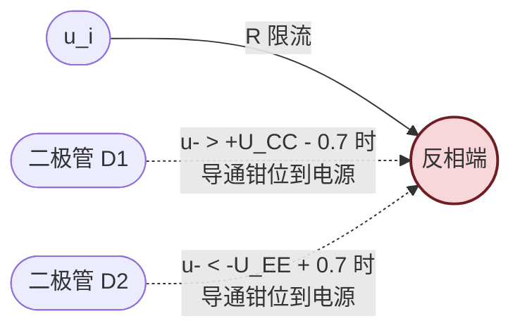

# 7.5 运放使用注意事项

> [!info] 本节定位
> 本节是对前四节**理想运放模型的工程修正**。它要回答的核心问题是：**实际运放与理想模型有哪些差距？这些差距会引起什么问题？如何通过参数选择、调零、消振、保护与供电设计把"理想公式"变成"可工作电路"？**
>
> 本节综合用到 [[7.1 运放理想模型、虚短虚断概念|7.1]]（理想参数与实际差距）、[[7.2 反相比例、同相比例运算电路|7.2]]（闭环稳定性与带宽）、[[7.3 加法、减法、积分、微分运算电路|7.3]]（积分漂移与微分自激）、[[7.4 电压比较器|7.4]]（比较器响应速度）的结论。本节内容是连接"课本公式"与"实际电路"的桥梁，也是 [[MOC - 第8章|第8章 负反馈放大电路]] 中稳定性分析与 [[MOC - 第10章|第10章 直流稳压电源]] 中运放选型的前置知识。

## 一、运放主要参数与选择

### 1.1 直流参数

> [!definition] 直流误差参数
> | 参数 | 符号 | 单位 | 物理含义 | 典型值（$\mu$A741） |
> | ---- | ---- | ---- | -------- | ------------------- |
> | 输入失调电压 | $U_{IO}$ | mV | 使输出为零所需在输入端施加的补偿电压 | $1\sim5$ |
> | 输入失调电流 | $I_{IO}$ | nA | 两输入端偏置电流之差 $|I_{B+}-I_{B-}|$ | $20\sim200$ |
> | 输入偏置电流 | $I_B$ | nA | 两输入端偏置电流的平均值 $(I_{B+}+I_{B-})/2$ | $80\sim500$ |
> | 共模抑制比 | $K_{CMR}$ | dB | 差模增益与共模增益之比的对数 | $70\sim90$ |
> | 电源电压抑制比 | $PSRR$ | dB | 电源变化对输出等效输入的影响 | $70\sim100$ |

> [!note] 失调的来源与影响
> - **失调电压 $U_{IO}$**：由输入级差动对管特性不对称引起，相当于在输入端串入一个误差电压源，被闭环放大后产生输出零点偏移 $U_{IO}\cdot(1+R_f/R_1)$（同相比例）；
> - **失调电流 $I_{IO}$**：两输入偏置电流不等，流过外接电阻产生误差电压，这是接入平衡电阻 $R_2=R_1\parallel R_f$ 的原因（使两输入端对地电阻相等，将 $I_{IO}$ 影响降至最小）；
> - **温漂**：$U_{IO}$、$I_{IO}$ 随温度变化（$\text{d}U_{IO}/\text{d}T$ 约 $5\sim20\,\mu\text{V}/^\circ\text{C}$），无法用调零完全消除，是高精度电路的主要误差源。

### 1.2 交流参数

> [!definition] 交流与动态参数
> | 参数 | 符号 | 单位 | 物理含义 | 典型值（$\mu$A741） |
> | ---- | ---- | ---- | -------- | ------------------- |
> | 开环差模增益 | $A_{od}$ | dB（或 V/mV） | 开环状态差模放大倍数 | $100\sim106\,\text{dB}$ |
> | 单位增益带宽 | $GBW$ / $f_T$ | MHz | 开环增益降至 1（0 dB）对应的频率 | $1\sim1.5$ |
> | 压摆率（转换速率） | $SR$ | V/μs | 输出电压最大变化率 $\max\lvert du_o/dt\rvert$ | $0.5$ |
> | 建立时间 | $t_s$ | μs | 阶跃响应进入终值 ±0.1% 或 ±0.01% 误差带的时间 | $1\sim5$ |
> | 全功率带宽 | $f_{pp}$ | kHz | 满幅正弦输出不失真的最高频率 | $10\sim20$ |

> [!theorem] 压摆率与全功率带宽的关系
> 正弦输出 $u_o=U_m\sin\omega t$ 的最大变化率为 $\lvert du_o/dt\rvert_{\max}=\omega U_m=2\pi f U_m$。要求不超过 $SR$：
> $$\boxed{\,f_{pp}=\frac{SR}{2\pi U_m}\,}$$
> 当输出幅值 $U_m$ 较大时，全功率带宽远小于单位增益带宽。

> [!example] 压摆率限制示例
> $\mu$A741 的 $SR=0.5\,\text{V/}\mu\text{s}$，输出 $U_m=10\,\text{V}$ 正弦时全功率带宽：
> $$f_{pp}=\frac{0.5\times10^6}{2\pi\times10}\approx7.96\,\text{kHz}$$
> 即输出 $10\,\text{V}$ 幅值正弦时频率超过约 $8\,\text{kHz}$ 即出现失真（波形变成三角波）。这是高频大信号运放选型的关键约束。

### 1.3 选型原则

> [!tip] 运放选型决策流程
> 1. **精度优先**（仪表放大、传感器调理）：选低失调 $U_{IO}<1\,\text{mV}$、低温漂、高 $K_{CMR}$ 的精密运放（如 OP07、OPA333、AD8551）；
> 2. **速度优先**（视频、通信、高速 ADC 驱动）：选高 $GBW$ 与高 $SR$ 的高速运放（如 AD811、LM7171）；
> 3. **低功耗优先**（电池供电、便携设备）：选微功耗运放（如 TLV2401、MCP604，静态电流 $\mu$A 级）；
> 4. **高阻信号源**（电容传感器、pH 电极）：选 MOS/JFET 输入高阻运放（如 TL082、CA3140、OPA128，输入电阻 $>10^{12}\,\Omega$）；
> 5. **单电源系统**：选轨到轨输入输出单电源运放（如 MCP6001、OPA340）。

## 二、调零与消振

### 2.1 调零

> [!definition] 调零
> 通过外接电路抵消失调电压与失调电流，使输入为零时输出为零的过程。常用方法：
> 1. **专用调零引脚**：许多运放（如 $\mu$A741）提供 `Offset Null` 引脚（1、5 脚），外接电位器（通常 $10\,\text{k}\Omega$）接负电源，调节使输入接地时输出为零；
> 2. **外加偏置电压**：在反相端或同相端经小电阻注入可调直流偏置电压（来自稳压管分压或电位器）抵消失调。

> [!warning] 调零的局限
> - 调零只能在某一温度下消除失调，温漂无法消除；
> - 调零范围有限（通常 $\pm 10\sim50\,\text{mV}$ 等效输入），超出范围的失调说明运放损坏或选型不当；
> - 高增益电路中失调被放大，调零更敏感，需用低失调运放而非依赖调零。

### 2.2 消振

> [!definition] 消振
> 防止运放电路自激振荡的措施。自激振荡表现为电路无输入时输出仍存在高频振荡波形。

> [!theorem] 自激振荡的成因
> 负反馈放大电路自激的条件（见 [[MOC - 第8章|第8章]]）是：环路增益 $|\dot A\dot F|\ge1$ 且附加相移 $\Delta\varphi=180^\circ$（使负反馈变正反馈）。运放内部多级放大在高频下产生附加相移，当反馈深度足够大时满足自激条件。

> [!tip] 消振措施
> 1. **内部补偿型运放**（如 $\mu$A741）：芯片内已集成密勒补偿电容（约 $30\,\text{pF}$），在大部分应用下不会自激，但代价是带宽受限；
> 2. **外部补偿**：未补偿型运放（如 LM301）提供补偿引脚，按手册接入指定电容；
> 3. **反馈电容补偿**：在反馈电阻 $R_f$ 两端并联小电容 $C_f$（几 pF 至几十 pF），引入超前相移抵消滞后，提高相位裕度。这是 [[7.2 反相比例、同相比例运算电路|7.2]] 与 [[7.3 加法、减法、积分、微分运算电路|7.3]] 电路常用方法；
> 4. **减小反馈深度**：增大闭环增益（减小反馈系数）使相位裕度增加；
> 5. **电源去耦**：电源引脚就近接去耦电容（见下节），消除电源内阻引起的寄生反馈。

## 三、电源去耦与保护

### 3.1 电源去耦

> [!definition] 电源去耦
> 在运放电源引脚（$+U_{CC}$、$-U_{EE}$）与地之间就近接入电容，为高频信号提供低阻抗回路，防止电源线寄生电感与电阻引起的高频耦合与振荡。

> [!tip] 去耦电容的标准做法
> 每个运放的每个电源引脚到地之间接入：
> - 一只**大电容**（$10\,\mu\text{F}$ 电解）：提供低频能量储备；
> - 一只**小电容**（$0.1\,\mu\text{F}$ 陶瓷）：提供高频旁路；
> - 电容**就近放置**在运放引脚 $1\sim2\,\text{cm}$ 范围内，引线尽量短；
> - 多运放共用电源时每只运放仍需独立去耦电容。

> [!warning] 不接去耦电容的后果
> 电源线在高频下呈现感性阻抗，运放输出电流变化会在电源上产生高频纹波，经内部偏置电路耦合到输入端形成正反馈，导致自激振荡或输出毛刺。这是实际电路最常见的故障之一。

### 3.2 输入保护

> [!definition] 输入保护电路
> 防止输入电压超出运放允许范围（通常为电源电压 $\pm U_{CC}$）造成损坏的措施。

> [!tip] 输入保护典型结构
> 在两输入端之间反向并联两只二极管（或接电源的二极管钳位），并串联限流电阻 $R$（约 $1\sim10\,\text{k}\Omega$）：当输入电压超过电源范围时二极管导通把输入钳位到电源电压附近，限流电阻防止大电流损坏二极管与运放。详见 [[4.3 二极管整流、限幅电路|4.3]] 限幅电路。

### 3.3 输出保护

> [!definition] 输出保护
> 防止输出端短路或接感性负载产生反电势损坏运放输出级的措施：
> 1. **串联限流电阻**：输出端串小电阻（$50\sim100\,\Omega$）限制短路电流；
> 2. **输出钳位二极管**：输出端到电源接二极管钳位，防止感性负载反电势击穿输出管；
> 3. **热保护**：多数现代运放内部集成过热关断电路。

### 3.4 电源反接保护

> [!tip] 电源反接保护
> 在电源正端串联二极管（阳极接电源、阴极接运放 $+U_{CC}$ 引脚），电源反接时二极管反偏截止保护运放；缺点是二极管压降（$0.7\,\text{V}$）降低运放可用电源电压。或用二极管桥式整流结构使任意极性都能正常工作（损耗更大）。

## 四、单电源供电问题

> [!definition] 单电源供电
> 运放采用单极性电源（如 $+5\,\text{V}$ 与地，无负电源）供电。此时运放无法处理双极性信号（输出不能为负），需特别处理。

### 4.1 偏置中点电压

> [!theorem] 单电源运放的双极性信号处理
> 单电源下运放输出只能在 $0\sim U_{CC}$ 之间变化，无法直接放大含负半周的交流信号。解决方法：**把静态工作点偏置到电源中点** $U_{CC}/2$，使信号围绕中点上下波动，相当于把"地"参考平移到 $U_{CC}/2$。

> [!tip] 单电源偏置电路典型结构
> 1. 用两只等值分压电阻 $R$、$R$ 从 $U_{CC}$ 分压得 $U_{CC}/2$，作为"虚地"参考；
> 2. 分压点经电压跟随器（见 [[7.2 反相比例、同相比例运算电路|7.2]]）缓冲，提供低阻抗的 $U_{CC}/2$ 参考；
> 3. 输入信号经耦合电容接到偏置点，输出经耦合电容取出交流分量（去直流偏置）；
> 4. 同相输入端接 $U_{CC}/2$，反相端经反馈电阻接输出与 $U_{CC}/2$。

> [!warning] 单电源运放的注意事项
> - 输入共模范围需包含 $U_{CC}/2$，部分运放（如 LM324）输入范围可低至地，但普通运放不行；
> - 输出摆幅受限于电源（轨到轨运放可接近电源，普通运放差 $1\sim2\,\text{V}$）；
> - 直流耦合场合需把"虚地"作为新的参考地，所有信号相对于 $U_{CC}/2$；
> - 单电源下不能直接用前几节的双电源公式（公式仍成立但参考点为 $U_{CC}/2$ 而非 0）。

## 五、典型应用电路注意事项

> [!abstract] 各类运放电路的工程注意
> | 电路类型 | 主要注意点 |
> | -------- | ---------- |
> | 比例放大 | 检查输出是否在 $\pm U_{OM}$ 内；同相组态检查共模输入范围；高增益时检查带宽 $f_{-3dB}=GBW/A_u$ |
> | 积分电路 | 必加泄漏电阻 $R_f$ 防直流漂移饱和；设复位开关；选低偏置电流运放（FET 输入） |
> | 微分电路 | 必加改进措施（串 $R_1$、并 $C_f$）防高频噪声与自激；实际工程少用 |
> | 比较器 | 专用比较器（如 LM311）比运放开环作比较器更好：响应快、可输出不同电平；滞回比较器回差需大于噪声峰值 |
> | 高阻抗源 | 输入端加屏蔽、印板走线短、加保护环（guard ring）防漏电；选 FET 输入运放 |
> | 容性负载 | 直接驱动大电容易自激，需串 $50\sim100\,\Omega$ 隔离电阻或在反馈环内加驱动级 |

## 六、典型例题

### 例题 1：失调引起的输出零点偏移

> [!example] 题目
> 同相比例电路 $R_1=1\,\text{k}\Omega$、$R_f=9\,\text{k}\Omega$，运放 $U_{IO}=2\,\text{mV}$。求输入接地时由 $U_{IO}$ 引起的输出直流偏移电压。

**解**：

1. 同相比例闭环增益 $A_u=1+R_f/R_1=1+9=10$。
2. 失调电压 $U_{IO}$ 等效于在同相端串入 $2\,\text{mV}$ 误差源，被同相比例放大：
   $$U_{o,\text{off}}=A_u\cdot U_{IO}=10\times2\,\text{mV}=20\,\text{mV}$$
3. 输入接地时输出约 $20\,\text{mV}$，需调零消除。

**单位检验**：$A_u$ 无量纲，$U_{IO}$ 单位 V，输出 V，自洽。

### 例题 2：带宽与压摆率限制

> [!example] 题目
> 反相比例电路 $R_1=10\,\text{k}\Omega$、$R_f=100\,\text{k}\Omega$（$A_u=-10$），运放 $GBW=1\,\text{MHz}$、$SR=0.5\,\text{V/}\mu\text{s}$。输入正弦 $u_i=0.5\sin(2\pi f\,t)\,\text{V}$。求：(a) 闭环 $-3\,\text{dB}$ 带宽；(b) 输出不失真最大幅值对应的全功率带宽，及幅值 $5\,\text{V}$ 时的最高频率。

**解**：

(a) 闭环带宽近似为 $f_{-3\,\text{dB}}\approx GBW/|A_u|=1\,\text{MHz}/10=100\,\text{kHz}$。

(b) 输出幅值 $U_m=|A_u|\cdot U_{im}=10\times0.5=5\,\text{V}$。由全功率带宽公式：
$$f_{pp}=\frac{SR}{2\pi U_m}=\frac{0.5\times10^6}{2\pi\times5}\approx15.9\,\text{kHz}$$
即幅值 $5\,\text{V}$ 时频率超过约 $15.9\,\text{kHz}$ 就会因压摆率不足而失真（小于 $100\,\text{kHz}$ 闭环带宽，故压摆率是主要限制）。

> [!note] 小信号带宽 vs 大信号带宽
> 闭环带宽 $100\,\text{kHz}$ 是**小信号**指标（信号幅度足够小，压摆率不限制）；大信号下压摆率限制更严，实际工作频率应取两者较小值。

**单位检验**：$GBW/|A_u|$ 单位 Hz，$SR/(2\pi U_m)$ 单位 $(\text{V/s})/\text{V}=\text{Hz}$，自洽。

### 例题 3：单电源同相放大偏置

> [!example] 题目
> 单电源 $+5\,\text{V}$ 供电，要求放大 $u_i=0.5\sin\omega t\,\text{V}$（含正负半周），闭环增益 $A_u=2$。设计偏置与电阻网络。

**解**：

1. 用分压电阻 $R=R=10\,\text{k}\Omega$ 从 $+5\,\text{V}$ 分压得 $U_{ref}=2.5\,\text{V}$（电源中点）。
2. 经电压跟随器缓冲 $U_{ref}$（提供低阻抗参考）。
3. 同相端接 $U_{ref}$ 与输入信号叠加：实际中输入经耦合电容 $C_{in}$ 接到同相端，同相端经 $R_b=10\,\text{k}\Omega$ 接 $U_{ref}$，使静态 $u_+=2.5\,\text{V}$，信号叠加为 $u_+=2.5+0.5\sin\omega t$。
4. 反相端经 $R_1=10\,\text{k}\Omega$ 接 $U_{ref}$、经 $R_f=10\,\text{k}\Omega$ 接输出，增益 $A_u=1+R_f/R_1=2$。
5. 输出静态 $2.5\,\text{V}$，叠加 $2\times0.5\sin\omega t=1.0\sin\omega t$，故 $u_o=2.5+\sin\omega t\,\text{V}$，范围 $1.5\sim3.5\,\text{V}$，在 $0\sim5\,\text{V}$ 电源范围内 ✓。
6. 输出经耦合电容 $C_{out}$ 取出交流分量 $1.0\sin\omega t\,\text{V}$。

**单位检验**：电压 V，电阻 kΩ，增益无量纲，自洽。

## 七、易错点

> [!warning] 易错点
> 1. **忽略带宽限制**：认为运放 $A_{od}$ 极大就什么频率都能放大。实际开环增益随频率下降，闭环带宽 $f_{-3\,\text{dB}}\approx GBW/A_u$，高频下增益下降、相位滞后。
> 2. **混淆小信号带宽与大信号带宽**：小信号带宽由 $GBW$ 决定，大信号带宽由 $SR$ 决定（全功率带宽）。两者不同，大信号下 $SR$ 限制更严。
> 3. **调零代替选型**：高精度场合不能用调零补偿大失调，应选低失调运放；温漂无法调零消除。
> 4. **去耦电容缺失或位置不当**：去耦电容必须就近放置，引线长则失效；高频去耦用陶瓷电容（$0.1\,\mu\text{F}$），低频储能用电解电容（$10\,\mu\text{F}$）。
> 5. **单电源下用双电源公式**：单电源下"地"参考变为 $U_{CC}/2$，公式中所有"接地"都应改为"接 $U_{CC}/2$ 虚地"。
> 6. **比较器用普通运放**：普通运放开环作比较器响应慢（恢复时间 $\mu$s 级），应选专用比较器（ns 级响应）；且专用比较器输出结构常为开路集电极，便于电平转换。
> 7. **容性负载自激**：运放直接驱动大电容（$>100\,\text{pF}$）易自激，需串隔离电阻。

## 八、与其他小节的联系

- 理想模型与实际差距源于 [[7.1 运放理想模型、虚短虚断概念|7.1]] 的理想化假设；
- 调零电阻接入位置参考 [[7.2 反相比例、同相比例运算电路|7.2]] 平衡电阻 $R_2=R_1\parallel R_f$；
- 积分漂移、微分自激等问题来自 [[7.3 加法、减法、积分、微分运算电路|7.3]]；
- 比较器响应速度影响 [[7.4 电压比较器|7.4]] 高频应用；
- 反馈稳定性深入分析见 [[MOC - 第8章|第8章 负反馈放大电路]]；
- 运放在稳压电源中的应用见 [[MOC - 第10章|第10章 直流稳压电源]]；
- 限幅、钳位二极管见 [[4.3 二极管整流、限幅电路|4.3]]、[[4.4 稳压二极管工作原理与稳压电路|4.4]]；
- 本章 MOC：[[MOC - 第7章]]。

## 章节导航

- 上一级：[[MOC - 第7章]]
- 上一节：[[7.4 电压比较器]]
- 下一章：[[MOC - 第8章|第8章 负反馈放大电路]]
- 习题：[[MOC - 第7章习题]]
