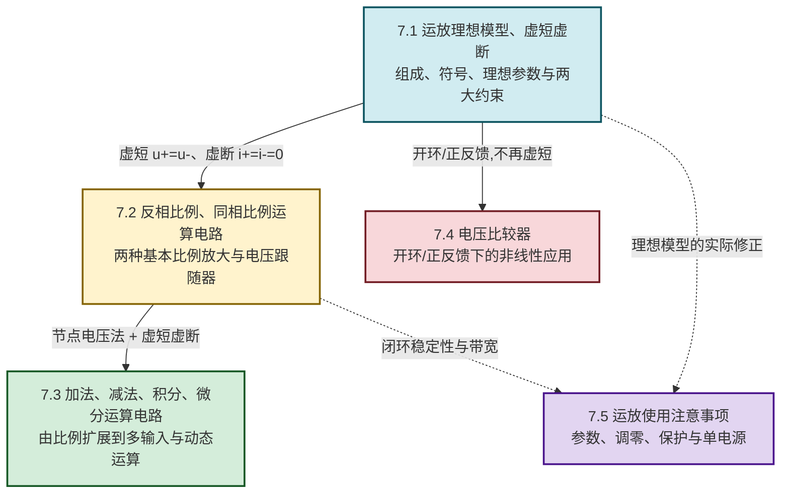

# MOC - 第7章 集成运算放大器基础

> [!info] 本章定位
> 集成运算放大器（Integrated Operational Amplifier，简称**运放**）是模拟电子技术的**核心应用器件**。本章要回答的核心问题是：**如何把一个高增益的直接耦合多级放大器，封装为近似理想的"数学运算单元"，并利用它实现信号的比例、加减、积分、微分运算以及电压比较？**
>
> 本章在 [[MOC - 第5章|第5章 双极型三极管及其放大电路]]（差动放大、电流源偏置）和 [[MOC - 第6章|第6章 场效应管与FET放大电路]]（MOS 有源负载、高输入阻抗级）基础上展开：运放内部正是"差动输入级 + 中间电压放大级 + 互补功率输出级 + 偏置电路"的多级组合，工作在线性区时借助**深度负反馈**把开环增益"压"成由外接元件决定的闭环关系，工作在非线性区（开环或正反馈）时则成为**电压比较器**。
>
> 本章是后续 [[MOC - 第8章|第8章 负反馈放大电路]]（运放是反馈最典型的载体）、[[MOC - 第9章|第9章 波形产生电路]]（运放构成振荡器与比较器）和 [[MOC - 第10章|第10章 直流稳压电源]]（运放用于稳压比较与基准）的共用基础。讨论范围限定于**理想运放模型与基本运算电路**，频率特性、噪声、漂移的深入定量留作进阶内容；公式中电压单位为伏特（V），电流单位为安培（A），电阻单位为欧姆（Ω），电容单位为法拉（F）。

## 学习路线图

## 知识点导航

| 小节 | 标题 | 核心内容 | 关键物理量（SI单位） |
| ---- | ---- | -------- | -------------------- |
| [[7.1 运放理想模型、虚短虚断概念\|7.1]] | 运放理想模型、虚短虚断概念 | 集成运放四大组成部分（差动输入级、中间电压放大级、互补功率输出级、电流源偏置电路）、运放符号与引脚（同相端 $+$、反相端 $-$、输出端）、理想运放参数（$A_{od}\to\infty$、$r_{id}\to\infty$、$r_o\to 0$、$K_{CMR}\to\infty$）、虚短 $u_+=u_-$、虚断 $i_+=i_-=0$ 及其适用条件 | 开环增益 $A_{od}$（无量纲）、输入电阻 $r_{id}$（Ω）、输出电阻 $r_o$（Ω） |
| [[7.2 反相比例、同相比例运算电路\|7.2]] | 反相比例、同相比例运算电路 | 反相比例 $u_o=-\dfrac{R_f}{R_1}u_i$、同相比例 $u_o=\left(1+\dfrac{R_f}{R_1}\right)u_i$、电压跟随器 $u_o=u_i$、平衡电阻 $R_2=R_1\parallel R_f$ 的作用与节点方程分析方法 | 电压放大倍数 $A_u$（无量纲）、电阻 $R$（Ω） |
| [[7.3 加法、减法、积分、微分运算电路\|7.3]] | 加法、减法、积分、微分运算电路 | 反相加法器、同相加法器、差动减法器 $u_o=\dfrac{R_f}{R_1}(u_{i2}-u_{i1})$、积分电路 $u_o=-\dfrac{1}{RC}\int u_i\,dt$、微分电路 $u_o=-RC\dfrac{du_i}{dt}$、实用改进 | 时间常数 $\tau=RC$（s）、电容 $C$（F） |
| [[7.4 电压比较器\|7.4]] | 电压比较器 | 比较器功能与运放工作区差异、过零比较器、一般电压比较器、滞回比较器（上门限 $U_{T+}$、下门限 $U_{T-}$、回差 $\Delta U$）、窗口比较器 | 门限电压 $U_T$（V）、回差电压 $\Delta U$（V）、输出电平 $U_{OM}$（V） |
| [[7.5 运放使用注意事项\|7.5]] | 运放使用注意事项 | 开环增益/带宽/压摆率/输入失调/共模抑制比等参数选择、调零与消振、电源去耦与输入输出保护、单电源供电偏置、典型应用注意 | 压摆率 $SR$（V/μs）、带宽 $BW$（Hz）、失调电压 $U_{IO}$（V） |

## 核心考点

> [!summary] 本章核心考点（8 点）
> 1. **集成运放的组成与各级职责**：输入级采用差动放大电路抑制零漂与共模信号；中间级采用有源负载共射电路提供高电压增益；输出级采用互补对称功率放大电路驱动低阻负载；偏置电路采用电流源为各级提供稳定静态电流。理解"为什么要这样分级"是分析实际运放参数的基础。
> 2. **理想运放参数与两大约束**：$A_{od}\to\infty$、$r_{id}\to\infty$、$r_o\to 0$、$K_{CMR}\to\infty$、带宽 $\to\infty$。由此推出"虚短"$u_+=u_-$（因 $u_o=A_{od}(u_+-u_-)$ 有限而 $A_{od}\to\infty$）和"虚断"$i_+=i_-=0$（因 $r_{id}\to\infty$）。**适用条件：必须工作在线性区，即必须有负反馈**。
> 3. **反相比例运算电路**：输入经 $R_1$ 接反相端、$R_f$ 跨接在反相端与输出端之间、同相端经平衡电阻 $R_2=R_1\parallel R_f$ 接地。利用虚短（反相端为"虚地"，电位为 0）与虚断得 $u_o=-\dfrac{R_f}{R_1}u_i$，输入电阻近似为 $R_1$，共模输入近似为零。
> 4. **同相比例与电压跟随器**：输入接同相端、反相端经 $R_1$ 接地且经 $R_f$ 接输出，$u_o=\left(1+\dfrac{R_f}{R_1}\right)u_i$，输入电阻高、输出电阻低，但存在共模输入。当 $R_f=0$、$R_1=\infty$ 时退化为电压跟随器 $u_o=u_i$，用于阻抗变换与缓冲。
> 5. **加减法电路的叠加分析**：多输入电路利用叠加定理分别令各输入单独作用，求和后再合并。反相加法器 $u_o=-\left(\dfrac{R_f}{R_1}u_{i1}+\dfrac{R_f}{R_2}u_{i2}\right)$；差动减法器当满足 $R_3/R_4=R_1/R_f$ 时 $u_o=\dfrac{R_f}{R_1}(u_{i2}-u_{i1})$。要会列节点方程推导。
> 6. **积分与微分电路**：积分电路用电容 $C$ 替换 $R_f$，$u_o=-\dfrac{1}{R_1 C}\int u_i\,dt$，对方波输入输出三角波、对阶跃输出斜坡；微分电路用电容 $C$ 替换 $R_1$，$u_o=-R_f C\dfrac{du_i}{dt}$，对三角波输出方波。注意二者均反相，且实用微分电路需串联小电阻抑制高频噪声。
> 7. **电压比较器与传输特性**：比较器工作在开环或正反馈状态，运放不满足虚短（仅虚断仍成立）。过零比较器门限为 0；滞回比较器由正反馈产生两个门限 $U_{T+}=\dfrac{R_1}{R_1+R_2}U_{OM}+U_{REF}\dfrac{R_2}{R_1+R_2}$、$U_{T-}=\dfrac{R_1}{R_1+R_2}(-U_{OM})+U_{REF}\dfrac{R_2}{R_1+R_2}$，回差 $\Delta U=U_{T+}-U_{T-}=\dfrac{2R_1}{R_1+R_2}U_{OM}$，抗干扰能力随回差增大而增强、灵敏度随之下降。
> 8. **运放参数与使用注意**：开环增益与带宽积（$GBW$）、压摆率 $SR$ 限制大信号高频输出、输入失调电压 $U_{IO}$ 与失调电流 $I_{IO}$ 引入零点误差、共模抑制比 $K_{CMR}$ 影响共模干扰抑制。调零电位器补偿失调、补偿电容防止自激振荡、电源去耦电容就近放置、单电源供电需将静态偏置到 $U_{CC}/2$。

## 自测题

> [!question]- 自测 1：虚短虚断的成立条件
> 说明"虚短"与"虚断"的物理来源，并指出在何种电路中二者成立、何种电路中"虚短"不成立。
>
> > [!check]- 答案
> > - **虚断** $i_+=i_-=0$：来自理想运放输入电阻 $r_{id}\to\infty$，输入端不取电流。无论运放工作在线性区还是非线性区（比较器），只要输入端未接其他低阻通路，虚断均近似成立。
> > - **虚短** $u_+\approx u_-$：来自 $u_o=A_{od}(u_+-u_-)$，输出电压 $u_o$ 为有限值而 $A_{od}\to\infty$，故 $u_+-u_-\to 0$。**仅当运放工作在线性区（输出未饱和）时才成立**，即电路必须引入**深度负反馈**使输出能在线性范围内调节。
> > - 在开环比较器或正反馈滞回比较器中，输出饱和在 $\pm U_{OM}$，$u_+\ne u_-$，**虚短失效**，只能用虚断列节点方程。

> [!question]- 自测 2：反相比例电路推导
> 反相比例电路中 $R_1=10\,\text{k}\Omega$、$R_f=100\,\text{k}\Omega$、$R_2=R_1\parallel R_f$。输入 $u_i=0.2\,\text{V}$（直流）。求输出 $u_o$、电压放大倍数 $A_u$ 与平衡电阻 $R_2$。
>
> > [!check]- 答案
> > 反相端为虚地（同相端接地，虚短使 $u_-\approx 0$）。由虚断，流入反相端的电流为零，故流过 $R_1$ 的电流全部流入 $R_f$：
> > $$\frac{u_i-0}{R_1}=\frac{0-u_o}{R_f}\Rightarrow u_o=-\frac{R_f}{R_1}u_i=-\frac{100}{10}\times0.2=-2.0\,\text{V}$$
> > 电压放大倍数 $A_u=u_o/u_i=-10$（反相放大 10 倍）。
> > 平衡电阻 $R_2=R_1\parallel R_f=\dfrac{10\times100}{10+100}\,\text{k}\Omega\approx9.09\,\text{k}\Omega$（保证两输入端对地直流电阻相等，抵消偏置电流引起的失调）。

> [!question]- 自测 3：滞回比较器门限
> 滞回比较器：同相端经 $R_1=10\,\text{k}\Omega$ 接地、经 $R_2=90\,\text{k}\Omega$ 接输出，反相端接参考电压 $U_{REF}=2\,\text{V}$，输出饱和电压 $\pm U_{OM}=\pm 12\,\text{V}$。求上、下门限 $U_{T+}$、$U_{T-}$ 与回差 $\Delta U$。
>
> > [!check]- 答案
> > 同相端电位由 $U_{OM}$ 与地（同相端 $R_1$ 接地）分压决定（反相端接电压源 $U_{REF}$，对同相端节点不贡献电流，因虚断）：
> > $$U_{T+}=\frac{R_1}{R_1+R_2}(+U_{OM})=\frac{10}{10+90}\times12=1.2\,\text{V}$$
> > $$U_{T-}=\frac{R_1}{R_1+R_2}(-U_{OM})=\frac{10}{100}\times(-12)=-1.2\,\text{V}$$
> > 回差 $\Delta U=U_{T+}-U_{T-}=2.4\,\text{V}$。
> > 注意：此题反相端接 $U_{REF}=2\,\text{V}$ 作为输入信号比较点，门限由输出经 $R_2$ 反馈到同相端形成。若题目把 $U_{REF}$ 接同相端而输入接反相端，则门限公式不同，需按实际节点列方程。

> [!question]- 自测 4：积分电路波形
> 理想积分电路 $R_1=10\,\text{k}\Omega$、$C=1\,\mu\text{F}$，输入 $u_i=2\,\text{V}$ 的阶跃电压（$t<0$ 时 $u_i=0$，$t\ge0$ 时 $u_i=2\,\text{V}$），$u_o(0)=0$。求 $t=0.1\,\text{s}$ 时的 $u_o$ 并说明当 $t$ 持续增大时会发生什么。
>
> > [!check]- 答案
> > 积分关系 $u_o(t)=-\dfrac{1}{R_1 C}\displaystyle\int_0^t u_i\,d\tau=-\dfrac{U_i}{R_1 C}t$。
> > 时间常数 $R_1 C=10\times10^3\times1\times10^{-6}=0.01\,\text{s}$。
> > $$u_o(0.1)=-\frac{2}{0.01}\times0.1=-20\,\text{V}$$
> > 当 $t$ 持续增大时，$|u_o|$ 线性增长，最终被运放输出饱和电压 $\pm U_{OM}$ 限制（实际运放约 $\pm 13\,\text{V}$），此后积分失效、输出保持饱和值。理想公式仅在未饱和时有效，这是积分电路"电容记忆 + 运放饱和"的典型限制。

## 章节导航

> [!nav] 导航
> 上级：[[MOC - 电路与模拟电子技术|课程总览]]
> 先修：[[MOC - 第5章|第5章 双极型三极管及其放大电路]]（差动放大、电流源偏置）、[[MOC - 第6章|第6章 场效应管与FET放大电路]]（MOS 有源负载、高输入阻抗）
> 下一章：[[MOC - 第8章|第8章 负反馈放大电路]]（运放是反馈最典型的载体）
> 关联：[[MOC - 第9章|第9章 波形产生电路]]（运放构成振荡器与比较器）、[[MOC - 第10章|第10章 直流稳压电源]]（运放用于稳压比较与基准）
> 配套习题：[[MOC - 第7章习题|第7章 习题]]
