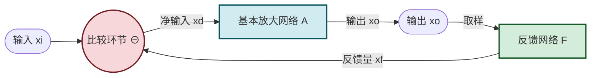

# 8.1 反馈概念、正负反馈判断

> [!abstract] 本节概述
> 反馈是把放大电路输出量（电压或电流）的一部分或全部，通过特定网络送回输入回路，与输入信号共同作用于放大器输入端的过程。本节建立反馈的统一描述框架——**基本放大网络 + 反馈网络 + 比较环节**的三模块框图，并给出判别正反馈与负反馈的**瞬时极性法**。这两个工具是 [[8.2 四种反馈组态识别|8.2]]、[[8.3 负反馈对放大电路性能影响|8.3]]、[[8.4 深度负反馈近似计算|8.4]] 的共同基础。

## 一、反馈的基本概念

> [!definition] 反馈
> 将放大电路输出量（电压 $u_o$ 或电流 $i_o$）的一部分或全部，通过特定连接的网络（反馈网络）送回到输入回路，与原输入信号共同作用于放大器输入端的过程称为**反馈**。包含反馈的放大电路称为**闭环放大电路**，不含反馈的称为**开环放大电路**。

> [!info] 直流反馈与交流反馈
> - **直流反馈**：反馈通路仅对直流信号起作用（如发射极电阻 $R_e$ 上的直流压降稳定 Q 点）。用于稳定静态工作点，见 [[5.5 分压式静态工作点稳定电路|5.5]]。
> - **交流反馈**：反馈通路对交流信号起作用。用于改善放大电路的动态性能（增益稳定、频带、失真等），是本章讨论重点。
> - 若反馈通路同时含直流与交流成分，则二者均存在。发射极电阻并联旁路电容 $C_e$ 时仅保留直流反馈。

## 二、反馈放大电路的基本框图

> [!definition] 反馈放大电路框图
> 任何反馈放大电路可抽象为三个模块：
> 1. **基本放大网络 $\dot A$**：不含反馈的放大电路，将净输入 $\dot x_d$ 放大为输出 $\dot x_o$，$\dot x_o=\dot A\dot x_d$；
> 2. **反馈网络 $\dot F$**：从输出 $\dot x_o$ 取样并产生反馈量 $\dot x_f$，$\dot x_f=\dot F\dot x_o$；
> 3. **比较环节**：在输入端将反馈量 $\dot x_f$ 与输入量 $\dot x_i$ 比较，得到净输入 $\dot x_d=\dot x_i-\dot x_f$（负反馈）或 $\dot x_d=\dot x_i+\dot x_f$（正反馈）。

> [!note] 信号量的统一表示
> 图中 $\dot x_i$、$\dot x_d$、$\dot x_f$、$\dot x_o$ 是相量形式的广义信号量，可以是**电压**也可以是**电流**，具体类型由反馈组态决定（见 [[8.2 四种反馈组态识别|8.2]]）。框图关系在四种组态下形式不变，只是 $\dot A$、$\dot F$ 的量纲不同。

## 三、闭环增益的一般公式

> [!theorem] 闭环增益基本公式
> 对负反馈电路（$\dot x_d=\dot x_i-\dot x_f$）：
> $$\dot x_o=\dot A\dot x_d=\dot A(\dot x_i-\dot x_f)=\dot A\dot x_i-\dot A\dot F\dot x_o$$
> 整理得闭环增益：
> $$\boxed{\,\dot A_f=\frac{\dot x_o}{\dot x_i}=\frac{\dot A}{1+\dot A\dot F}\,}$$
> 其中 $D=1+\dot A\dot F$ 称为**反馈深度**，是无量纲量。

> [!definition] 反馈深度与环路增益
> - **反馈深度**：$D=1+\dot A\dot F$，反映负反馈的强弱；
> - **环路增益**：$\dot T=\dot A\dot F$，是信号沿环路一圈的总放大倍数；
> - 当 $|D|>1$（即 $|\dot A\dot F|>0$ 且为正实数）时为**负反馈**，闭环增益小于开环增益 $|\dot A_f|<|\dot A|$；
> - 当 $0<|D|<1$ 时为**正反馈**，$|\dot A_f|>|\dot A|$；
> - 当 $D=0$（即 $\dot A\dot F=-1$，环路增益模为 1、附加相移 $180^\circ$）时 $|\dot A_f|\to\infty$，电路**自激振荡**（无输入也有输出），这是 [[MOC - 第9章|第9章]] 振荡器的起振条件。

> [!example] 反馈深度的影响
> 设 $\dot A=10^3$、$\dot F=0.1$（均为实数）：
> - $D=1+10^3\times0.1=101$，$\dot A_f=10^3/101\approx9.9$，增益下降约 100 倍；
> - 若 $\dot F=0.01$，$D=11$，$\dot A_f\approx90.9$，增益下降约 10 倍；
> - 若 $\dot F=-0.001$（正反馈），$D=1-1=0$，自激振荡。
> 可见反馈越深（$D$ 越大），闭环增益越低但其他性能越好（见 [[8.3 负反馈对放大电路性能影响|8.3]]）。

## 四、正反馈与负反馈的判别——瞬时极性法

> [!definition] 瞬时极性法
> 判别反馈极性的标准方法，步骤如下：
> 1. 假设输入端在某瞬时极性为 $+$（电位升高）；
> 2. 沿信号流通方向逐级标注各节点瞬时极性（$+$ 或 $-$）；
> 3. 根据反馈网络求出反馈量送回输入端的极性；
> 4. 比较反馈量与输入量的极性：**反馈量削弱净输入则为负反馈，增强则为正反馈**。

> [!tip] 各级放大电路的极性规律
> | 电路组态 | 输入端 | 输出端 | 输入输出极性关系 |
> | -------- | ------ | ------ | ---------------- |
> | 共射（CE） | 基极 | 集电极 | 反相（基极为 $+$ 时集电极为 $-$） |
> | 共集（CC，射极跟随器） | 基极 | 发射极 | 同相 |
> | 共基（CB） | 发射极 | 集电极 | 同相 |
> | 共源（CS，FET） | 栅极 | 漏极 | 反相 |
> | 共漏（CD，源极跟随器） | 栅极 | 源极 | 同相 |
> | 运放同相输入 | 同相端 $+$ | 输出 | 同相 |
> | 运放反相输入 | 反相端 $-$ | 输出 | 反相 |

### 4.1 串联比较的极性判别

> [!example] 例 1：共射电路发射极电阻反馈
> 共射放大电路发射极接未旁路电阻 $R_e$，集电极输出。判别反馈极性。
>
> **分析**：
> 1. 设基极瞬时极性 $+$，则发射极电流增大、$R_e$ 上压降增大，发射极瞬时极性 $+$（共集同相）；
> 2. 净输入 $u_{be}=u_b-u_e$，$u_b$ 升高而 $u_e$ 也升高，**净输入增量小于输入增量**，反馈削弱净输入，故为**负反馈**；
> 3. 反馈量 $u_f=u_e\approx i_e R_e$ 与输出电流成正比，属电流反馈；
> 4. 输入端以电压 $u_f$ 与 $u_i$ 串联比较，属串联反馈；
> 5. 综合为**电流串联负反馈**。

### 4.2 并联比较的极性判别

> [!example] 例 2：运放反相比例电路
> 运放反相比例电路（输入 $u_i$ 经 $R_1$ 接反相端、$R_f$ 跨接反相端与输出）。判别反馈极性。
>
> **分析**：
> 1. 设 $u_i$ 瞬时极性 $+$，反相端电位升高（瞬时极性 $+$）；
> 2. 运放反相输入，输出 $u_o$ 瞬时极性 $-$（反相）；
> 3. $R_f$ 两端电位差 $(u_- - u_o)$ 增大，反馈电流 $i_f=(u_--u_o)/R_f$ 从反相节点流出（向输出端）；
> 4. 流入反相节点的净输入电流 $i_d=i_i-i_f$ 减小，反馈**削弱**净输入电流，故为**负反馈**。
> 5. 综合为**电压并联负反馈**（详见 [[8.2 四种反馈组态识别|8.2]]）。

## 五、反馈存在的判别

> [!tip] 反馈存在性判别步骤
> 1. **找反馈通路**：检查输出回路与输入回路之间是否存在连接元件（电阻、电容、导线）；
> 2. **判交直流**：若反馈通路被旁路电容仅在直流导通则为直流反馈；若同时构成交流通路则交流反馈也存在；
> 3. **判极性**：用瞬时极性法判正负反馈；
> 4. **判组态**：用输出短路法与输入比较方式判四种组态（见 [[8.2 四种反馈组态识别|8.2]]）。

> [!warning] 常见判别错误
> 1. **将本级反馈与级间反馈混淆**：本级反馈（如发射极电阻）仅影响本级性能，级间反馈跨多级、影响整体增益，需分别分析；
> 2. **忽略旁路电容作用**：$R_e$ 并联 $C_e$ 时交流被旁路，仅保留直流反馈，分析交流特性时不能把 $R_e$ 当作交流反馈元件；
> 3. **极性标注方向错误**：共射电路基-集反相是高频考点，标注错误会导致极性判断相反；
> 4. **正反馈不等于自激振荡**：正反馈仅使增益增大，自激振荡需要 $|\dot A\dot F|=1$ 且相位条件满足，是正反馈的极端情况。

## 六、本节与其他小节的联系

- 反馈概念是 [[8.2 四种反馈组态识别|8.2]] 的基础，组态判别必须在极性判别之后进行；
- 闭环增益公式 $\dot A_f=\dot A/(1+\dot A\dot F)$ 是 [[8.3 负反馈对放大电路性能影响|8.3]] 中所有性能改善定量分析的出发点；
- 反馈深度 $D\gg1$ 的深度负反馈近似是 [[8.4 深度负反馈近似计算|8.4]] 的前提；
- 自激振荡条件 $D=0$ 对应 [[MOC - 第9章|第9章]] 振荡器起振；
- 分压式偏置电路的直流负反馈见 [[5.5 分压式静态工作点稳定电路|5.5]]；
- 运放线性应用的深度负反馈本质见 [[7.1 运放理想模型、虚短虚断概念|7.1]]。

## 章节导航

- 上一级：[[MOC - 第8章]]
- 下一节：[[8.2 四种反馈组态识别]]
- 习题：[[MOC - 第8章习题]]
