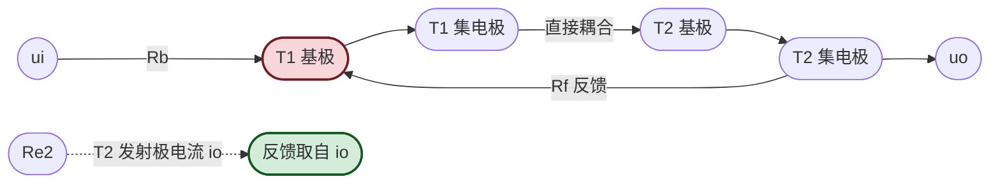
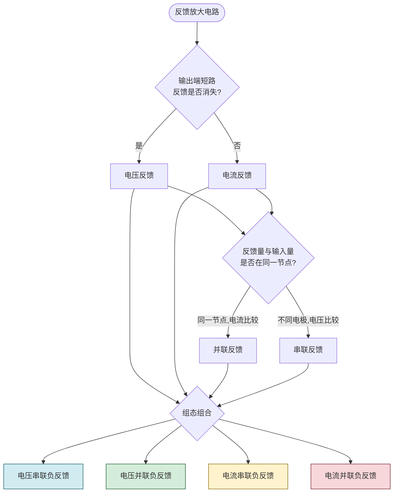

# 8.2 四种反馈组态识别

> [!abstract] 本节概述
> 按"输出端取样方式"（电压/电流）与"输入端比较方式"（串联/并联）两个独立维度的组合，负反馈放大电路共有**四种组态**：电压串联、电压并联、电流串联、电流并联。本节给出每种组态的判别法则、典型电路、反馈系数量纲与对输入输出电阻的调节方向，为 [[8.3 负反馈对放大电路性能影响|8.3]] 与 [[8.4 深度负反馈近似计算|8.4]] 提供组态层面的分类依据。

## 一、组态分类的两个维度

> [!definition] 输出取样方式
> - **电压反馈**：反馈网络从输出电压 $u_o$ 取样，反馈量 $\dot x_f$ 正比于 $u_o$。判别：将输出端**短路**（$u_o=0$），若反馈消失则为电压反馈。
> - **电流反馈**：反馈网络从输出电流 $i_o$ 取样，反馈量 $\dot x_f$ 正比于 $i_o$。判别：将输出端**短路**（$u_o=0$，但 $i_o$ 仍可能存在），若反馈仍存在则为电流反馈。

> [!definition] 输入比较方式
> - **串联反馈**：反馈量 $\dot x_f$ 以**电压**形式与输入电压 $u_i$ 在输入回路中**串联**比较，净输入 $u_d=u_i-u_f$。判别：反馈量与输入量接在不同电极（如基极-发射极之间）。
> - **并联反馈**：反馈量 $\dot x_f$ 以**电流**形式与输入电流 $i_i$ 在输入节点**并联**比较，净输入 $i_d=i_i-i_f$。判别：反馈量与输入量接在同一节点。

> [!theorem] 四种组态
> | 组态 | 取样方式 | 比较方式 | 反馈系数定义 | 典型应用 |
> | ---- | -------- | -------- | ------------ | -------- |
> | 电压串联 | 电压 $u_o$ | 串联（电压） | $\dot F_{uu}=\dfrac{u_f}{u_o}$（无量纲） | 同相比例运放、共集电极放大 |
> | 电压并联 | 电压 $u_o$ | 并联（电流） | $\dot F_{iu}=\dfrac{i_f}{u_o}$（S） | 反相比例运放、互阻放大器 |
> | 电流串联 | 电流 $i_o$ | 串联（电压） | $\dot F_{ui}=\dfrac{u_f}{i_o}$（Ω） | 共射放大（发射极电阻反馈） |
> | 电流并联 | 电流 $i_o$ | 并联（电流） | $\dot F_{ii}=\dfrac{i_f}{i_o}$（无量纲） | 共基放大、电流放大器 |

## 二、电压串联负反馈

### 2.1 典型电路：同相比例运放

```mermaid
flowchart LR
    Ui(["ui"]) --> P([("同相端 +")])
    P --> A["运放 A"]
    A -->|uo| Out(["uo"])
    Out -->|Rf 反馈| N([("反相端 -")])
    N -.->|R1 接地| GND(["地"])
    style P fill:#d1ecf1,stroke:#0c5460,stroke-width:2px
    style N fill:#f8d7da,stroke:#721c24,stroke-width:2px
```

> [!example] 同相比例运放组态分析
> 1. **输出短路**：$u_o=0$ 时反馈线 $R_f$ 直接接地，反相端无反馈电压，反馈消失 → **电压反馈**；
> 2. **输入比较**：反馈电压 $u_f=\dfrac{R_1}{R_1+R_f}u_o$ 作用在反相端，与输入 $u_i$（接同相端）通过运放两输入端**串联**比较，$u_d=u_i-u_f$ → **串联反馈**；
> 3. **极性**：$u_i$ 增大 → $u_o$ 增大（同相放大）→ $u_f$ 增大 → $u_d=u_i-u_f$ 增量小于 $u_i$ 增量 → **负反馈**；
> 4. 反馈系数 $\dot F_{uu}=\dfrac{u_f}{u_o}=\dfrac{R_1}{R_1+R_f}$（无量纲）；
> 5. **性能影响**：稳定输出电压、增大输入电阻、减小输出电阻，适合电压放大与缓冲。

### 2.2 典型电路：共集电极放大电路

> [!note] 共集组态的反馈
> 共集电极（射极跟随器）输出从发射极取出，发射极电阻 $R_e$ 同时是反馈元件：
> - 输出短路（$u_o=0$ 即 $u_e=0$）反馈消失 → 电压反馈；
> - 反馈电压 $u_f=u_e=u_o$ 与输入 $u_i$ 在基-射回路串联比较 → 串联反馈；
> - 极性：基极 $+$ → 发射极 $+$，$u_{be}=u_i-u_f$ 减小 → 负反馈；
> - 综合为**电压串联负反馈**，反馈系数 $F=1$（深度负反馈，$u_o\approx u_i$）。

## 三、电压并联负反馈

### 3.1 典型电路：反相比例运放

> [!example] 反相比例运放组态分析
> 1. **输出短路**：$u_o=0$ 时 $R_f$ 直接接地，反馈电流 $i_f=0$ → **电压反馈**；
> 2. **输入比较**：输入电流 $i_i$（经 $R_1$）与反馈电流 $i_f$（经 $R_f$）在反相节点**并联**比较，$i_d=i_i-i_f$ → **并联反馈**；
> 3. **极性**：$u_i$ 增大 → 反相端电位升高 → $u_o$ 下降（反相放大）→ $i_f=(u_- - u_o)/R_f$ 增大且方向为流出反相节点 → 削弱 $i_d$ → **负反馈**；
> 4. 反馈系数 $\dot F_{iu}=\dfrac{i_f}{u_o}=-\dfrac{1}{R_f}$（单位 S，注意虚地近似下 $u_-\approx0$）；
> 5. **性能影响**：稳定输出电压、减小输入电阻（虚地使输入电阻近似为 $R_1$）、减小输出电阻，适合电流-电压转换（互阻放大）。

### 3.2 典型电路：基极反馈偏置共射

> [!note] 单级共射电压并联负反馈
> 共射电路集电极经 $R_f$ 接回基极：
> - 输出短路 $u_o=0$（集电极接地）反馈消失 → 电压反馈；
> - 反馈电流 $i_f=(u_b-u_c)/R_f$ 与输入电流 $i_i$ 在基极节点并联比较 → 并联反馈；
> - 极性：$u_b$ 升高 → $u_c$ 下降（反相）→ $i_f$ 增大且流出基极节点 → 削弱 $i_b$ → 负反馈；
> - 综合为**电压并联负反馈**，同时稳定 Q 点与交流性能。

## 四、电流串联负反馈

### 4.1 典型电路：共射放大（发射极电阻反馈）

> [!example] 共射发射极电阻反馈组态分析
> 1. **输出短路**：将集电极输出端短路（$u_o=0$），但 $i_c$ 仍存在，发射极电流 $i_e\approx i_c$ 仍在 $R_e$ 上产生压降 $u_f=i_e R_e$，反馈**仍存在** → **电流反馈**；
> 2. **输入比较**：反馈电压 $u_f=u_e$ 与输入 $u_i$ 在基-射回路**串联**比较，$u_{be}=u_i-u_f$ → **串联反馈**；
> 3. **极性**：$u_i$ 增大 → $i_b$ 增大 → $i_e$ 增大 → $u_f$ 增大 → $u_{be}$ 增量小于 $u_i$ 增量 → **负反馈**；
> 4. 反馈系数 $\dot F_{ui}=\dfrac{u_f}{i_o}=\dfrac{i_e R_e}{i_c}\approx R_e$（单位 Ω，因为 $i_e\approx i_c$）；
> 5. **性能影响**：稳定输出电流、增大输入电阻、增大输出电阻，适合电流放大与传感器接口。

## 五、电流并联负反馈

### 5.1 典型电路：两级共射电流并联反馈



> [!example] 两级共射电流并联反馈分析
> 1. **取样位置**：反馈电阻 $R_f$ 从第二级发射极（电流 $i_{e2}\approx i_o$）取反馈，而非集电极输出；
> 2. **输出短路**：将输出端（$u_o$ 处）短路，$i_{e2}$ 仍存在，反馈**仍存在** → **电流反馈**；
> 3. **输入比较**：反馈电流 $i_f$ 与输入电流 $i_i$ 在第一级基极节点**并联**比较 → **并联反馈**；
> 4. **极性**：$u_i$ 升高 → $u_{c1}$ 下降（反相）→ $i_{c2}$ 增大 → $u_{e2}$ 升高 → 反馈电流 $i_f=(u_{b1}-u_{e2})/R_f$ 流出基极节点 → 削弱 $i_{b1}$ → **负反馈**；
> 5. 反馈系数 $\dot F_{ii}=\dfrac{i_f}{i_o}\approx\dfrac{R_{e2}}{R_f+R_{e2}}$（无量纲，由 $R_f$ 与 $R_{e2}$ 分流决定）；
> 6. **性能影响**：稳定输出电流、减小输入电阻、增大输出电阻，适合电流放大。

## 六、组态判别流程图



## 七、组态与性能改善对照表

> [!summary] 四种组态对放大电路性能的调节
> | 组态 | 稳定输出量 | 输入电阻 | 输出电阻 | 适合信号源 | 适合负载 |
> | ---- | ---------- | -------- | -------- | ---------- | -------- |
> | 电压串联 | 输出电压 $u_o$ | 增大 | 减小 | 低内阻电压源 | 高阻负载 |
> | 电压并联 | 输出电压 $u_o$ | 减小 | 减小 | 高内阻电流源 | 高阻负载 |
> | 电流串联 | 输出电流 $i_o$ | 增大 | 增大 | 低内阻电压源 | 低阻负载 |
> | 电流并联 | 输出电流 $i_o$ | 减小 | 增大 | 高内阻电流源 | 低阻负载 |

> [!tip] 组态选择原则
> - **稳定电压用电压反馈，稳定电流用电流反馈**；
> - **高阻信号源用串联反馈（提高输入电阻），低阻信号源用并联反馈**；
> - 电压串联是放大电路最常用组态（同相运放、共集电极）；
> - 电流串联常用于传感器接口（共射发射极电阻反馈）。

## 八、易错点

> [!warning] 易错点
> 1. **混淆电压反馈与电流反馈**：判别关键是输出端**短路**而非负载开路，且要看反馈信号是否消失，而非反馈通路是否存在；
> 2. **混淆串联与并联**：串联比较的是电压（不同电极），并联比较的是电流（同一节点），不能简单看反馈元件接在哪个电极；
> 3. **反馈系数的量纲**：四种组态 $\dot F$ 的量纲不同（无量纲、S、Ω），写公式时必须明确；
> 4. **极性判别遗漏反相级**：多级放大要逐级标注极性，共射每级反相一次，共集/共基同相；
> 5. **电流反馈取样位置**：电流反馈常取自发射极电阻（共射）而非集电极输出端，因为发射极电阻上压降正比于 $i_o$。

## 九、与其他小节的联系

- 组态判别依赖 [[8.1 反馈概念、正负反馈判断|8.1]] 的瞬时极性法；
- 四种组态对输入输出电阻的定量影响见 [[8.3 负反馈对放大电路性能影响|8.3]]；
- 深度负反馈下不同组态的增益计算见 [[8.4 深度负反馈近似计算|8.4]]；
- 同相比例、反相比例运放电路的反馈组态分别见 [[7.2 反相比例、同相比例运算电路|7.2]]；
- 共射、共集、共基放大电路的组态见 [[5.4 共集、共基放大电路特点|5.4]]。

## 章节导航

- 上一级：[[MOC - 第8章]]
- 上一节：[[8.1 反馈概念、正负反馈判断]]
- 下一节：[[8.3 负反馈对放大电路性能影响]]
- 习题：[[MOC - 第8章习题]]
