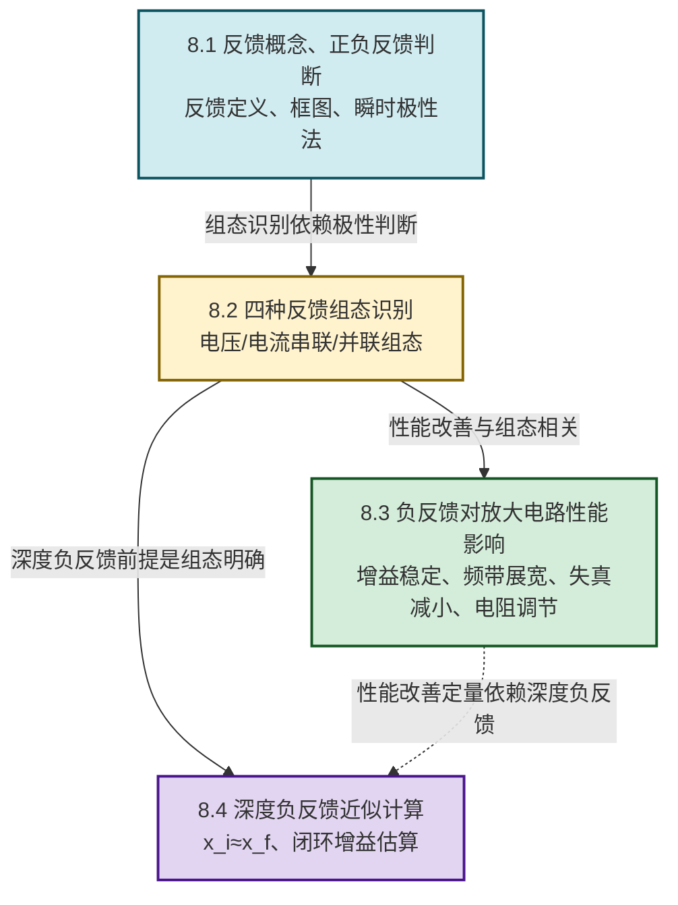

# MOC - 第8章 负反馈放大电路

> [!info] 本章定位
> 负反馈（Negative Feedback）是模拟电子技术的**核心设计思想**。本章要回答的核心问题是：**如何把放大电路的输出量（电压或电流）的一部分送回输入端，并使其削弱输入信号，从而以"牺牲增益"换取增益稳定性、频带展宽、非线性失真减小、输入输出电阻控制等多方面性能的改善？**
>
> 本章在 [[MOC - 第5章|第5章 双极型三极管及其放大电路]]（共射放大、分压式偏置稳定电路本身就是直流负反馈）、[[MOC - 第6章|第6章 场效应管与FET放大电路]]（FET 偏置稳定）和 [[MOC - 第7章|第7章 集成运算放大器基础]]（运放线性应用必须依赖深度负反馈）基础上展开：把"局部直流负反馈稳定 Q 点"上升为"系统化的反馈网络分析方法"，把"理想运放虚短虚断"明确归因为"深度负反馈下 $x_i\approx x_f$"。
>
> 本章是后续 [[MOC - 第9章|第9章 波形产生电路]]（正弦波振荡的起振条件 $|\dot A\dot F|>1$、相位平衡条件 $\Delta\varphi=2n\pi$）的对照基础——振荡器正是"正反馈 + 选频网络"，与本章负反馈形成对偶。本章也是评估 [[MOC - 第10章|第10章 直流稳压电源]] 中串联稳压电路稳定性的工具。

## 学习路线图

## 知识点导航

| 小节 | 标题 | 核心内容 | 关键物理量（SI单位） |
| ---- | ---- | -------- | -------------------- |
| [[8.1 反馈概念、正负反馈判断\|8.1]] | 反馈概念、正负反馈判断 | 反馈定义、基本框图（放大网络 $\dot A$、反馈网络 $\dot F$、比较环节）、闭环增益一般公式 $\dot A_f=\dfrac{\dot A}{1+\dot A\dot F}$、反馈深度 $D=1+\dot A\dot F$、瞬时极性法判正/负反馈 | 开环增益 $\dot A$（无量纲）、反馈系数 $\dot F$（无量纲）、反馈深度 $D$（无量纲） |
| [[8.2 四种反馈组态识别\|8.2]] | 四种反馈组态识别 | 电压串联（稳定输出电压、增大输入电阻）、电压并联、电流串联、电流并联（稳定输出电流）四种组态的判别法则（输出端短路法判电压/电流反馈、输入端比较方式判串联/并联反馈）及典型电路 | 反馈系数 $\dot F$（量纲随组态而异：$\Omega$、S 或无量纲） |
| [[8.3 负反馈对放大电路性能影响\|8.3]] | 负反馈对放大电路性能影响 | 增益稳定性提高 $D$ 倍、频带展宽 $D$ 倍、非线性失真减小 $D$ 倍、输入电阻（串联增 $D$ 倍、并联减 $D$ 倍）、输出电阻（电压减 $D$ 倍、电流增 $D$ 倍） | 频带 $BW$（Hz）、输入电阻 $R_{if}$（Ω）、输出电阻 $R_{of}$（Ω） |
| [[8.4 深度负反馈近似计算\|8.4]] | 深度负反馈近似计算 | 深度负反馈条件 $D=|1+\dot A\dot F|\gg1$、近似关系 $\dot A_f\approx1/\dot F$、$x_i\approx x_f$（串联反馈 $u_i\approx u_f$、并联反馈 $i_i\approx i_f$）、四种组态下的电压放大倍数估算 | 闭环电压增益 $\dot A_{uf}$（无量纲） |

## 核心考点

> [!summary] 本章核心考点（8 点）
> 1. **反馈的存在性判别**：看放大电路输出回路与输入回路之间是否存在连接通路（反馈支路）；若存在反馈支路但仅有直流通路（如旁路电容断开交流通路），则为直流反馈；若交流通路也存在，则为交流反馈。分压式偏置电路的发射极电阻 $R_e$ 是典型直流负反馈。
> 2. **正负反馈判别——瞬时极性法**：假定输入端瞬时极性为 $+$，沿信号流向逐级标注极性，反馈量送回输入端后若**增强**净输入信号则为正反馈，若**削弱**则为负反馈。共射电路基-集反相、共集电路基-射同相是判断的关键。
> 3. **四种组态判别法则**：输出端**短路**反馈信号若消失则为电压反馈，若仍存在则为电流反馈；输入端反馈量以**电压形式**与输入串联比较则为串联反馈，以**电流形式**并联比较则为并联反馈。
> 4. **闭环增益一般公式**：$\dot A_f=\dfrac{\dot A}{1+\dot A\dot F}$，反馈深度 $D=1+\dot A\dot F$。负反馈使 $|D|>1$、增益下降；正反馈使 $|D|<1$、增益上升；$|D|=0$ 时自激振荡。
> 5. **深度负反馈近似**：当 $|D|\gg1$ 时 $\dot A_f\approx\dfrac{1}{\dot F}$，闭环增益几乎只由反馈网络决定。这是运放线性应用的统一计算依据，也是"虚短虚断"的本质来源。
> 6. **性能改善与反馈深度的关系**：增益稳定性提高 $D$ 倍（$\dfrac{dA_f}{A_f}=\dfrac{1}{D}\dfrac{dA}{A}$）、频带展宽 $D$ 倍（$BW_f\approx D\cdot BW$）、非线性失真减小 $D$ 倍、信噪比改善（仅当噪声在反馈环内）。
> 7. **输入输出电阻的调节规律**：串联负反馈使输入电阻增大 $D$ 倍、并联负反馈使输入电阻减小 $D$ 倍；电压负反馈使输出电阻减小 $D$ 倍（稳定输出电压）、电流负反馈使输出电阻增大 $D$ 倍（稳定输出电流）。
> 8. **深度负反馈下的具体计算**：串联反馈 $u_i\approx u_f$、并联反馈 $i_i\approx i_f$，配合反馈系数定义（电压串联 $F=u_f/u_o$、电压并联 $F=i_f/u_o$、电流串联 $F=u_f/i_o$、电流并联 $F=i_f/i_o$）直接求 $\dot A_{uf}\approx1/F$（注意组态不同需转换）。

## 自测题

> [!question]- 自测 1：瞬时极性法判别
> 共射放大电路两级级联，第二级集电极经反馈电阻 $R_f$ 接回第一级基极。判断反馈极性。
>
> > [!check]- 答案
> > 设第一级基极瞬时极性为 $+$，则其集电极为 $-$（共射反相）；第二级基极为 $-$，其集电极为 $+$（再次反相）；反馈电流从第二级集电极（$+$）经 $R_f$ 流入第一级基极（$+$），与输入信号电流同向，**增强**净输入电流，故为**正反馈**。

> [!question]- 自测 2：四种组态识别
> 运放反相输入端经 $R_1$ 接输入信号 $u_i$、经 $R_f$ 接输出 $u_o$，同相端接地。判断反馈组态。
>
> > [!check]- 答案
> > - **输出端短路**（$u_o=0$）：$R_f$ 直接接地，反馈电流 $i_f=u_o/R_f=0$，反馈消失，故为**电压反馈**；
> > - 输入端反馈以电流 $i_f$ 形式与输入电流 $i_i$ 在反相节点并联比较，故为**并联反馈**；
> > - 极性：$u_i$ 增大使反相端电位升高，输出 $u_o$ 下降（反相放大），反馈电流 $i_f=(u_--u_o)/R_f$ 流出反相节点，**削弱**净输入电流 $i_d=i_i-i_f$，故为**负反馈**。
> > 综合为**电压并联负反馈**。

> [!question]- 自测 3：深度负反馈增益
> 电压串联负反馈电路，反馈系数 $F=0.05$，开环增益 $A=10^4$。求闭环增益 $A_f$ 并验证深度负反馈近似成立。
>
> > [!check]- 答案
> > 反馈深度 $D=1+AF=1+10^4\times0.05=501\gg1$，深度负反馈近似成立。
> > 精确值：$A_f=\dfrac{A}{1+AF}=\dfrac{10^4}{501}\approx19.96$；
> > 近似值：$A_f\approx\dfrac{1}{F}=\dfrac{1}{0.05}=20$；
> > 相对误差 $\dfrac{20-19.96}{19.96}\approx0.2\%$，近似精度满足工程要求。

> [!question]- 自测 4：频带展宽
> 开环放大电路 $A=10^3$、$BW=10\,\text{kHz}$，引入 $F=0.09$ 的负反馈。求闭环增益 $A_f$ 与闭环频带 $BW_f$（设增益带宽积近似不变）。
>
> > [!check]- 答案
> > $D=1+AF=1+10^3\times0.09=91$。
> > $A_f=A/D=10^3/91\approx11.0$；
> > $BW_f\approx D\cdot BW=91\times10\,\text{kHz}=910\,\text{kHz}$；
> > 验证增益带宽积：$A\cdot BW=10^3\times10=10^4\,\text{kHz}$，$A_f\cdot BW_f\approx11.0\times910\approx1.0\times10^4\,\text{kHz}$，近似不变 ✓。

## 章节导航

> [!nav] 导航
> 上级：[[MOC - 电路与模拟电子技术|课程总览]]
> 先修：[[MOC - 第5章|第5章 双极型三极管及其放大电路]]（分压式偏置直流负反馈）、[[MOC - 第7章|第7章 集成运算放大器基础]]（运放线性应用依赖深度负反馈）
> 下一章：[[MOC - 第9章|第9章 波形产生电路]]（振荡器为正反馈的对照应用）
> 关联：[[MOC - 第10章|第10章 直流稳压电源]]（稳压电路稳定性分析）
> 配套习题：[[MOC - 第8章习题|第8章 习题]]
