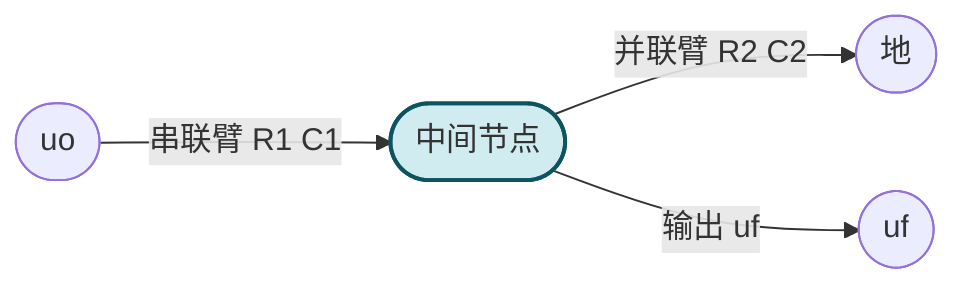
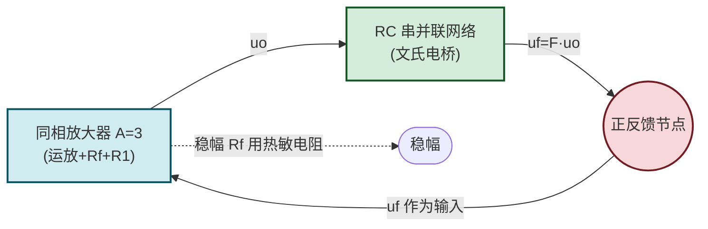

# 9.1 RC 桥式正弦波振荡电路

> [!abstract] 本节概述
> RC 桥式正弦波振荡电路（Wien 桥振荡器）是产生低频正弦信号（$1\,\text{Hz}\sim1\,\text{MHz}$）的经典电路。它由**同相放大器**（提供增益 $\dot A$）与**RC 串并联选频网络**（提供反馈系数 $\dot F$ 且具有选频特性）组成，仅在谐振频率 $f_0=1/(2\pi RC)$ 处同时满足相位平衡与幅度平衡条件，从而产生单一频率的正弦波。本节建立正弦波振荡的统一条件，并给出文氏电桥的具体实现与稳幅措施。

## 一、正弦波振荡的统一条件

> [!theorem] 自激振荡的条件
> 正弦波振荡电路本质上是一个满足自激振荡条件的正反馈放大电路。由 [[8.1 反馈概念、正负反馈判断|8.1]] 闭环增益公式 $\dot A_f=\dfrac{\dot A}{1+\dot A\dot F}$，当 $1+\dot A\dot F=0$ 即 $\dot A\dot F=-1$ 时 $|\dot A_f|\to\infty$，电路自激振荡。分为两个条件：
> 1. **相位平衡条件**：$\Delta\varphi=\varphi_A+\varphi_F=2n\pi$（$n=0,\pm1,\pm2,\ldots$），即环路总相移为 $2\pi$ 的整数倍，保证反馈为正反馈；
> 2. **幅度平衡条件**：$|\dot A\dot F|=1$，环路增益模为 1，信号经一周回到原值。

> [!definition] 起振条件与稳幅
> - **起振条件**：$|\dot A\dot F|>1$。开机时电路中的微小噪声被反复放大，幅度逐渐增长；
> - **稳态条件**：$|\dot A\dot F|=1$。幅度增大到非线性区时放大器增益 $A$ 自动下降（或稳幅电路作用），使 $|AF|$ 从 $>1$ 降到 $=1$，维持等幅振荡；
> - **稳幅方式**：利用放大器自身的非线性（晶体管饱和/截止）、外接非线性元件（热敏电阻、二极管、稳压管）、自动增益控制（AGC）电路。

## 二、RC 串并联选频网络

### 2.1 网络结构

> [!definition] RC 串并联网络
> 输入电压 $u_o$（放大器输出）加在 RC 串并联网络上，输出 $u_f$（反馈电压）从并联臂取出。通常取 $R_1=R_2=R$、$C_1=C_2=C$（对称设计）。

### 2.2 传输系数（反馈系数）

> [!theorem] 文氏电桥传输系数
> 对称 RC 串并联网络的传输系数（即反馈系数）：
> $$\dot F=\frac{\dot U_f}{\dot U_o}=\frac{1}{3+j\left(\omega RC-\dfrac{1}{\omega RC}\right)}$$
> 模与相角：
> $$|F|=\frac{1}{\sqrt{9+\left(\omega RC-\dfrac{1}{\omega RC}\right)^2}},\quad \varphi_F=-\arctan\frac{\omega RC-\dfrac{1}{\omega RC}}{3}$$

> [!theorem] 谐振频率与谐振传输系数
> 当 $\omega RC=\dfrac{1}{\omega RC}$ 即 $\omega_0=\dfrac{1}{RC}$ 时：
> - 相移 $\varphi_F=0$（满足相位平衡条件的关键）；
> - 模 $|F|_{\max}=\dfrac{1}{3}$（最大传输系数）；
> - 谐振频率 $f_0=\dfrac{1}{2\pi RC}$。
> 在 $f_0$ 处 $\dot F$ 为正实数 $\dfrac{1}{3}$，反馈为正反馈且传输系数最大，这正是选频的物理本质。

### 2.3 选频特性曲线

> [!note] 选频特性
> - 当 $f=f_0$ 时 $|F|=1/3$、$\varphi_F=0$，满足振荡条件；
> - 当 $f\ne f_0$ 时 $|F|<1/3$ 且 $\varphi_F\ne0$，无法同时满足相位与幅度条件；
> - 网络的 Q 值较低（约 1/3），选频能力不如 LC 振荡器，但适合低频应用。

## 三、RC 桥式振荡电路组成

> [!definition] RC 桥式振荡电路组成
> 1. **同相放大器**：运放同相输入，反馈电阻 $R_f$ 与 $R_1$ 构成同相比例放大，增益 $A=1+R_f/R_1$；
> 2. **RC 串并联选频网络**：输出 $u_o$ 经 RC 网络得到反馈电压 $u_f$，$u_f$ 接到运放同相输入端（正反馈）；
> 3. **稳幅环节**：$R_f$ 用负温度系数热敏电阻（或 $R_1$ 用正温度系数），幅度增大时 $R_f$ 阻值变化使 $A$ 下降，自动维持 $|AF|=1$。

## 四、振荡频率与起振条件

> [!theorem] 振荡频率
> 由相位平衡条件 $\varphi_A+\varphi_F=0$（同相放大器 $\varphi_A=0$，文氏电桥 $\varphi_F=0$ 仅在 $f_0$ 处成立）：
> $$\boxed{\,f_0=\frac{1}{2\pi RC}\,}$$
> 调节 $R$（电位器）可连续调频，调节 $C$（波段开关）可换挡。

> [!theorem] 起振条件
> 在 $f_0$ 处 $|F|=1/3$，由起振条件 $|AF|>1$ 得：
> $$|A|>\frac{1}{|F|}=3\Rightarrow A=1+\frac{R_f}{R_1}>3\Rightarrow R_f>2R_1$$
> 即同相放大器增益略大于 3 即可起振。稳态时 $A=3$，$R_f=2R_1$。

## 五、稳幅措施

### 5.1 热敏电阻稳幅

> [!tip] 负温度系数热敏电阻稳幅
> - 将 $R_f$ 用负温度系数（NTC）热敏电阻替代；
> - 起振时 $u_o$ 小、$R_f$ 冷态阻值大、$A>3$，满足起振条件；
> - 幅度增大时 $R_f$ 上功耗增大、温度升高、阻值下降，使 $A$ 下降到 3，达到稳态；
> - 优点：波形好、失真小；缺点：响应慢（热惯性）、受环境温度影响。

### 5.2 二极管稳幅

> [!tip] 二极管自动稳幅
> - 在 $R_f$ 两端并联两只反向并联的二极管（或二极管-电阻网络）；
> - 幅度小时二极管不导通，$A>3$ 起振；
> - 幅度大时二极管导通，等效并联电阻减小，$A$ 下降到 3 稳幅；
> - 优点：响应快、电路简单；缺点：二极管非线性引入一定失真。

### 5.3 场效应管稳幅

> [!note] 场效应管压控电阻稳幅
> - 输出电压经整流滤波得到与幅度成正比的直流电压，控制 FET 栅极；
> - FET 工作在可变电阻区，作为压控电阻调节反馈系数；
> - 优点：稳幅精度高、失真小；缺点：电路复杂。

## 六、典型例题

### 例题 1：振荡频率与元件参数

> [!example] 题目
> 设计 RC 桥式振荡器，要求 $f_0=1\,\text{kHz}$，选 $C=0.01\,\mu\text{F}$。求 $R$ 与 $R_f/R_1$。

**解**：

1. $R=\dfrac{1}{2\pi f_0 C}=\dfrac{1}{2\pi\times10^3\times0.01\times10^{-6}}=\dfrac{1}{2\pi\times10^{-5}}\approx15.9\,\text{k}\Omega$（取标称值 $16\,\text{k}\Omega$）。
2. 起振条件 $A>3$，取 $A=3.05$，$R_f=2.05 R_1$。选 $R_1=10\,\text{k}\Omega$、$R_f=20.5\,\text{k}\Omega$（或用 $20\,\text{k}\Omega$ 电位器调节）。

**单位检验**：$R$ 单位 Ω，$1/(2\pi f C)$ 单位 $1/(\text{Hz}\cdot\text{F})=1/(\text{s}^{-1}\cdot\text{s/}\Omega)=\Omega$，自洽。

### 例题 2：频率调节范围

> [!example] 题目
> RC 桥式振荡器 $C=0.1\,\mu\text{F}$，$R$ 用双联电位器 $1\sim100\,\text{k}\Omega$。求频率调节范围。

**解**：

1. $f_{\min}=\dfrac{1}{2\pi R_{\max}C}=\dfrac{1}{2\pi\times10^5\times10^{-7}}\approx15.9\,\text{Hz}$；
2. $f_{\max}=\dfrac{1}{2\pi R_{\min}C}=\dfrac{1}{2\pi\times10^3\times10^{-7}}\approx1591.5\,\text{Hz}\approx1.59\,\text{kHz}$；
3. 频率调节范围约 $15.9\,\text{Hz}\sim1.59\,\text{kHz}$，覆盖比约 100:1。

**单位检验**：$1/(RC)$ 单位 $1/(\Omega\cdot\text{F})=1/(\Omega\cdot\text{s/}\Omega)=\text{s}^{-1}=\text{Hz}$，自洽。

## 七、易错点

> [!warning] 易错点
> 1. **混淆相位条件与幅度条件**：相位条件决定振荡频率（仅在 $f_0$ 满足 $\varphi_F=0$），幅度条件决定是否能起振（$|AF|>1$）；
> 2. **混淆起振条件与稳态条件**：起振时 $|AF|>1$，稳态时 $|AF|=1$，二者通过稳幅环节衔接；
> 3. **放大器增益方向**：文氏电桥用**同相**放大器（$\varphi_A=0$ 配合 $\varphi_F=0$），若用反相放大器则 $\varphi_A=180^\circ$ 不满足相位条件；
> 4. **振荡频率公式**：$f_0=1/(2\pi RC)$ 仅在对称网络（$R_1=R_2$、$C_1=C_2$）下成立；
> 5. **稳幅环节不可省**：若无稳幅，幅度增长到运放饱和，输出为方波而非正弦波；
> 6. **频率上限受运放带宽限制**：$f_0$ 超过运放 GBW/A 时无法起振，高频应用需用 LC 振荡器。

## 八、与其他小节的联系

- 自激振荡条件是 [[8.1 反馈概念、正负反馈判断|8.1]] 闭环增益公式 $D=0$ 的特殊情况；
- 同相放大器分析见 [[7.2 反相比例、同相比例运算电路|7.2]]；
- 稳幅二极管限幅见 [[4.3 二极管整流、限幅电路|4.3]]；
- 稳压管稳幅见 [[4.4 稳压二极管工作原理与稳压电路|4.4]]；
- 方波与三角波产生见 [[9.2 方波、三角波发生器|9.2]]；
- 高频振荡与晶振见 [[9.3 石英晶体振荡简介|9.3]]。

## 章节导航

- 上一级：[[MOC - 第9章]]
- 下一节：[[9.2 方波、三角波发生器]]
- 习题：[[MOC - 第9章习题]]
