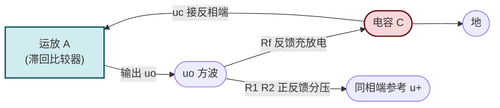
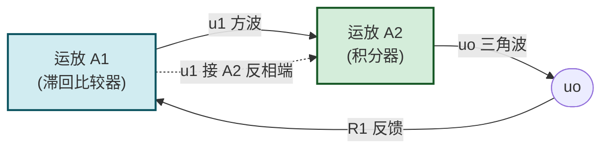

# 9.2 方波、三角波发生器

> [!abstract] 本节概述
> 方波与三角波发生器属于**弛张振荡器**，通过储能元件（电容）的充放电与比较器的状态翻转产生周期信号。本节给出运放构成的方波发生器（滞回比较器 + RC 定时）与三角波发生器（滞回比较器 + 积分器）的工作原理、周期公式与频率调节方法。这是 [[7.4 电压比较器|7.4]] 滞回比较器与 [[7.3 加法、减法、积分、微分运算电路|7.3]] 积分器的典型综合应用。

## 一、方波发生器

### 1.1 电路结构

> [!definition] 方波发生器组成
> 1. **滞回比较器**：运放开环或正反馈组态，输出在 $\pm U_{OM}$ 之间跳变（$U_{OM}$ 为输出饱和电压或经稳压管钳位的值）；
> 2. **RC 定时网络**：输出 $u_o$ 经 $R_f$ 对电容 $C$ 充放电，电容电压 $u_c$ 接运放反相输入端；
> 3. **正反馈分压**：$u_o$ 经 $R_1$、$R_2$ 分压得到同相端电位 $u_+$，形成滞回特性。

### 1.2 工作原理

> [!theorem] 方波发生器工作过程
> 1. 设初始 $u_o=+U_{OM}$，则 $u_+=+\dfrac{R_1}{R_1+R_2}U_{OM}=+U_{T+}$（上门限）；
> 2. $u_o$ 经 $R_f$ 对 $C$ 充电，$u_c$ 按指数规律趋近 $+U_{OM}$；
> 3. 当 $u_c$ 升至 $u_c\ge U_{T+}$ 时，比较器翻转，$u_o=-U_{OM}$，$u_+=-U_{T-}$（下门限）；
> 4. $C$ 经 $R_f$ 放电并反向充电，$u_c$ 趋向 $-U_{OM}$；
> 5. 当 $u_c$ 降至 $u_c\le -U_{T-}$ 时，比较器再次翻转，$u_o=+U_{OM}$；
> 6. 如此循环，输出方波。

### 1.3 周期与频率公式

> [!theorem] 方波周期
> 电容充放电的暂态方程 $u_c(t)=u_c(\infty)+(u_c(0)-u_c(\infty))e^{-t/\tau}$，$\tau=R_f C$。结合两个门限 $U_{T+}=\dfrac{R_1}{R_1+R_2}U_{OM}$ 与 $U_{T-}=-\dfrac{R_1}{R_1+R_2}U_{OM}$（对称滞回），充放电各占半周期：
> $$T_1=T_2=\tau\ln\frac{U_{OM}+U_{T+}}{U_{OM}-U_{T+}}=R_f C\ln\left(1+\frac{2R_1}{R_2}\right)$$
> 总周期：
> $$\boxed{\,T=2R_f C\ln\left(1+\frac{2R_1}{R_2}\right)\,}$$
> 频率 $f=1/T$。方波占空比 50%（对称电路）。

> [!tip] 频率调节
> - 调 $R_f$ 或 $C$ 改变充放电时间常数，连续调频；
> - 调 $R_1/R_2$ 改变门限，也影响频率；
> - 若需非对称方波（占空比可调），用两只二极管将充电与放电回路分开，分别用 $R_{f1}$、$R_{f2}$ 调节。

### 1.4 输出幅度

> [!note] 输出幅度
> - 不接稳压管：$U_{OM}$ 为运放饱和电压，约 $\pm(U_{CC}-1\sim2)\,\text{V}$，受电源与负载影响；
> - 接稳压管钳位：输出经限流电阻接反向串联稳压管，$U_{OM}=\pm U_Z$（$U_Z$ 为稳压值），幅度稳定且可精确设定。详见 [[4.4 稳压二极管工作原理与稳压电路|4.4]]。

## 二、三角波发生器

### 2.1 电路结构

> [!definition] 三角波发生器组成
> 1. **第一级滞回比较器**：产生方波 $u_1$，其门限由输出 $u_o$ 反馈决定；
> 2. **第二级积分器**：对 $u_1$ 积分，$u_o=-\dfrac{1}{RC}\int u_1\,dt$。方波积分得到三角波；
> 3. **闭环反馈**：积分器输出 $u_o$ 反馈到比较器输入端，形成闭环振荡。

### 2.2 工作原理

> [!theorem] 三角波发生器工作过程
> 1. 设 $u_1=+U_{Z}$，积分器反向积分，$u_o$ 线性下降：$u_o(t)=u_o(0)-\dfrac{U_Z}{RC}t$；
> 2. 当 $u_o$ 降至比较器下门限 $-U_{T}$ 时，比较器翻转，$u_1=-U_Z$；
> 3. 积分器正向积分，$u_o$ 线性上升：$u_o(t)=u_o(t_1)+\dfrac{U_Z}{RC}(t-t_1)$；
> 4. 当 $u_o$ 升至比较器上门限 $+U_T$ 时，比较器再次翻转，$u_1=+U_Z$；
> 5. 如此循环，$u_o$ 为三角波，$u_1$ 为方波。

### 2.3 周期与幅度公式

> [!theorem] 三角波幅度与周期
> 设比较器输出经稳压管钳位为 $\pm U_Z$，门限 $\pm U_T=\pm\dfrac{R_1}{R_2}U_Z$（由 $R_1$、$R_2$ 分压决定）：
> - **三角波幅度**：$U_{om}=U_T=\dfrac{R_1}{R_2}U_Z$；
> - **半周期**：积分器从 $-U_T$ 积到 $+U_T$，$\Delta u_o=2U_T=\dfrac{U_Z}{RC}\cdot\dfrac{T}{2}$，故：
> $$T_1=T_2=\frac{2RC\cdot U_T}{U_Z}=\frac{2RC\cdot R_1}{R_2}$$
> - **总周期**：
> $$\boxed{\,T=\frac{4R_1 R C}{R_2}\,}$$
> - **频率** $f=\dfrac{R_2}{4R_1 RC}$。

> [!tip] 三角波发生器调节
> - 调 $R$（积分电阻）或 $C$ 改变积分斜率，连续调频；
> - 调 $R_1/R_2$ 同时改变门限与频率，影响幅度；
> - 改变 $U_Z$ 改变幅度（需重新校准频率）。

## 三、锯齿波发生器

> [!definition] 锯齿波发生器
> 锯齿波是三角波的非对称变体：上升斜率与下降斜率不同。在积分器输入端用二极管将正反向积分通路分开，分别用不同电阻 $R_{\text{slow}}$、$R_{\text{fast}}$ 控制充放电速率，即可产生锯齿波。常用于示波器扫描电压。

## 四、典型例题

### 例题 1：方波发生器参数计算

> [!example] 题目
> 方波发生器 $R_1=10\,\text{k}\Omega$、$R_2=20\,\text{k}\Omega$、$R_f=100\,\text{k}\Omega$、$C=0.1\,\mu\text{F}$，稳压管 $U_Z=\pm6\,\text{V}$。求：(1) 振荡频率 $f$；(2) 输出幅度；(3) 电容电压峰峰值。

**解**：

1. $T=2R_f C\ln\left(1+\dfrac{2R_1}{R_2}\right)=2\times10^5\times10^{-7}\times\ln\left(1+\dfrac{20}{20}\right)=0.02\times\ln2\approx0.01386\,\text{s}=13.86\,\text{ms}$。
2. $f=1/T\approx72.2\,\text{Hz}$。
3. 输出幅度（稳压管钳位）$\pm6\,\text{V}$，峰峰值 $12\,\text{V}$。
4. 门限 $U_T=\dfrac{R_1}{R_1+R_2}U_Z=\dfrac{10}{30}\times6=2\,\text{V}$，电容电压在 $\pm2\,\text{V}$ 之间变化，峰峰值 $4\,\text{V}$。

**单位检验**：$R_f C$ 单位 s，$\ln$ 无量纲，$T$ 单位 s 自洽；$R_1/(R_1+R_2)\cdot U_Z$ 单位 V，自洽。

### 例题 2：三角波发生器参数设计

> [!example] 题目
> 设计三角波发生器，要求 $f=1\,\text{kHz}$、三角波幅度 $\pm3\,\text{V}$，稳压管 $U_Z=\pm6\,\text{V}$。确定 $R_1$、$R_2$、$R$、$C$。

**解**：

1. 由幅度 $U_T=\dfrac{R_1}{R_2}U_Z=3\,\text{V}$，得 $\dfrac{R_1}{R_2}=\dfrac{3}{6}=0.5$，选 $R_2=20\,\text{k}\Omega$、$R_1=10\,\text{k}\Omega$。
2. 由频率 $f=\dfrac{R_2}{4R_1 RC}=\dfrac{1}{4\times0.5\times RC}=\dfrac{1}{2RC}=10^3\,\text{Hz}$，得 $RC=\dfrac{1}{2000}=5\times10^{-4}\,\text{s}=0.5\,\text{ms}$。
3. 选 $C=0.01\,\mu\text{F}$，则 $R=\dfrac{5\times10^{-4}}{10^{-8}}=50\,\text{k}\Omega$。
4. 验算：$T=4R_1 RC/R_2=4\times10^4\times5\times10^{-4}/(2\times10^4)=10^{-3}\,\text{s}=1\,\text{ms}$，$f=1\,\text{kHz}$ ✓。

**单位检验**：$RC$ 单位 s，$R_1/R_2$ 无量纲，$T$ 单位 s，自洽。

### 例题 3：占空比可调方波

> [!example] 题目
> 方波发生器要求占空比 $D=25\%$（高电平时间占周期 25%），$f=1\,\text{kHz}$，$U_Z=\pm6\,\text{V}$，$R_1=10\,\text{k}\Omega$、$R_2=20\,\text{k}\Omega$。设计充放电电阻 $R_{f1}$（充电）、$R_{f2}$（放电）与电容 $C$。

**解**：

1. 门限 $U_T=2\,\text{V}$（同例 1）。
2. 充电时间（高电平）$T_H=R_{f1}C\ln\left(1+\dfrac{2R_1}{R_2}\right)=R_{f1}C\ln2$。
3. 放电时间（低电平）$T_L=R_{f2}C\ln2$。
4. 占空比 $D=\dfrac{T_H}{T_H+T_L}=\dfrac{R_{f1}}{R_{f1}+R_{f2}}=0.25$，得 $R_{f2}=3R_{f1}$。
5. 周期 $T=T_H+T_L=(R_{f1}+R_{f2})C\ln2=4R_{f1}C\ln2=1\,\text{ms}$。
6. 选 $C=0.01\,\mu\text{F}$，$R_{f1}=\dfrac{10^{-3}}{4\times10^{-8}\times\ln2}\approx36.1\,\text{k}\Omega$，$R_{f2}\approx108.3\,\text{k}\Omega$。

**单位检验**：$RC\ln$ 单位 s，自洽。

## 五、易错点

> [!warning] 易错点
> 1. **混淆方波发生器与正弦波振荡器**：方波发生器靠 RC 充放电与比较器翻转，无选频网络，输出是方波而非正弦波；
> 2. **周期公式记忆错误**：方波 $T=2R_f C\ln(1+2R_1/R_2)$、三角波 $T=4R_1 RC/R_2$，二者不同；
> 3. **三角波幅度与方波幅度混淆**：三角波幅度由门限 $U_T$ 决定，方波幅度由稳压管 $U_Z$ 决定，二者不同；
> 4. **积分器方向**：积分器反相，正向输入时输出下降，方向判断错误会导致工作过程分析错误；
> 5. **运放带宽与压摆率限制**：高频方波要求运放压摆率 $SR>4U_Z f$（保证上升沿陡峭），否则方波退化为梯形波；
> 6. **比较器响应时间**：高速方波需用专用比较器而非普通运放，详见 [[7.5 运放使用注意事项|7.5]]。

## 六、与其他小节的联系

- 滞回比较器是方波发生器核心，见 [[7.4 电压比较器|7.4]]；
- 积分器是三角波发生器核心，见 [[7.3 加法、减法、积分、微分运算电路|7.3]]；
- 稳压管钳位见 [[4.4 稳压二极管工作原理与稳压电路|4.4]]；
- RC 正弦波振荡见 [[9.1 RC 桥式正弦波振荡电路|9.1]]；
- 石英晶体振荡见 [[9.3 石英晶体振荡简介|9.3]]；
- 运放压摆率限制见 [[7.5 运放使用注意事项|7.5]]。

## 章节导航

- 上一级：[[MOC - 第9章]]
- 上一节：[[9.1 RC 桥式正弦波振荡电路]]
- 下一节：[[9.3 石英晶体振荡简介]]
- 习题：[[MOC - 第9章习题]]
