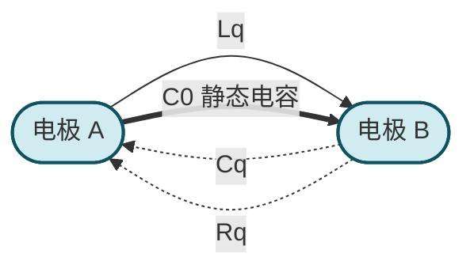
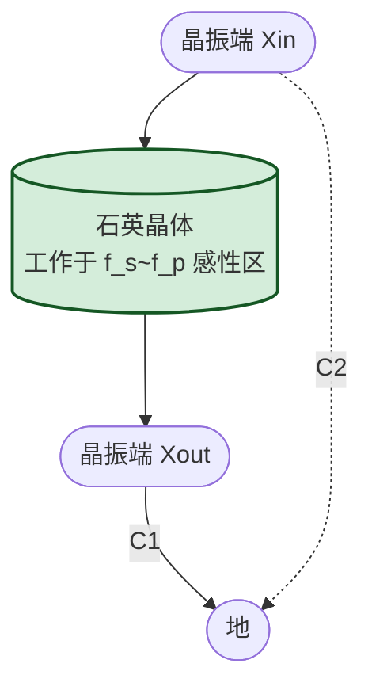

# 9.3 石英晶体振荡简介

> [!abstract] 本节概述
> 石英晶体振荡器（晶振）利用石英晶体的**压电效应**与**机械谐振**特性，在谐振频率附近呈现极高的等效 Q 值（$10^4\sim10^6$），使振荡频率稳定度达 $10^{-6}\sim10^{-12}$，远超 RC 与 LC 振荡器。本节简介石英晶体的压电效应、等效电路、两个谐振频率（串联 $f_s$ 与并联 $f_p$）及典型振荡电路（串联型与并联型），作为高频高稳定信号源的基础知识。

## 一、压电效应

> [!definition] 压电效应
> 石英（SiO₂ 晶体）是各向异性材料，按特定方位切下的晶片具有**压电效应**：
> - **正压电效应**：机械应力使晶片变形时，其表面产生与应变成正比的电荷（电压）；
> - **逆压电效应**：在晶片两电极加电压时，晶片产生与电压成正比的机械变形。
> 当外加交变电压频率等于晶片的机械谐振频率时，振幅最大，呈现谐振特性。机械谐振频率由晶片尺寸与切割方位决定，非常稳定。

## 二、石英晶体的等效电路

> [!definition] 石英晶体等效电路
> 石英晶体在电路中的等效电路由两条并联支路组成：
> 1. **串联谐振支路**（机械谐振）：电感 $L_q$（动态电感，亨利级）、电容 $C_q$（动态电容，fF-pF 级）、电阻 $R_q$（机械损耗，数十欧至千欧）串联，反映晶片的机械谐振；
> 2. **静态电容 $C_0$**（电极间电容与支架电容）：pF 级，与串联支路并联。
> $L_q$、$C_q$、$R_q$ 也称"动生参数"。

> [!info] 典型参数（1 MHz AT 切晶片）
> | 参数 | 典型值 | 物理意义 |
> | ---- | ------ | -------- |
> | $L_q$ | $1\sim10\,\text{H}$ | 动态电感（机械惯性等效） |
> | $C_q$ | $0.01\sim0.1\,\text{pF}$ | 动态电容（机械弹性等效） |
> | $R_q$ | $10\sim1000\,\Omega$ | 机械损耗（阻尼等效） |
> | $C_0$ | $1\sim10\,\text{pF}$ | 静态电极电容 |
> | $Q$ | $10^4\sim10^6$ | 品质因数，远高于 LC 回路 |

## 三、两个谐振频率

> [!theorem] 串联谐振频率
> 串联支路 $L_q$-$C_q$-$R_q$ 的谐振频率：
> $$\boxed{\,f_s=\frac{1}{2\pi\sqrt{L_q C_q}}\,}$$
> 在 $f_s$ 处串联支路阻抗最小（约 $R_q$），晶体呈纯阻性。

> [!theorem] 并联谐振频率
> $L_q$-$C_q$ 串联后与 $C_0$ 并联的谐振频率：
> $$\boxed{\,f_p=\frac{1}{2\pi\sqrt{L_q\dfrac{C_q C_0}{C_q+C_0}}}=f_s\sqrt{1+\frac{C_q}{C_0}}\,}$$
> 在 $f_p$ 处并联支路阻抗最大。由于 $C_q\ll C_0$，$f_p$ 略高于 $f_s$：
> $$f_p\approx f_s\left(1+\frac{C_q}{2C_0}\right)$$
> 相对差 $\dfrac{f_p-f_s}{f_s}\approx\dfrac{C_q}{2C_0}$，典型值 $0.05\%\sim0.5\%$。

> [!note] 频率区间的电抗特性
> | 频率区间 | 晶体电抗 | 等效特性 |
> | -------- | -------- | -------- |
> | $f<f_s$ | 容性 | 电容性 |
> | $f=f_s$ | 阻性（最小） | 串联谐振 |
> | $f_s<f<f_p$ | 感性 | 电感性（关键工作区） |
> | $f=f_p$ | 阻性（最大） | 并联谐振 |
> | $f>f_p$ | 容性 | 电容性 |

> [!theorem] 品质因数
> $$Q=\frac{1}{R_q}\sqrt{\frac{L_q}{C_q}}=\frac{\omega_0 L_q}{R_q}$$
> 由于 $L_q$ 大（亨利级）、$C_q$ 小（fF 级）、$R_q$ 小（百欧级），$Q$ 可达 $10^4\sim10^6$，远高于 LC 回路（$Q\sim10^2$）。这是晶振频率稳定度极高的物理根源。

## 四、石英晶体振荡电路

### 4.1 并联型晶振（Pierce 振荡器）

> [!definition] 并联型晶振
> - 晶体作为**电感**接入电容三点式（Colpitts）振荡电路，工作频率在 $f_s<f<f_p$ 区间；
> - 晶体与外接电容 $C_1$、$C_2$ 构成 LC 谐振回路，晶体等效电感由频率决定；
> - 振荡频率 $f_0$ 接近 $f_s$（略高），由晶体参数主导，外接电容微调；
> - 典型电路：Pierce 振荡器（晶体接在反相器输出与输入之间）、Colpitts 晶振。

### 4.2 串联型晶振

> [!definition] 串联型晶振
> - 晶体接在放大器输出与输入之间的正反馈通路中，工作频率为 $f_s$；
> - 在 $f_s$ 处晶体阻抗最小（约 $R_q$），正反馈最强，满足振荡条件；
> - 偏离 $f_s$ 时晶体阻抗急剧增大，反馈不足，无法起振；
> - 典型电路：晶体接在两级共射放大器之间的正反馈支路。

### 4.3 两种类型对比

> [!summary] 并联型与串联型晶振对比
> | 特性 | 并联型 | 串联型 |
> | ---- | ------ | ------ |
> | 工作频率 | $f_s<f_0<f_p$（接近 $f_s$） | $f_0=f_s$ |
> | 晶体等效 | 电感 | 短路（低阻） |
> | 典型电路 | Pierce、Colpitts | 两级放大正反馈 |
> | 频率微调 | 调外接电容 $C_1$、$C_2$ | 串联微调电容 |
> | 应用 | 微处理器时钟、单片机 | 精密频率标准、滤波器 |

## 五、频率稳定度

> [!theorem] 晶振频率稳定度
> 晶振的频率稳定度 $\dfrac{\Delta f}{f_0}$ 可达 $10^{-6}\sim10^{-12}$（取决于切割类型与恒温条件）：
> | 类型 | 稳定度 | 温度系数 |
> | ---- | ------ | -------- |
> | 普通晶振（XO） | $10^{-5}\sim10^{-6}$ | AT 切约 $10^{-6}/^\circ\text{C}$ |
> | 温度补偿晶振（TCXO） | $10^{-7}\sim10^{-8}$ | 内置热敏网络补偿 |
> | 恒温晶振（OCXO） | $10^{-9}\sim10^{-12}$ | 晶体置于恒温槽 |
> | 铷原子钟 | $10^{-11}\sim10^{-12}$ | 原子跃迁参考 |

> [!info] AT 切与频率温度特性
> AT 切（AT-cut）晶片在 $-10\sim60^\circ\text{C}$ 范围内频率温度系数呈三次曲线，在 $25^\circ\text{C}$ 附近接近零，是室温应用最常用的切割方式。其他切割（BT、CT、DT 等）适用于不同温度范围与频率范围。

## 六、典型例题

### 例题 1：谐振频率计算

> [!example] 题目
> 石英晶体 $L_q=5\,\text{H}$、$C_q=0.05\,\text{pF}$、$C_0=10\,\text{pF}$、$R_q=100\,\Omega$。求 $f_s$、$f_p$、$Q$。

**解**：

1. $f_s=\dfrac{1}{2\pi\sqrt{L_q C_q}}=\dfrac{1}{2\pi\sqrt{5\times0.05\times10^{-12}}}=\dfrac{1}{2\pi\sqrt{2.5\times10^{-13}}}\approx\dfrac{1}{2\pi\times5\times10^{-7}}\approx318.3\,\text{kHz}$。
2. $f_p=f_s\sqrt{1+C_q/C_0}=f_s\sqrt{1+0.05/10}=f_s\sqrt{1.005}\approx f_s\times1.0025\approx319.1\,\text{kHz}$。
3. $Q=\dfrac{1}{R_q}\sqrt{\dfrac{L_q}{C_q}}=\dfrac{1}{100}\sqrt{\dfrac{5}{5\times10^{-14}}}=\dfrac{1}{100}\sqrt{10^{14}}=\dfrac{10^7}{100}=10^5$。

**单位检验**：$f$ 单位 Hz，$Q$ 无量纲，自洽。

### 例题 2：晶振频率稳定度

> [!example] 题目
> 标称频率 $f_0=10\,\text{MHz}$ 的晶振，稳定度 $\dfrac{\Delta f}{f_0}=10^{-7}$。求频率偏差范围。

**解**：

$\Delta f=f_0\times10^{-7}=10^7\times10^{-7}=1\,\text{Hz}$。频率范围 $10\,\text{MHz}\pm1\,\text{Hz}$，相对精度 $10^{-7}$。

**单位检验**：$f\cdot\dfrac{\Delta f}{f}$ 单位 Hz，自洽。

## 七、易错点

> [!warning] 易错点
> 1. **混淆 $f_s$ 与 $f_p$**：$f_s$ 是串联支路谐振（阻抗最小），$f_p$ 是并联谐振（阻抗最大），$f_p>f_s$；
> 2. **混淆串联型与并联型晶振工作频率**：串联型工作在 $f_s$，并联型工作在 $f_s\sim f_p$ 区间；
> 3. **忽略 $C_0$ 的作用**：$C_0$ 使晶体有两个谐振频率，仅考虑串联支路会遗漏 $f_p$；
> 4. **误用 LC 回路公式**：晶振的等效 $L_q$、$C_q$ 是机械参数的电气等效，与实际电感电容不同，不能用普通 LC 公式直接估算；
> 5. **忽略负载电容**：并联型晶振的标称频率是在指定负载电容 $C_L$（如 $12\,\text{pF}$、$20\,\text{pF}$）下定义的，外接电容不匹配会引起频率偏差；
> 6. **混淆稳定度与精度**：稳定度是温度/时间引起的频率变化，精度是标称值与实际值的偏差，二者不同。

## 八、与其他小节的联系

- 振荡条件与稳幅见 [[9.1 RC 桥式正弦波振荡电路|9.1]]；
- 方波与三角波发生器见 [[9.2 方波、三角波发生器|9.2]]；
- 反馈放大电路自激条件见 [[MOC - 第8章|第8章]]；
- 谐振概念见 [[3.4 串联谐振、并联谐振|3.4]]（RLC 谐振是晶振等效电路的基础）；
- 二极管与稳压管稳幅见 [[4.3 二极管整流、限幅电路|4.3]]、[[4.4 稳压二极管工作原理与稳压电路|4.4]]。

## 章节导航

- 上一级：[[MOC - 第9章]]
- 上一节：[[9.2 方波、三角波发生器]]
- 下一章：[[MOC - 第10章|第10章 直流稳压电源]]
- 习题：[[MOC - 第9章习题]]
