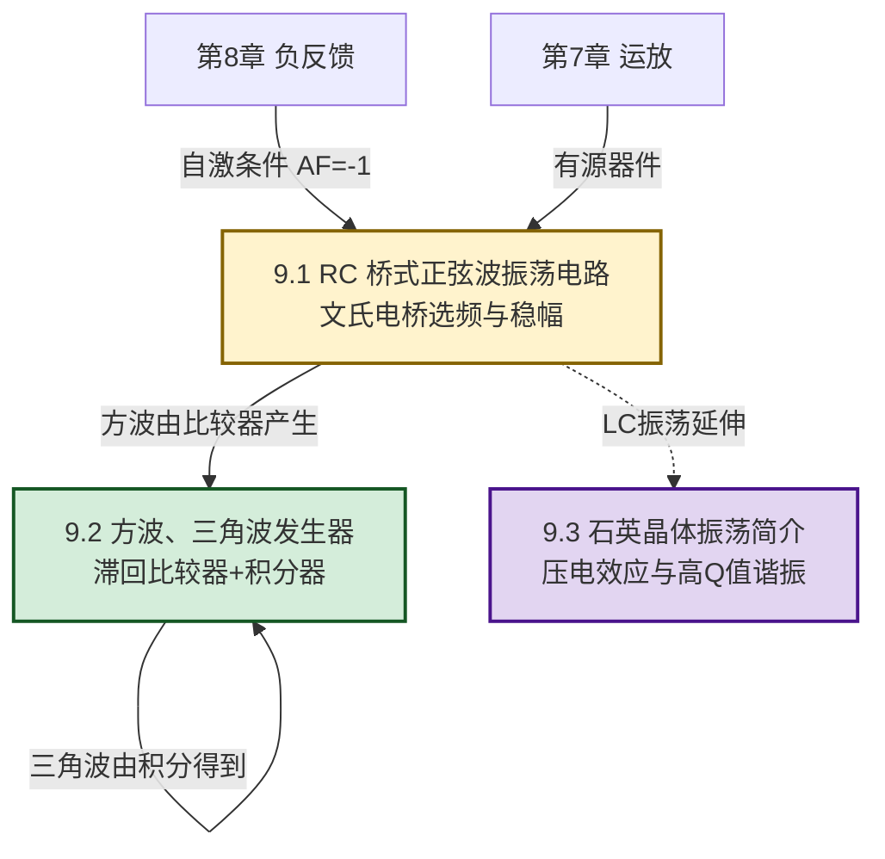

# MOC - 第9章 波形产生电路

> [!info] 本章定位
> 波形产生电路（振荡器）是模拟电子技术的**信号源核心**。本章要回答的核心问题是：**如何在不外加输入信号的情况下，利用放大电路、反馈网络与选频网络的自激振荡，产生稳定的正弦波、方波、三角波等周期信号？**
>
> 本章在 [[MOC - 第7章|第7章 集成运算放大器基础]]（运放作为有源器件构成振荡器）和 [[MOC - 第8章|第8章 负反馈放大电路]]（自激振荡条件 $\dot A\dot F=-1$ 是反馈深度的边界情况）基础上展开：把第8章的"避免自激"反转为"利用自激"，引入**选频网络**使仅在特定频率满足振荡条件，从而产生单一频率的正弦波；引入**非线性元件**（稳压管、比较器）使振荡幅度稳定；通过**充放电定时**产生方波与三角波。
>
> 本章与 [[MOC - 第8章|第8章]] 形成对偶：负反馈"抑制"自激以稳定放大，正反馈"利用"自激以产生振荡。石英晶体振荡器的高 Q 值特性是 [[4.2 二极管伏安特性、参数|4.2]] 谐振概念的延伸应用。

## 学习路线图

## 知识点导航

| 小节 | 标题 | 核心内容 | 关键物理量（SI单位） |
| ---- | ---- | -------- | -------------------- |
| [[9.1 RC 桥式正弦波振荡电路\|9.1]] | RC 桥式正弦波振荡电路 | 振荡条件（相位平衡 $\Delta\varphi=2n\pi$、幅度平衡 $|AF|=1$）、起振条件 $|AF|>1$、文氏电桥选频网络（谐振频率 $f_0=1/(2\pi RC)$）、同相放大器增益 $A=3$、稳幅措施（热敏电阻、二极管） | 振荡频率 $f_0$（Hz）、电阻 $R$（Ω）、电容 $C$（F） |
| [[9.2 方波、三角波发生器\|9.2]] | 方波、三角波发生器 | 滞回比较器产生方波、RC 充放电定时、振荡周期 $T=2R_f C\ln(1+2R_1/R_2)$、积分器把方波转换为三角波、频率可调设计 | 周期 $T$（s）、频率 $f$（Hz）、时间常数 $RC$（s） |
| [[9.3 石英晶体振荡简介\|9.3]] | 石英晶体振荡简介 | 压电效应、石英晶体等效电路（$L_q$、$C_q$、$R_q$、$C_0$）、串联谐振频率 $f_s$ 与并联谐振频率 $f_p$、高 Q 值（$10^4\sim10^6$）、串联型与并联型晶振电路 | 串联谐振频率 $f_s$（Hz）、并联谐振频率 $f_p$（Hz）、品质因数 $Q$（无量纲） |

## 核心考点

> [!summary] 本章核心考点（7 点）
> 1. **自激振荡条件**：相位平衡条件 $\Delta\varphi=\varphi_A+\varphi_F=2n\pi$（$n$ 为整数）保证反馈为正反馈；幅度平衡条件 $|\dot A\dot F|=1$ 保证环路增益足够维持振荡。二者同时满足才能产生稳定振荡。
> 2. **起振条件与稳幅**：起振时 $|\dot A\dot F|>1$ 使幅度逐渐增长，稳态时 $|\dot A\dot F|=1$ 维持等幅振荡。稳幅由非线性元件（热敏电阻、二极管、稳压管）自动调节增益实现。
> 3. **文氏电桥选频网络**：RC 串并联网络在 $f_0=1/(2\pi RC)$ 时相移为零、传输系数 $|F|=1/3$，配合同相放大器 $A=3$ 满足 $|AF|=1$。偏离 $f_0$ 时 $|F|<1/3$ 且相移不为零，无法起振，实现选频。
> 4. **RC 桥式振荡频率**：$f_0=\dfrac{1}{2\pi RC}$，调节 $R$ 或 $C$ 可连续改变频率。频率范围 $1\,\text{Hz}\sim1\,\text{MHz}$，适合低频信号源。
> 5. **方波发生器**：运放滞回比较器加 RC 反馈，电容充放电使比较器反复翻转，输出方波。周期 $T=2R_f C\ln\left(1+\dfrac{2R_1}{R_2}\right)$，频率 $f=1/T$。
> 6. **三角波发生器**：方波经积分器积分得到三角波，或滞回比较器输出经积分器反馈到输入端形成闭环。三角波幅度由比较器门限与积分时间常数决定。
> 7. **石英晶体的两个谐振频率**：串联谐振 $f_s=\dfrac{1}{2\pi\sqrt{L_q C_q}}$、并联谐振 $f_p=f_s\sqrt{1+C_q/C_0}\approx f_s(1+C_q/(2C_0))$，$f_p$ 略高于 $f_s$。在 $f_s<f<f_p$ 区间晶体呈感性，用于并联型晶振；在 $f_s$ 处阻抗最小（串联谐振），用于串联型晶振。

## 自测题

> [!question]- 自测 1：振荡条件
> 说明正弦波振荡电路的起振条件与幅度平衡条件，并解释为何起振时 $|AF|>1$ 而稳态时 $|AF|=1$。
>
> > [!check]- 答案
> > - **相位平衡条件**：$\Delta\varphi=\varphi_A+\varphi_F=2n\pi$（正反馈）；
> > - **起振条件**：$|\dot A\dot F|>1$，使初始微小噪声被反复放大，幅度逐渐增长；
> > - **幅度平衡条件**：$|\dot A\dot F|=1$，环路增益等于 1，信号经一周回到原值，维持等幅振荡；
> > - 起振时 $|AF|>1$ 是为了让幅度从零增长；当幅度增大到非线性区时放大器增益 $A$ 自动下降（或稳幅电路作用），使 $|AF|$ 从 $>1$ 降到 $=1$，达到稳态。

> [!question]- 自测 2：文氏电桥振荡频率
> RC 桥式振荡电路 $R=10\,\text{k}\Omega$、$C=0.01\,\mu\text{F}$。求振荡频率 $f_0$ 与同相放大器最小增益。
>
> > [!check]- 答案
> > $f_0=\dfrac{1}{2\pi RC}=\dfrac{1}{2\pi\times10^4\times0.01\times10^{-6}}=\dfrac{1}{2\pi\times10^{-4}}\approx1591.5\,\text{Hz}\approx1.59\,\text{kHz}$。
> > 文氏电桥在 $f_0$ 处 $|F|=1/3$，故 $|A|\ge3$ 才能满足 $|AF|\ge1$。最小增益 $A=3$。

> [!question]- 自测 3：方波发生器周期
> 方波发生器 $R_1=10\,\text{k}\Omega$、$R_2=20\,\text{k}\Omega$、$R_f=100\,\text{k}\Omega$、$C=0.1\,\mu\text{F}$。求振荡周期与频率。
>
> > [!check]- 答案
> > $T=2R_f C\ln\left(1+\dfrac{2R_1}{R_2}\right)=2\times10^5\times10^{-7}\times\ln\left(1+\dfrac{20}{20}\right)=0.02\times\ln2\approx0.01386\,\text{s}=13.86\,\text{ms}$。
> > $f=1/T\approx72.2\,\text{Hz}$。

> [!question]- 自测 4：石英晶体谐振频率
> 石英晶体 $L_q=10\,\text{H}$、$C_q=0.1\,\text{pF}$、$C_0=20\,\text{pF}$。求串联谐振频率 $f_s$ 与并联谐振频率 $f_p$。
>
> > [!check]- 答案
> > $f_s=\dfrac{1}{2\pi\sqrt{L_q C_q}}=\dfrac{1}{2\pi\sqrt{10\times10^{-13}}}\approx\dfrac{1}{2\pi\times3.16\times10^{-6}}\approx50.3\,\text{kHz}$（注：实际晶振 $L_q$ 可达亨级、$C_q$ 在 fF-pF 级，本题为示意值）。
> > $f_p=f_s\sqrt{1+C_q/C_0}=f_s\sqrt{1+0.1/20}\approx f_s\times1.0025\approx50.4\,\text{kHz}$。
> > $f_p$ 略高于 $f_s$，相对差约 $0.25\%$。

## 章节导航

> [!nav] 导航
> 上级：[[MOC - 电路与模拟电子技术|课程总览]]
> 先修：[[MOC - 第7章|第7章 集成运算放大器基础]]（运放构成振荡器）、[[MOC - 第8章|第8章 负反馈放大电路]]（自激振荡条件）
> 下一章：[[MOC - 第10章|第10章 直流稳压电源]]
> 关联：[[7.4 电压比较器|7.4 电压比较器]]（方波发生器核心）、[[7.3 加法、减法、积分、微分运算电路|7.3 积分电路]]（三角波发生器）
> 配套习题：[[MOC - 第9章习题|第9章 习题]]
