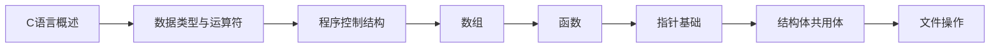

# C语言程序设计A

> [!abstract] 课程定位
> 本课程是计算机专业入门核心课程，系统讲授C语言的语法基础、程序结构、数据类型、控制流程、函数、指针、结构体和文件操作等内容，培养学生的程序设计能力和逻辑思维能力。

> [!info] 进阶学习路径
> 完成本课程后，可深入学习以下方向：
> - **编程进阶**：C++面向对象编程 → 数据结构与算法 → 操作系统原理
> - **系统开发**：Linux系统编程 → 嵌入式开发 → 驱动开发
> - **应用开发**：Python编程 → Web开发 → 数据库开发

## 学习路线



## 课程目录

### 第1章-C语言概述与开发环境

- [[知识点/第1章-C语言概述与开发环境/MOC - 第1章.md|第1章导航]]
- [[知识点/第1章-C语言概述与开发环境/1.1-C语言发展与特点.md]]：C语言发展史、特点、应用领域
- [[知识点/第1章-C语言概述与开发环境/1.2-C程序基础结构.md]]：C程序的基本结构、main函数、语句
- [[知识点/第1章-C语言概述与开发环境/1.3-编译运行流程.md]]：编辑、编译、链接、运行过程

### 第2章-数据类型、常量变量与运算符

- [[知识点/第2章-数据类型、常量变量与运算符/MOC - 第2章.md|第2章导航]]
- [[知识点/第2章-数据类型、常量变量与运算符/2.1-数据类型.md]]：基本数据类型、类型转换
- [[知识点/第2章-数据类型、常量变量与运算符/2.2-常量与变量.md]]：常量定义、变量声明与初始化
- [[知识点/第2章-数据类型、常量变量与运算符/2.3-运算符与表达式.md]]：算术运算符、关系运算符、逻辑运算符、位运算符

### 第3章-顺序选择循环结构

- [[知识点/第3章-顺序选择循环结构/MOC - 第3章.md|第3章导航]]
- [[知识点/第3章-顺序选择循环结构/3.1-顺序结构.md]]：赋值语句、输入输出函数
- [[知识点/第3章-顺序选择循环结构/3.2-选择结构.md]]：if语句、switch语句
- [[知识点/第3章-顺序选择循环结构/3.3-循环结构.md]]：while循环、for循环、do-while循环

### 第4章-数组

- [[知识点/第4章-数组/MOC - 第4章.md|第4章导航]]
- [[知识点/第4章-数组/4.1-一维数组.md]]：一维数组的定义、初始化、访问
- [[知识点/第4章-数组/4.2-二维数组.md]]：二维数组的定义、初始化、访问
- [[知识点/第4章-数组/4.3-字符数组与字符串.md]]：字符数组、字符串处理函数

### 第5章-函数

- [[知识点/第5章-函数/MOC - 第5章.md|第5章导航]]
- [[知识点/第5章-函数/5.1-函数定义与调用.md]]：函数定义、函数调用、参数传递
- [[知识点/第5章-函数/5.2-函数的递归调用.md]]：递归概念、递归实现、递归与迭代
- [[知识点/第5章-函数/5.3-变量的作用域与存储类别.md]]：局部变量、全局变量、静态变量、extern

### 第6章-指针基础

- [[知识点/第6章-指针基础/MOC - 第6章.md|第6章导航]]
- [[知识点/第6章-指针基础/6.1-指针的概念与基本操作.md]]：指针定义、指针运算、指针与数组
- [[知识点/第6章-指针基础/6.2-指针与函数.md]]：指针作为函数参数、返回指针的函数、函数指针
- [[知识点/第6章-指针基础/6.3-指针与字符串.md]]：指针处理字符串、字符串函数实现

### 第7章-结构体共用体枚举

- [[知识点/第7章-结构体共用体枚举/MOC - 第7章.md|第7章导航]]
- [[知识点/第7章-结构体共用体枚举/7.1-结构体.md]]：结构体定义、结构体变量、结构体数组
- [[知识点/第7章-结构体共用体枚举/7.2-共用体.md]]：共用体定义、共用体特点、应用场景
- [[知识点/第7章-结构体共用体枚举/7.3-枚举类型.md]]：枚举定义、枚举常量、应用场景

### 第8章-文件操作

- [[知识点/第8章-文件操作/MOC - 第8章.md|第8章导航]]
- [[知识点/第8章-文件操作/8.1-文件概述与文件指针.md]]：文件概念、文件类型、文件指针
- [[知识点/第8章-文件操作/8.2-文件的打开与关闭.md]]：fopen、fclose、文件打开模式
- [[知识点/第8章-文件操作/8.3-文件的读写操作.md]]：fscanf、fprintf、fgetc、fputc、fgets、fputs

## 习题目录

### 第1章-C语言概述与开发环境

- [[习题/习题-第1章-C语言概述与开发环境.md]]：选择题、填空题、简答题、编程题

### 第2章-数据类型与运算符

- [[习题/习题-第2章-数据类型与运算符.md]]：选择题、填空题、简答题、编程题

### 第3章-程序控制结构

- [[习题/习题-第3章-程序控制结构.md]]：选择题、填空题、简答题、编程题

### 第4章-数组

- [[习题/习题-第4章-数组.md]]：选择题、填空题、简答题、编程题

### 第5章-函数

- [[习题/习题-第5章-函数.md]]：选择题、填空题、简答题、编程题

### 第6章-指针基础

- [[习题/习题-第6章-指针基础.md]]：选择题、填空题、简答题、编程题

### 第7章-结构体共用体枚举

- [[习题/习题-第7章-结构体共用体枚举.md]]：选择题、填空题、简答题、编程题

### 第8章-文件操作

- [[习题/习题-第8章-文件操作.md]]：选择题、填空题、简答题、编程题

## 易混淆概念对比

| 概念对 | 区别 | 联系 |
|-------|------|------|
| **常量 vs 变量** | 常量值不可变；变量值可变 | 都占用内存空间 |
| **局部变量 vs 全局变量** | 局部变量作用域限于函数；全局变量作用域全局 | 都遵循作用域规则 |
| **数组 vs 指针** | 数组是连续内存；指针是地址 | 数组名可视为指针常量 |
| **结构体 vs 共用体** | 结构体各成员独立；共用体共享内存 | 都用于组织多个数据 |

## 复习要点

> [!question] 核心问题自测
> 1. C语言的特点是什么？C程序的基本结构是什么？
> 2. 基本数据类型有哪些？类型转换规则是什么？
> 3. 三种循环语句的区别是什么？如何选择？
> 4. 数组名和指针的关系是什么？如何用指针访问数组？
> 5. 函数参数传递的方式是什么？递归函数的执行过程是什么？
> 6. 结构体和共用体的区别是什么？枚举类型的作用是什么？
> 7. 文件操作的基本步骤是什么？常用的文件读写函数有哪些？

## 笔记维护约定

- 每个章节包含：MOC导航笔记、知识点笔记、assets资源目录
- 知识点笔记使用「章节号.小节号-知识点名称.md」命名格式
- 代码示例使用C语言，标注运行结果和关键前提
- 使用Mermaid绘制流程图和内存示意图
- 使用表格对比易混淆概念和语法特性

```dataview
TABLE status AS 状态, chapter AS 章节, section AS 小节
FROM #C语言
WHERE file.name != this.file.name
SORT chapter ASC, section ASC
```