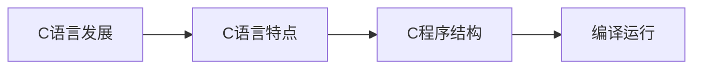

# 第1章-C语言概述与开发环境

> [!abstract] 本章定位
> 本章介绍C语言的发展历程、特点和应用领域，讲解C程序的基本结构和编译运行流程，为后续学习打下基础。

## 学习主线

## 章节内容

- [[1.1-C语言发展与特点.md]]：C语言发展史、特点、应用领域
- [[1.2-C程序基础结构.md]]：C程序的基本结构、main函数、语句
- [[1.3-编译运行流程.md]]：编辑、编译、链接、运行过程

## 考点汇总

> [!important] 核心考点
> 1. C语言的特点：简洁、高效、可移植、面向过程
> 2. C程序的基本结构：包含头文件、main函数、语句
> 3. main函数的作用：程序入口
> 4. 编译运行流程：编辑→编译→链接→运行
> 5. 常见开发环境：VC++、Dev-C++、Code::Blocks、VS Code

## 前后章节依赖

| 方向 | 章节 | 依赖关系 |
|-----|------|---------|
| 先修 | - | 无 |
| 后续 | 第2章 | 数据类型和运算符是C语言的基础 |

## 复习自测

> [!question] 自测题
> 1. C语言有哪些特点？
> 2. C程序的基本结构是什么？
> 3. main函数的作用是什么？
> 4. C程序的编译运行流程是什么？
> 5. 什么是头文件？常见的头文件有哪些？