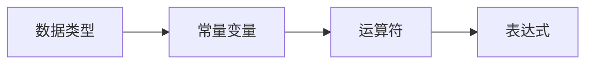

# 第2章-数据类型、常量变量与运算符

> [!abstract] 本章定位
> 本章介绍C语言的基本数据类型、常量与变量的定义和使用，以及各种运算符和表达式，是编写C程序的基础。

## 学习主线

## 章节内容

- [[2.1-数据类型.md]]：基本数据类型、类型转换
- [[2.2-常量与变量.md]]：常量定义、变量声明与初始化
- [[2.3-运算符与表达式.md]]：算术运算符、关系运算符、逻辑运算符、位运算符

## 考点汇总

> [!important] 核心考点
> 1. 基本数据类型：int、float、double、char
> 2. 常量：字面常量、const常量、宏定义
> 3. 变量：声明、初始化、作用域
> 4. 运算符优先级和结合性
> 5. 类型转换：隐式转换、显式转换

## 前后章节依赖

| 方向 | 章节 | 依赖关系 |
|-----|------|---------|
| 先修 | 第1章 | C程序结构是基础 |
| 后续 | 第3章 | 控制结构需要数据类型和运算符 |

## 复习自测

> [!question] 自测题
> 1. C语言的基本数据类型有哪些？
> 2. 常量和变量的区别是什么？
> 3. 运算符的优先级顺序是什么？
> 4. 类型转换的规则是什么？
> 5. 什么是左值和右值？