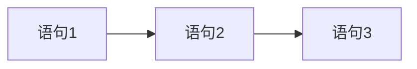

# 3.1 顺序结构

> [!abstract] 核心问题
> 什么是顺序结构？如何使用赋值语句和输入输出函数？

## 一、顺序结构概述

### 1. 定义
顺序结构是最简单的程序结构，程序按照语句的先后顺序依次执行。

### 2. 流程图



## 二、赋值语句

### 1. 基本形式

```c
变量 = 表达式;
```

### 2. 示例

```c
int a = 5;
int b = a + 3;
b = b * 2;
```

### 3. 多重赋值

```c
int a, b, c;
a = b = c = 0;  // 等价于 a = (b = (c = 0))
```

## 三、输入函数

### 1. scanf函数

```c
int a;
scanf("%d", &a);  // 输入整数
```

### 2. 格式说明符

| 格式符 | 含义 | 示例 |
|-------|------|------|
| `%d` | 整型 | `scanf("%d", &a)` |
| `%f` | 单精度浮点型 | `scanf("%f", &x)` |
| `%lf` | 双精度浮点型 | `scanf("%lf", &y)` |
| `%c` | 字符型 | `scanf("%c", &ch)` |
| `%s` | 字符串 | `scanf("%s", str)` |

### 3. 注意事项

```c
int a, b;
scanf("%d%d", &a, &b);  // 输入两个整数，用空格或回车分隔
```

> [!warning] 易错点
> scanf的变量参数必须加取地址符`&`！字符串变量除外。

## 四、输出函数

### 1. printf函数

```c
printf("Hello, World!\n");
printf("a = %d\n", a);
```

### 2. 格式说明符

| 格式符 | 含义 | 示例 | 输出 |
|-------|------|------|------|
| `%d` | 整型 | `printf("%d", 10)` | 10 |
| `%f` | 浮点型 | `printf("%f", 3.14)` | 3.140000 |
| `%c` | 字符型 | `printf("%c", 'A')` | A |
| `%s` | 字符串 | `printf("%s", "Hello")` | Hello |
| `%5d` | 宽度为5的整型 | `printf("%5d", 10)` | `  10` |
| `%.2f` | 保留两位小数 | `printf("%.2f", 3.14)` | 3.14 |

### 3. 转义字符

| 转义字符 | 含义 |
|---------|------|
| `\n` | 换行 |
| `\t` | 制表符 |
| `\\` | 反斜杠 |
| `\'` | 单引号 |
| `\"` | 双引号 |

## 五、程序示例

```c
#include <stdio.h>

int main() {
    int a, b, sum;
    printf("请输入两个整数：");
    scanf("%d%d", &a, &b);
    sum = a + b;
    printf("它们的和是：%d\n", sum);
    return 0;
}
```

---

**导航**：[[MOC - 第3章.md|返回章节导航]] · 下一节 [[3.2-选择结构.md]]