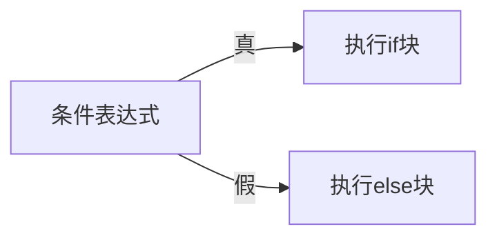
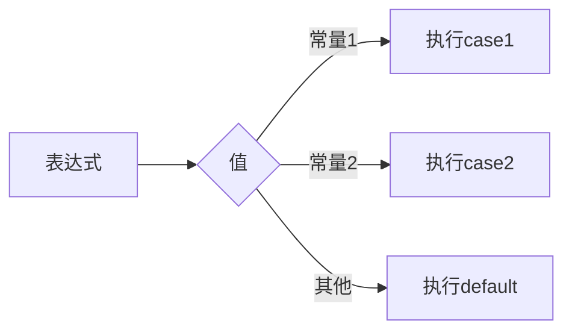

# 3.2 选择结构

> [!abstract] 核心问题
> 如何使用if语句和switch语句实现选择结构？

## 一、if语句

### 1. 基本形式

```c
if (条件表达式) {
    // 条件为真时执行的语句
}
```

### 2. if-else语句

```c
if (条件表达式) {
    // 条件为真时执行的语句
} else {
    // 条件为假时执行的语句
}
```

### 3. 流程图



### 4. if-else if语句

```c
if (score >= 90) {
    printf("优秀\n");
} else if (score >= 80) {
    printf("良好\n");
} else if (score >= 60) {
    printf("及格\n");
} else {
    printf("不及格\n");
}
```

### 5. 嵌套if语句

```c
if (age >= 18) {
    if (gender == '男') {
        printf("成年男性\n");
    } else {
        printf("成年女性\n");
    }
} else {
    printf("未成年\n");
}
```

> [!warning] 易错点
> else总是与最近的if配对！如果需要改变配对关系，使用大括号。

## 二、switch语句

### 1. 基本形式

```c
switch (表达式) {
    case 常量1:
        // 语句1
        break;
    case 常量2:
        // 语句2
        break;
    default:
        // 默认语句
        break;
}
```

### 2. 流程图



### 3. 示例

```c
switch (grade) {
    case 'A':
        printf("优秀\n");
        break;
    case 'B':
        printf("良好\n");
        break;
    case 'C':
        printf("及格\n");
        break;
    default:
        printf("不及格\n");
        break;
}
```

### 4. break的作用

break用于跳出switch语句。如果没有break，程序会继续执行后续的case，直到遇到break或switch结束。

```c
switch (n) {
    case 1:
        printf("one\n");
    case 2:
        printf("two\n");  // 如果n=1，会输出one和two
        break;
}
```

### 5. default的作用

default处理所有未匹配的情况，通常放在最后。

## 三、if vs switch

| 对比项 | if语句 | switch语句 |
|-------|--------|-----------|
| 判断条件 | 任意表达式 | 整型或字符型常量 |
| 分支数量 | 适合少量分支 | 适合大量分支 |
| 可读性 | 嵌套多时较差 | 结构清晰 |
| 效率 | 依次判断 | 跳转表 |

---

**导航**：上一节 [[3.1-顺序结构.md]] · [[MOC - 第3章.md|返回章节导航]] · 下一节 [[3.3-循环结构.md]]