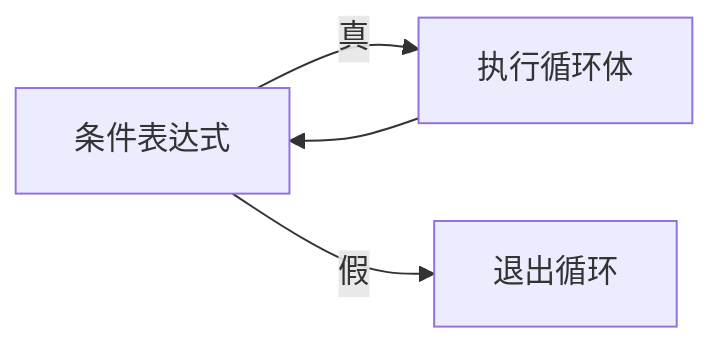
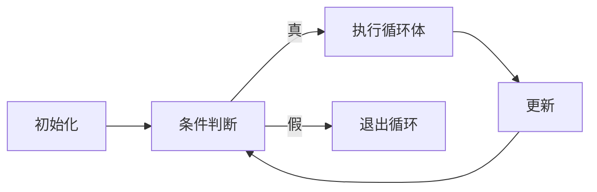

# 3.3 循环结构

> [!abstract] 核心问题
> 如何使用while、for、do-while循环？它们有什么区别？

## 一、while循环

### 1. 基本形式

```c
while (条件表达式) {
    // 循环体
}
```

### 2. 流程图



### 3. 示例

```c
int i = 1;
while (i <= 10) {
    printf("%d ", i);
    i++;
}
```

### 4. 特点
- 先判断条件，再执行循环体
- 循环体可能一次都不执行

## 二、do-while循环

### 1. 基本形式

```c
do {
    // 循环体
} while (条件表达式);
```

### 2. 流程图


### 3. 示例

```c
int i = 1;
do {
    printf("%d ", i);
    i++;
} while (i <= 10);
```

### 4. 特点
- 先执行循环体，再判断条件
- 循环体至少执行一次

## 三、for循环

### 1. 基本形式

```c
for (初始化表达式; 条件表达式; 更新表达式) {
    // 循环体
}
```

### 2. 执行顺序



### 3. 示例

```c
for (int i = 1; i <= 10; i++) {
    printf("%d ", i);
}
```

### 4. 变体

```c
// 省略初始化（在外部声明）
int i = 1;
for (; i <= 10; i++) { ... }

// 省略条件（无限循环）
for (;;) { ... }

// 省略更新（在循环体内更新）
for (int i = 1; i <= 10; ) { ... i++; }
```

## 四、三种循环对比

| 对比项 | while | do-while | for |
|-------|-------|----------|-----|
| 执行顺序 | 先判断后执行 | 先执行后判断 | 先判断后执行 |
| 执行次数 | 0次或多次 | 1次或多次 | 0次或多次 |
| 适用场景 | 循环次数不确定 | 循环次数不确定但至少执行一次 | 循环次数确定 |

## 五、循环嵌套

### 1. 示例

```c
for (int i = 1; i <= 9; i++) {
    for (int j = 1; j <= i; j++) {
        printf("%d*%d=%d ", j, i, j*i);
    }
    printf("\n");
}
```

### 2. 流程图


## 六、跳转语句

### 1. break

用于跳出当前循环或switch语句。

```c
for (int i = 1; i <= 10; i++) {
    if (i == 5) break;
    printf("%d ", i);  // 输出1 2 3 4
}
```

### 2. continue

用于跳过当前循环的剩余部分，继续下一次循环。

```c
for (int i = 1; i <= 10; i++) {
    if (i == 5) continue;
    printf("%d ", i);  // 输出1 2 3 4 6 7 8 9 10
}
```

### 3. goto

用于无条件跳转到指定标签。

```c
int i = 1;
loop:
if (i <= 10) {
    printf("%d ", i);
    i++;
    goto loop;
}
```

> [!warning] 易错点
> goto语句会破坏程序的结构化，应尽量避免使用！

---

**导航**：上一节 [[3.2-选择结构.md]] · [[MOC - 第3章.md|返回章节导航]]