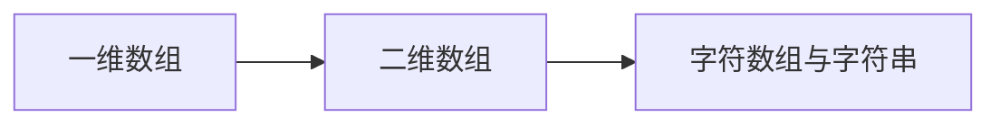

# 第4章-数组

> [!abstract] 本章定位
> 本章介绍一维数组、二维数组和字符数组的定义、初始化和使用，以及常用的字符串处理函数。

## 学习主线

## 章节内容

- [[4.1-一维数组.md]]：一维数组的定义、初始化、访问
- [[4.2-二维数组.md]]：二维数组的定义、初始化、访问
- [[4.3-字符数组与字符串.md]]：字符数组、字符串处理函数

## 考点汇总

> [!important] 核心考点
> 1. 数组的定义和初始化
> 2. 数组元素的访问（下标从0开始）
> 3. 数组名与指针的关系
> 4. 字符串处理函数：strlen、strcpy、strcmp、strcat
> 5. 二维数组的存储方式

## 前后章节依赖

| 方向 | 章节 | 依赖关系 |
|-----|------|---------|
| 先修 | 第3章 | 循环结构用于遍历数组 |
| 后续 | 第5章 | 数组作为函数参数 |

## 复习自测

> [!question] 自测题
> 1. 一维数组的定义格式是什么？
> 2. 数组下标从几开始？数组越界会怎样？
> 3. 数组名代表什么？
> 4. 字符串结束标志是什么？
> 5. 常用的字符串处理函数有哪些？