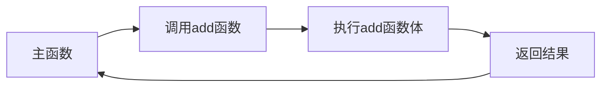

# 5.1 函数定义与调用

> [!abstract] 核心问题
> 如何定义和调用函数？参数传递的方式有哪些？

## 一、函数定义

### 1. 基本形式

```c
返回值类型 函数名(参数列表) {
    // 函数体
    return 返回值;
}
```

### 2. 示例

```c
int add(int a, int b) {
    return a + b;
}
```

### 3. 返回值

```c
// 有返回值
int square(int x) {
    return x * x;
}

// 无返回值
void print_hello() {
    printf("Hello!\n");
}
```

## 二、函数声明

### 1. 声明格式

```c
返回值类型 函数名(参数列表);
```

### 2. 声明位置

- 在调用之前声明
- 或在头文件中声明

```c
#include <stdio.h>

// 函数声明
int add(int a, int b);

int main() {
    int result = add(3, 5);
    printf("%d", result);
    return 0;
}

// 函数定义
int add(int a, int b) {
    return a + b;
}
```

## 三、函数调用

### 1. 调用格式

```c
函数名(实参列表);
```

### 2. 示例

```c
int result = add(3, 5);
print_hello();
```

### 3. 调用过程



## 四、参数传递

### 1. 值传递

```c
void swap(int a, int b) {
    int temp = a;
    a = b;
    b = temp;
}

int main() {
    int x = 3, y = 5;
    swap(x, y);  // 值传递，x和y不会交换
    printf("%d %d", x, y);  // 输出3 5
    return 0;
}
```

特点：
- 实参的值复制给形参
- 形参的修改不影响实参

### 2. 地址传递

```c
void swap(int *a, int *b) {
    int temp = *a;
    *a = *b;
    *b = temp;
}

int main() {
    int x = 3, y = 5;
    swap(&x, &y);  // 地址传递，x和y会交换
    printf("%d %d", x, y);  // 输出5 3
    return 0;
}
```

特点：
- 实参的地址传递给形参
- 通过指针可以修改实参的值

> [!warning] 易错点
> C语言的参数传递默认是值传递！要修改实参，必须使用指针。

## 五、数组作为函数参数

### 1. 传递方式

```c
void print_array(int arr[], int n) {
    for (int i = 0; i < n; i++) {
        printf("%d ", arr[i]);
    }
}
```

### 2. 注意事项

- 数组作为函数参数时，退化为指针
- 函数无法获取数组的长度，需要额外传递长度参数

## 六、函数原型

### 1. 定义

函数原型是函数声明的一种形式，只包含函数名、返回值类型和参数类型。

```c
int add(int, int);
```

### 2. 作用

- 告诉编译器函数的名称、返回类型和参数类型
- 允许函数在定义之前被调用

---

**导航**：[[MOC - 第5章.md|返回章节导航]] · 下一节 [[5.2-函数的递归调用.md]]