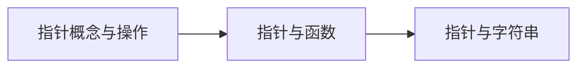

# 第6章-指针基础

> [!abstract] 本章定位
> 本章介绍指针的概念、基本操作、指针与函数、指针与字符串，是C语言的重点和难点。

## 学习主线

## 章节内容

- [[6.1-指针的概念与基本操作.md]]：指针定义、指针运算、指针与数组
- [[6.2-指针与函数.md]]：指针作为函数参数、返回指针的函数、函数指针
- [[6.3-指针与字符串.md]]：指针处理字符串、字符串函数实现

## 考点汇总

> [!important] 核心考点
> 1. 指针的定义和基本操作（&、*）
> 2. 指针与数组的关系
> 3. 指针作为函数参数
> 4. 返回指针的函数
> 5. 函数指针

## 前后章节依赖

| 方向 | 章节 | 依赖关系 |
|-----|------|---------|
| 先修 | 第5章 | 函数参数传递需要指针 |
| 后续 | 第7章 | 结构体需要指针 |

## 复习自测

> [!question] 自测题
> 1. 什么是指针？如何定义指针？
> 2. &和*运算符的作用是什么？
> 3. 数组名和指针的关系是什么？
> 4. 如何用指针作为函数参数修改实参？
> 5. 什么是函数指针？如何使用？