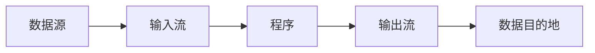
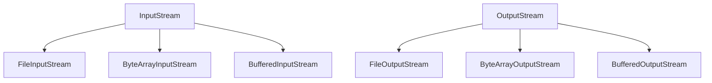
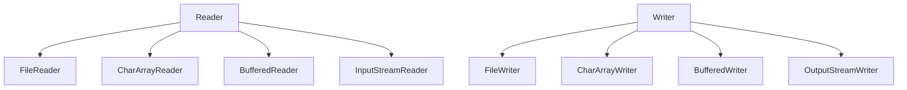

# 10.1 I/O流概述

> [!abstract] 核心问题
> 什么是I/O流？字节流和字符流的区别是什么？流的分类有哪些？

## 一、I/O流的概念

### 1. 定义

I/O（Input/Output）流是Java中用于处理输入输出的机制，数据像水流一样从一个地方流向另一个地方。

### 2. 流的特点

| 特点 | 说明 |
|-----|------|
| 顺序性 | 数据按顺序读取或写入 |
| 方向性 | 输入流（读）或输出流（写） |
| 字节导向 | 字节流处理二进制数据 |
| 字符导向 | 字符流处理文本数据 |

### 3. 流的示意图



## 二、流的分类

### 1. 按数据流向分类

| 类型 | 说明 | 示例 |
|-----|------|------|
| 输入流 | 从外部读取数据到程序 | FileInputStream |
| 输出流 | 从程序写入数据到外部 | FileOutputStream |

### 2. 按数据类型分类

| 类型 | 说明 | 处理单位 | 父类 |
|-----|------|---------|------|
| 字节流 | 处理二进制数据 | 字节 | InputStream、OutputStream |
| 字符流 | 处理文本数据 | 字符 | Reader、Writer |

### 3. 按功能分类

| 类型 | 说明 | 示例 |
|-----|------|------|
| 节点流 | 直接连接数据源 | FileInputStream |
| 处理流 | 包装节点流，增强功能 | BufferedReader |

## 三、字节流

### 1. 字节流体系



### 2. InputStream常用方法

| 方法 | 说明 |
|-----|------|
| `read()` | 读取一个字节 |
| `read(byte[] b)` | 读取多个字节到数组 |
| `read(byte[] b, int off, int len)` | 读取指定长度的字节 |
| `close()` | 关闭流 |
| `available()` | 返回可用字节数 |

### 3. OutputStream常用方法

| 方法 | 说明 |
|-----|------|
| `write(int b)` | 写入一个字节 |
| `write(byte[] b)` | 写入字节数组 |
| `write(byte[] b, int off, int len)` | 写入指定长度的字节 |
| `flush()` | 刷新缓冲区 |
| `close()` | 关闭流 |

## 四、字符流

### 1. 字符流体系



### 2. Reader常用方法

| 方法 | 说明 |
|-----|------|
| `read()` | 读取一个字符 |
| `read(char[] cbuf)` | 读取多个字符到数组 |
| `read(char[] cbuf, int off, int len)` | 读取指定长度的字符 |
| `close()` | 关闭流 |

### 3. Writer常用方法

| 方法 | 说明 |
|-----|------|
| `write(int c)` | 写入一个字符 |
| `write(char[] cbuf)` | 写入字符数组 |
| `write(char[] cbuf, int off, int len)` | 写入指定长度的字符 |
| `write(String str)` | 写入字符串 |
| `flush()` | 刷新缓冲区 |
| `close()` | 关闭流 |

## 五、字节流 vs 字符流

### 1. 区别对比

| 对比项 | 字节流 | 字符流 |
|-------|-------|-------|
| 处理数据 | 二进制数据 | 文本数据 |
| 处理单位 | 字节（8位） | 字符（16位） |
| 编码处理 | 不处理编码 | 自动处理编码 |
| 父类 | InputStream/OutputStream | Reader/Writer |
| 适用场景 | 图片、音频、视频 | 文本文件 |

### 2. 选择建议

| 场景 | 选择 |
|-----|------|
| 读取文本文件 | 字符流 |
| 读取二进制文件 | 字节流 |
| 需要编码转换 | 字符流 |
| 性能优先 | 字节流 |

## 六、转换流

### 1. InputStreamReader

```java
// 将字节流转换为字符流
InputStream is = new FileInputStream("file.txt");
Reader reader = new InputStreamReader(is, "UTF-8");
```

### 2. OutputStreamWriter

```java
// 将字符流转换为字节流
OutputStream os = new FileOutputStream("file.txt");
Writer writer = new OutputStreamWriter(os, "UTF-8");
```

---

**导航**：[[MOC - 第10章.md|返回章节导航]] · 下一节 [[10.2-文件读写.md]]