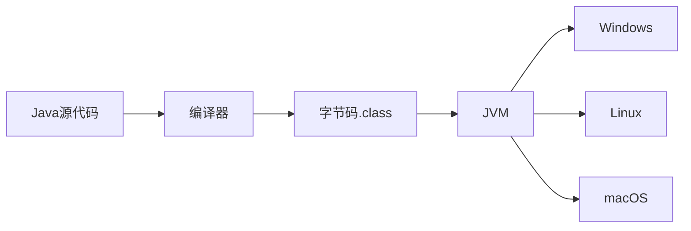

# 1.1 Java语言特点与发展

> [!abstract] 核心问题
> Java语言是如何发展起来的？它有哪些特点？应用在哪些领域？

## 一、Java的发展历程

### 1. 起源
- 1991年，Sun公司的James Gosling开始开发Oak语言
- 1995年，正式命名为Java，发布JDK 1.0

### 2. 版本历史

| 版本 | 发布时间 | 重要特性 |
|-----|---------|---------|
| JDK 1.0 | 1995 | Java基础语法、Applet |
| JDK 1.1 | 1997 | 内部类、JDBC |
| JDK 1.2 | 1998 | Swing、集合框架、JIT编译 |
| JDK 5 | 2004 | 泛型、枚举、自动装箱、增强for循环 |
| JDK 8 | 2014 | Lambda表达式、Stream API、接口默认方法 |
| JDK 11 | 2018 | LTS版本、模块化、HttpClient |
| JDK 17 | 2021 | LTS版本、密封类、模式匹配 |

## 二、Java的特点

### 1. 跨平台性
- "一次编写，到处运行"
- 通过JVM实现跨平台

### 2. 面向对象
- 封装、继承、多态
- 万物皆对象

### 3. 安全性
- 沙箱机制
- 字节码验证
- 权限控制

### 4. 健壮性
- 自动内存管理（垃圾回收）
- 强类型检查
- 异常处理机制

### 5. 简单性
- 去掉指针
- 自动内存管理
- 语法简洁

### 6. 高性能
- JIT编译
- 垃圾回收优化

## 三、Java的应用领域

### 1. 桌面应用
- Swing、JavaFX

### 2. Web应用
- Java EE、Spring框架

### 3. 移动应用
- Android开发

### 4. 大数据
- Hadoop、Spark

### 5. 企业级应用
- 金融、电信、电商

### 6. 嵌入式开发
- 智能设备

> [!warning] 易错点
> Java是编译型语言还是解释型语言？Java是编译型语言，先编译成字节码，然后由JVM解释执行。JIT编译可以将热点代码编译成机器码提高性能。

---

**导航**：[[MOC - 第1章.md|返回章节导航]] · 下一节 [[1.2-JVM/JRE/JDK三者区别.md]]