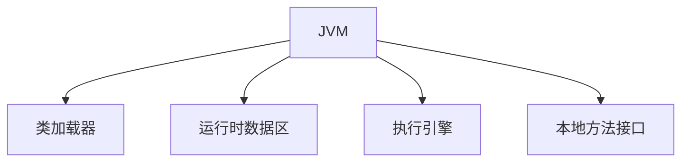
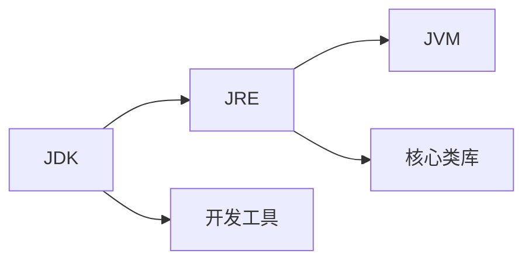

# 1.2 JVM/JRE/JDK三者区别

> [!abstract] 核心问题
> JVM、JRE、JDK分别是什么？它们之间有什么关系？

## 一、基本概念

### 1. JVM（Java Virtual Machine）

**Java虚拟机**，是Java程序运行的核心。

- 负责执行字节码
- 提供内存管理、垃圾回收
- 实现跨平台



### 2. JRE（Java Runtime Environment）

**Java运行时环境**，是运行Java程序所需的环境。

- 包含JVM
- 包含核心类库
- 不包含开发工具

### 3. JDK（Java Development Kit）

**Java开发工具包**，是开发Java程序所需的工具包。

- 包含JRE
- 包含编译器（javac）
- 包含调试器（jdb）
- 包含其他开发工具

## 二、三者关系



| 组件 | 包含内容 | 用途 |
|-----|---------|------|
| **JDK** | JRE + 开发工具 | 开发Java程序 |
| **JRE** | JVM + 核心类库 | 运行Java程序 |
| **JVM** | 虚拟机 | 执行字节码 |

## 三、安装和配置

### 1. 下载JDK
- 从Oracle官网或OpenJDK下载
- 选择合适的版本（推荐LTS版本）

### 2. 配置环境变量

```bash
# Windows
set JAVA_HOME=C:\Program Files\Java\jdk-17
set PATH=%JAVA_HOME%\bin;%PATH%

# Linux/macOS
export JAVA_HOME=/usr/lib/jvm/java-17-openjdk
export PATH=$JAVA_HOME/bin:$PATH
```

### 3. 验证安装

```bash
java -version
javac -version
```

## 四、运行时数据区

### 1. 程序计数器
记录当前线程执行的字节码行号。

### 2. Java栈
存储方法调用栈帧，包含局部变量表、操作数栈等。

### 3. 本地方法栈
存储本地方法调用。

### 4. 堆
存储对象实例和数组。

### 5. 方法区
存储类信息、常量、静态变量等。

> [!warning] 易错点
> JDK包含JRE，JRE包含JVM。开发Java程序需要安装JDK，只运行Java程序只需要安装JRE。

---

**导航**：上一节 [[1.1-Java语言特点与发展.md]] · [[MOC - 第1章.md|返回章节导航]] · 下一节 [[1.3-Java程序编译运行流程.md]]