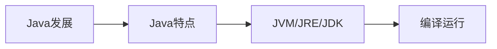

# 第1章-Java开发概述与环境搭建

> [!abstract] 本章定位
> 本章介绍Java语言的发展历程、特点和应用领域，讲解JVM、JRE、JDK的概念和关系，以及Java程序的编译运行流程。

## 学习主线

## 章节内容

- [[1.1-Java语言特点与发展.md]]：Java发展史、特点、应用领域
- [[1.2-JVM/JRE/JDK三者区别.md]]：JVM、JRE、JDK的概念和关系
- [[1.3-Java程序编译运行流程.md]]：编辑、编译、运行过程

## 考点汇总

> [!important] 核心考点
> 1. Java的特点：跨平台、面向对象、安全性、健壮性
> 2. JVM、JRE、JDK的区别和关系
> 3. Java程序的编译运行流程：.java → .class → JVM执行
> 4. Java的应用领域：桌面应用、Web应用、移动应用、大数据
> 5. Java的版本历史：JDK 8、11、17等LTS版本

## 前后章节依赖

| 方向 | 章节 | 依赖关系 |
|-----|------|---------|
| 先修 | - | 无 |
| 后续 | 第2章 | 基础语法需要运行环境 |

## 复习自测

> [!question] 自测题
> 1. Java语言有哪些特点？
> 2. JVM、JRE、JDK的区别是什么？
> 3. Java程序的编译运行流程是什么？
> 4. Java的应用领域有哪些？
> 5. 什么是跨平台？Java如何实现跨平台？