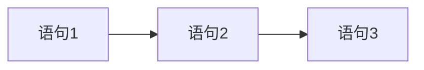

# 3.1 顺序结构

> [!abstract] 核心问题
> 什么是顺序结构？如何使用赋值语句和输入输出？

## 一、顺序结构概述

### 1. 定义
顺序结构是最简单的程序结构，程序按照语句的先后顺序依次执行。

### 2. 流程图



## 二、赋值语句

### 1. 基本形式

```java
变量 = 表达式;
```

### 2. 示例

```java
int a = 5;
int b = a + 3;
b = b * 2;
```

### 3. 多重赋值

```java
int a, b, c;
a = b = c = 0;
```

## 三、输出

### 1. System.out.println

```java
System.out.println("Hello, World!");
System.out.println(10);
System.out.println(3.14);
```

### 2. System.out.print

```java
System.out.print("Hello");
System.out.print(" World");  // 输出在同一行
```

### 3. System.out.printf

```java
int a = 10;
double b = 3.14;
System.out.printf("a = %d, b = %.2f\n", a, b);
```

### 4. 格式说明符

| 格式符 | 含义 | 示例 |
|-------|------|------|
| `%d` | 整数 | `%d` |
| `%f` | 浮点数 | `%.2f` |
| `%c` | 字符 | `%c` |
| `%s` | 字符串 | `%s` |
| `%5d` | 宽度为5 | `%5d` |

## 四、输入

### 1. 使用Scanner类

```java
import java.util.Scanner;

public class Main {
    public static void main(String[] args) {
        Scanner scanner = new Scanner(System.in);
        
        System.out.print("请输入整数：");
        int a = scanner.nextInt();
        
        System.out.print("请输入浮点数：");
        double b = scanner.nextDouble();
        
        System.out.print("请输入字符串：");
        String str = scanner.next();
        
        scanner.close();
    }
}
```

### 2. Scanner常用方法

| 方法 | 功能 |
|-----|------|
| `nextInt()` | 读取整数 |
| `nextDouble()` | 读取浮点数 |
| `next()` | 读取字符串（不含空格） |
| `nextLine()` | 读取整行字符串 |

## 五、程序示例

```java
import java.util.Scanner;

public class Main {
    public static void main(String[] args) {
        Scanner scanner = new Scanner(System.in);
        
        System.out.print("请输入两个整数：");
        int a = scanner.nextInt();
        int b = scanner.nextInt();
        
        int sum = a + b;
        System.out.println("它们的和是：" + sum);
        
        scanner.close();
    }
}
```

---

**导航**：[[MOC - 第3章.md|返回章节导航]] · 下一节 [[3.2-选择结构.md]]