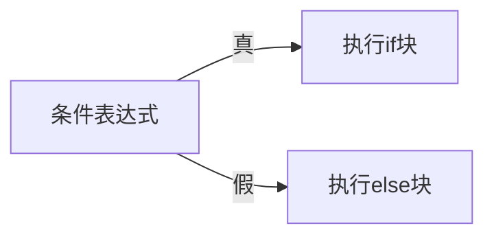
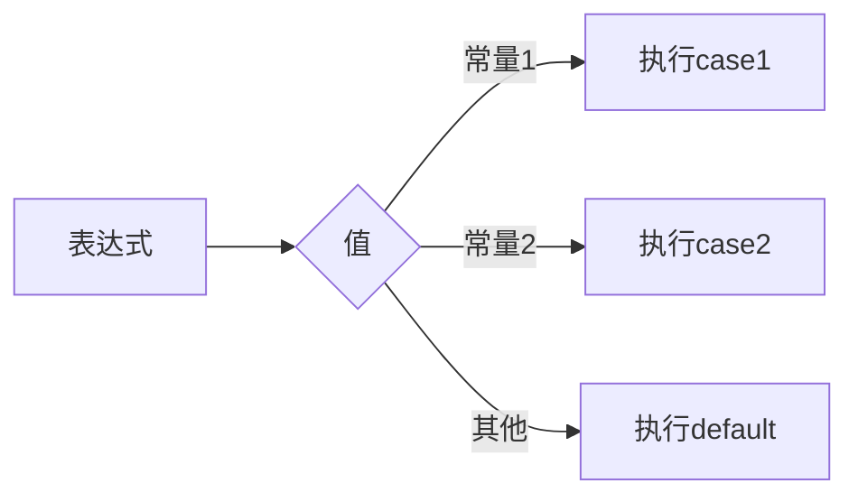

# 3.2 选择结构

> [!abstract] 核心问题
> 如何使用if语句和switch语句实现选择结构？

## 一、if语句

### 1. 基本形式

```java
if (条件表达式) {
    // 条件为真时执行的语句
}
```

### 2. if-else语句

```java
if (条件表达式) {
    // 条件为真时执行的语句
} else {
    // 条件为假时执行的语句
}
```

### 3. 流程图



### 4. if-else if语句

```java
if (score >= 90) {
    System.out.println("优秀");
} else if (score >= 80) {
    System.out.println("良好");
} else if (score >= 60) {
    System.out.println("及格");
} else {
    System.out.println("不及格");
}
```

### 5. 嵌套if语句

```java
if (age >= 18) {
    if (gender == '男') {
        System.out.println("成年男性");
    } else {
        System.out.println("成年女性");
    }
} else {
    System.out.println("未成年");
}
```

## 二、switch语句

### 1. 基本形式

```java
switch (表达式) {
    case 常量1:
        // 语句1
        break;
    case 常量2:
        // 语句2
        break;
    default:
        // 默认语句
        break;
}
```

### 2. 流程图



### 3. 示例

```java
switch (grade) {
    case 'A':
        System.out.println("优秀");
        break;
    case 'B':
        System.out.println("良好");
        break;
    case 'C':
        System.out.println("及格");
        break;
    default:
        System.out.println("不及格");
        break;
}
```

### 4. break的作用

break用于跳出switch语句。如果没有break，程序会继续执行后续的case。

```java
switch (n) {
    case 1:
        System.out.println("one");
    case 2:
        System.out.println("two");  // 如果n=1，会输出one和two
        break;
}
```

### 5. Java 7+的switch

```java
// Java 7及以上支持字符串
String fruit = "apple";
switch (fruit) {
    case "apple":
        System.out.println("苹果");
        break;
    case "banana":
        System.out.println("香蕉");
        break;
}
```

## 三、if vs switch

| 对比项 | if语句 | switch语句 |
|-------|--------|-----------|
| 判断条件 | 任意表达式 | 整型、字符型、字符串（Java 7+） |
| 分支数量 | 适合少量分支 | 适合大量分支 |
| 可读性 | 嵌套多时较差 | 结构清晰 |

---

**导航**：上一节 [[3.1-顺序结构.md]] · [[MOC - 第3章.md|返回章节导航]] · 下一节 [[3.3-循环结构.md]]