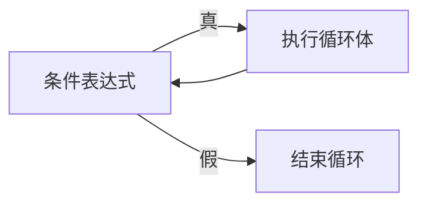
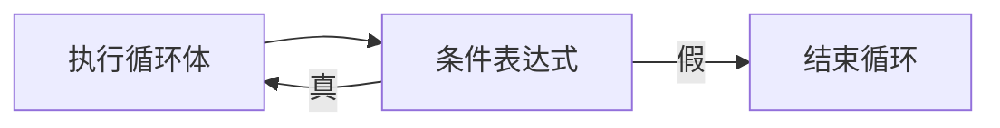
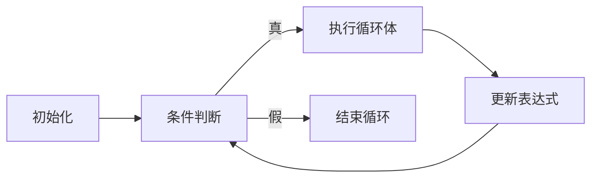

# 3.3 循环结构

> [!abstract] 核心问题
> 如何使用while、for、do-while循环？break和continue的区别是什么？

## 一、while循环

### 1. 基本形式

```java
while (条件表达式) {
    // 循环体
}
```

### 2. 流程图



### 3. 示例：计算1到100的和

```java
int sum = 0;
int i = 1;
while (i <= 100) {
    sum += i;
    i++;
}
System.out.println(sum);  // 5050
```

## 二、do-while循环

### 1. 基本形式

```java
do {
    // 循环体
} while (条件表达式);
```

### 2. 流程图



### 3. while vs do-while

| 对比项 | while | do-while |
|-------|-------|----------|
| 执行顺序 | 先判断再执行 | 先执行再判断 |
| 最少执行次数 | 0次 | 1次 |

### 4. 示例

```java
int a;
do {
    System.out.println("请输入正数：");
    Scanner scanner = new Scanner(System.in);
    a = scanner.nextInt();
} while (a <= 0);
```

## 三、for循环

### 1. 基本形式

```java
for (初始化表达式; 条件表达式; 更新表达式) {
    // 循环体
}
```

### 2. 执行顺序



### 3. 示例：计算1到100的和

```java
int sum = 0;
for (int i = 1; i <= 100; i++) {
    sum += i;
}
System.out.println(sum);  // 5050
```

### 4. 省略表达式

```java
// 省略初始化
int i = 1;
for (; i <= 10; i++) {
    System.out.println(i);
}

// 省略条件（无限循环）
for (;;) {
    System.out.println("无限循环");
}
```

## 四、增强for循环

### 1. 基本形式

```java
for (类型 变量 : 数组或集合) {
    // 循环体
}
```

### 2. 示例

```java
int[] arr = {1, 2, 3, 4, 5};
for (int num : arr) {
    System.out.println(num);
}
```

### 3. 注意事项
- 增强for循环不能修改数组元素（使用引用类型时除外）
- 不能获取索引

## 五、break和continue

### 1. break

用于跳出循环或switch语句。

```java
for (int i = 1; i <= 10; i++) {
    if (i == 5) {
        break;  // 跳出循环
    }
    System.out.println(i);  // 输出1-4
}
```

### 2. continue

用于跳过当前循环，继续下一次循环。

```java
for (int i = 1; i <= 10; i++) {
    if (i % 2 == 0) {
        continue;  // 跳过偶数
    }
    System.out.println(i);  // 输出1,3,5,7,9
}
```

### 3. break vs continue

| 对比项 | break | continue |
|-------|-------|----------|
| 作用 | 跳出整个循环 | 跳过当前迭代 |
| 后续操作 | 执行循环后的语句 | 执行下一次循环 |

## 六、嵌套循环

### 1. 示例：打印九九乘法表

```java
for (int i = 1; i <= 9; i++) {
    for (int j = 1; j <= i; j++) {
        System.out.print(j + "×" + i + "=" + i*j + "\t");
    }
    System.out.println();
}
```

---

**导航**：上一节 [[3.2-选择结构.md]] · [[MOC - 第3章.md|返回章节导航]]