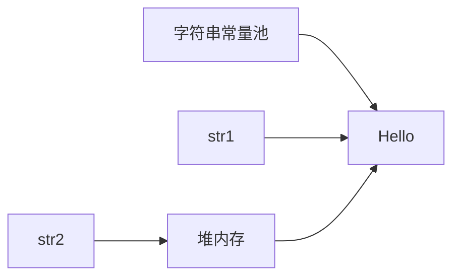

# 4.2 字符串

> [!abstract] 核心问题
> String类的特点是什么？String、StringBuilder、StringBuffer的区别是什么？

## 一、String类

### 1. 创建字符串

```java
String str1 = "Hello";           // 字符串常量池
String str2 = new String("Hello");  // 堆内存
String str3 = new String("Hello");
```

### 2. 字符串常量池



### 3. String的不可变性

String对象创建后，其内容不能被修改。每次修改都会创建新的对象。

```java
String str = "Hello";
str = str + " World";  // 创建新的String对象
```

### 4. == vs equals

```java
String str1 = "Hello";
String str2 = "Hello";
String str3 = new String("Hello");

str1 == str2;       // true（同一对象）
str1 == str3;       // false（不同对象）
str1.equals(str3);  // true（内容相同）
```

## 二、StringBuilder

### 1. 特点

- 可变字符串
- 非线程安全
- 性能高

### 2. 使用

```java
StringBuilder sb = new StringBuilder();
sb.append("Hello");
sb.append(" ");
sb.append("World");
String str = sb.toString();  // "Hello World"
```

### 3. 常用方法

```java
StringBuilder sb = new StringBuilder("Hello");

sb.length();        // 5
sb.charAt(0);       // 'H'
sb.insert(5, " World");  // "Hello World"
sb.delete(0, 6);    // "World"
sb.reverse();       // "dlroW"
```

## 三、StringBuffer

### 1. 特点

- 可变字符串
- 线程安全（synchronized）
- 性能较低

### 2. 使用

```java
StringBuffer sb = new StringBuffer();
sb.append("Hello");
sb.append(" World");
String str = sb.toString();
```

## 四、三者对比

| 对比项 | String | StringBuilder | StringBuffer |
|-------|--------|--------------|--------------|
| 可变性 | 不可变 | 可变 | 可变 |
| 线程安全 | - | 不安全 | 安全 |
| 性能 | 低 | 高 | 中 |
| 使用场景 | 少量操作 | 单线程大量操作 | 多线程大量操作 |

### 1. 性能测试示例

```java
// 使用String（效率低）
String str = "";
for (int i = 0; i < 10000; i++) {
    str += i;  // 每次创建新对象
}

// 使用StringBuilder（效率高）
StringBuilder sb = new StringBuilder();
for (int i = 0; i < 10000; i++) {
    sb.append(i);  // 在原对象上操作
}
```

## 五、字符串常量池优化

### 1. intern()方法

```java
String str1 = new String("Hello").intern();
String str2 = "Hello";
str1 == str2;  // true
```

### 2. Java 7+优化

Java 7将字符串常量池移到堆内存中，减少了永久代溢出的风险。

> [!warning] 易错点
> String是不可变的！频繁拼接字符串会产生大量临时对象，应使用StringBuilder或StringBuffer。

---

**导航**：上一节 [[4.1-数组.md]] · [[MOC - 第4章.md|返回章节导航]] · 下一节 [[4.3-常用字符串操作.md]]