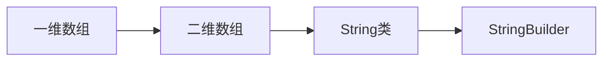

# 第4章-数组与字符串

> [!abstract] 本章定位
> 本章介绍Java的数组和字符串处理，包括一维数组、二维数组、String类、StringBuilder等。

## 学习主线

## 章节内容

- [[4.1-数组.md]]：一维数组、二维数组、Arrays工具类
- [[4.2-字符串.md]]：String类、StringBuilder、StringBuffer
- [[4.3-常用字符串操作.md]]：字符串比较、查找、替换、分割

## 考点汇总

> [!important] 核心考点
> 1. 数组的声明、初始化和访问
> 2. 数组的遍历和常见算法（排序、查找）
> 3. String类的不可变性
> 4. String、StringBuilder、StringBuffer的区别
> 5. 常用字符串方法：equals、length、substring、indexOf、split

## 前后章节依赖

| 方向 | 章节 | 依赖关系 |
|-----|------|---------|
| 先修 | 第3章 | 循环结构用于数组遍历 |
| 后续 | 第5章 | 对象数组是面向对象的基础 |

## 复习自测

> [!question] 自测题
> 1. 如何声明和初始化一维数组？
> 2. 如何遍历二维数组？
> 3. String为什么是不可变的？
> 4. String、StringBuilder、StringBuffer的区别是什么？
> 5. 如何比较两个字符串的内容？