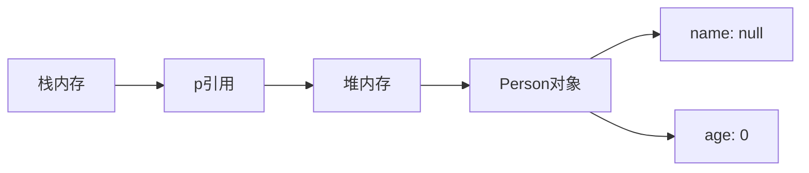
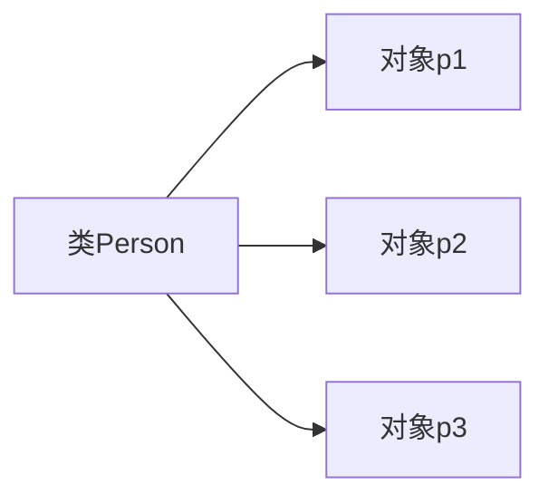

# 5.1 类与对象

> [!abstract] 核心问题
> 什么是类？什么是对象？如何定义类和创建对象？

## 一、类的定义

### 1. 类的概念

类是对象的模板，描述了对象的属性和行为。

### 2. 类的组成

| 组成 | 说明 |
|-----|------|
| 成员变量 | 对象的属性 |
| 成员方法 | 对象的行为 |
| 构造方法 | 创建对象的方法 |

### 3. 定义类

```java
public class Person {
    // 成员变量（属性）
    String name;
    int age;
    
    // 成员方法（行为）
    public void sayHello() {
        System.out.println("Hello, I'm " + name);
    }
    
    public int getAge() {
        return age;
    }
}
```

## 二、对象的创建和使用

### 1. 创建对象

```java
Person p = new Person();
```

### 2. 对象的内存分配



### 3. 使用对象

```java
Person p = new Person();

// 访问成员变量
p.name = "张三";
p.age = 18;

// 调用成员方法
p.sayHello();  // Hello, I'm 张三
```

### 4. 创建多个对象

```java
Person p1 = new Person();
Person p2 = new Person();

p1.name = "张三";
p2.name = "李四";

p1.sayHello();  // Hello, I'm 张三
p2.sayHello();  // Hello, I'm 李四
```

## 三、成员变量的默认值

| 类型 | 默认值 |
|-----|------|
| `byte/short/int/long` | 0 |
| `float/double` | 0.0 |
| `char` | '\u0000' |
| `boolean` | false |
| 引用类型 | null |

```java
Person p = new Person();
System.out.println(p.name);  // null
System.out.println(p.age);   // 0
```

## 四、方法的调用

### 1. 无参数方法

```java
public void show() {
    System.out.println("Hello");
}
```

### 2. 有参数方法

```java
public void setName(String n) {
    name = n;
}
```

### 3. 有返回值方法

```java
public String getName() {
    return name;
}
```

## 五、类和对象的关系

### 1. 类比

- 类：图纸
- 对象：根据图纸建造的房子

### 2. 关系



> [!warning] 易错点
> 类是抽象的，对象是具体的！类不能直接使用，必须创建对象后才能使用。

---

**导航**：[[MOC - 第5章.md|返回章节导航]] · 下一节 [[5.2-封装.md]]