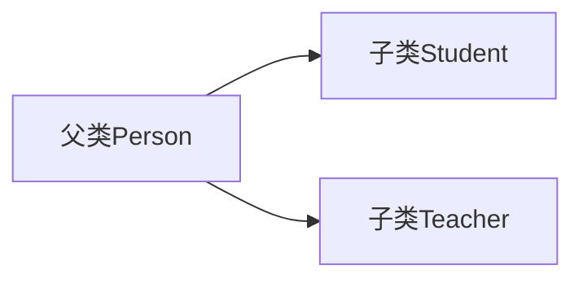

# 6.1 继承

> [!abstract] 核心问题
> 什么是继承？继承的特点是什么？super关键字的作用是什么？

## 一、继承的概念

### 1. 定义

继承是一种机制，允许一个类（子类）获取另一个类（父类）的属性和方法。

### 2. 继承的优点

| 优点 | 说明 |
|-----|------|
| 代码复用 | 子类可以直接使用父类的代码 |
| 扩展功能 | 子类可以添加新的属性和方法 |
| 层次结构 | 建立类之间的层次关系 |

### 3. 继承关系



## 二、定义子类

### 1. 使用extends关键字

```java
public class Person {
    protected String name;
    protected int age;
    
    public void sayHello() {
        System.out.println("Hello, I'm " + name);
    }
}

public class Student extends Person {
    private String school;
    
    public void study() {
        System.out.println(name + " is studying at " + school);
    }
}
```

### 2. 继承的特性

| 特性 | 说明 |
|-----|------|
| 单继承 | 一个类只能有一个直接父类 |
| 传递性 | 如果A继承B，B继承C，则A继承C |
| is-a关系 | 子类是父类的一种特殊形式 |

## 三、super关键字

### 1. 调用父类构造方法

```java
public class Person {
    public Person(String name) {
        this.name = name;
    }
}

public class Student extends Person {
    public Student(String name, String school) {
        super(name);  // 调用父类构造方法
        this.school = school;
    }
}
```

### 2. 访问父类成员

```java
public class Person {
    protected String name = "Person";
    
    public void sayHello() {
        System.out.println("Hello from Person");
    }
}

public class Student extends Person {
    private String name = "Student";
    
    public void printNames() {
        System.out.println(this.name);   // Student（子类）
        System.out.println(super.name);  // Person（父类）
    }
    
    public void callParentMethod() {
        super.sayHello();  // 调用父类方法
    }
}
```

### 3. super与this的区别

| 对比项 | this | super |
|-------|------|-------|
| 指向 | 当前对象 | 父类对象 |
| 调用构造方法 | `this()` | `super()` |
| 访问成员 | 当前类成员 | 父类成员 |

## 四、继承中的成员访问

### 1. 成员变量的继承

```java
public class Person {
    public String name;
    protected int age;
    private String gender;  // 私有成员不能被继承
}

public class Student extends Person {
    public void access() {
        name = "张三";  // 可以访问
        age = 18;       // 可以访问
        // gender = "男";  // 编译错误，不能访问
    }
}
```

### 2. 方法的继承

```java
public class Person {
    public void sayHello() {
        System.out.println("Hello");
    }
}

public class Student extends Person {
    public void study() {
        sayHello();  // 可以直接调用父类方法
    }
}
```

## 五、Java的继承限制

### 1. 单继承

Java不支持多继承，但可以通过接口实现类似功能。

### 2. 不能继承的内容

| 内容 | 说明 |
|-----|------|
| 构造方法 | 不能继承，但可以调用 |
| 私有成员 | 不能继承 |
| 静态成员 | 可以继承，但属于类，不属于对象 |

> [!warning] 易错点
> 子类构造方法必须调用父类构造方法！如果没有显式调用，编译器会自动添加`super()`调用。

---

**导航**：[[MOC - 第6章.md|返回章节导航]] · 下一节 [[6.2-方法重写.md]]