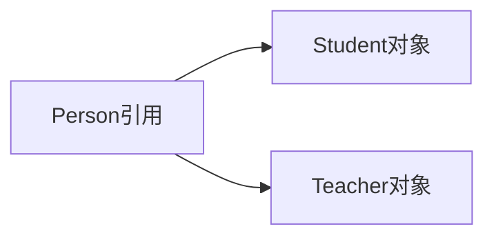

# 6.3 多态

> [!abstract] 核心问题
> 什么是多态？如何实现多态？向上转型和向下转型的区别是什么？

## 一、多态的概念

### 1. 定义

多态是指同一个方法调用可以根据对象的实际类型产生不同的行为。

### 2. 多态的特点

| 特点 | 说明 |
|-----|------|
| 编译时类型 | 引用变量的类型 |
| 运行时类型 | 对象的实际类型 |
| 动态绑定 | 运行时根据实际类型调用方法 |

### 3. 多态的示意图



## 二、实现多态

### 1. 向上转型

```java
Person p1 = new Student();  // 向上转型
Person p2 = new Teacher();  // 向上转型
```

### 2. 方法调用

```java
public class Person {
    public void sayHello() {
        System.out.println("Hello from Person");
    }
}

public class Student extends Person {
    @Override
    public void sayHello() {
        System.out.println("Hello from Student");
    }
}

public class Teacher extends Person {
    @Override
    public void sayHello() {
        System.out.println("Hello from Teacher");
    }
}

// 使用多态
Person p1 = new Student();
Person p2 = new Teacher();

p1.sayHello();  // Hello from Student
p2.sayHello();  // Hello from Teacher
```

### 3. 多态的优势

```java
public void greet(Person p) {
    p.sayHello();  // 根据实际类型调用不同的方法
}

// 可以传入任意Person子类对象
greet(new Student());
greet(new Teacher());
```

## 三、向上转型和向下转型

### 1. 向上转型

```java
Person p = new Student();  // 自动完成
```

特点：
- 安全，不会出错
- 可以调用父类的方法
- 不能调用子类特有的方法

### 2. 向下转型

```java
Person p = new Student();
Student s = (Student) p;  // 需要显式转换
```

特点：
- 需要显式转换
- 可能抛出ClassCastException
- 可以调用子类特有的方法

### 3. instanceof运算符

```java
Person p = new Student();

if (p instanceof Student) {
    Student s = (Student) p;
    s.study();  // 安全调用子类方法
}

if (p instanceof Teacher) {
    Teacher t = (Teacher) p;
    t.teach();
}
```

## 四、多态的应用场景

### 1. 参数多态

```java
public class Printer {
    public void print(Animal animal) {
        animal.sound();
    }
}

public class Dog extends Animal {
    @Override
    public void sound() {
        System.out.println("Woof");
    }
}

public class Cat extends Animal {
    @Override
    public void sound() {
        System.out.println("Meow");
    }
}
```

### 2. 返回值多态

```java
public Animal createAnimal(String type) {
    if ("dog".equals(type)) {
        return new Dog();
    } else {
        return new Cat();
    }
}
```

### 3. 集合多态

```java
List<Person> people = new ArrayList<>();
people.add(new Student());
people.add(new Teacher());

for (Person p : people) {
    p.sayHello();
}
```

## 五、多态与静态方法

### 1. 静态方法不支持多态

```java
public class Person {
    public static void sayHello() {
        System.out.println("Hello from Person");
    }
}

public class Student extends Person {
    public static void sayHello() {
        System.out.println("Hello from Student");
    }
}

Person p = new Student();
p.sayHello();  // Hello from Person（静态方法不支持多态）
```

### 2. 原因

静态方法属于类，不属于对象，编译时就确定了调用哪个方法。

> [!warning] 易错点
> 多态只适用于实例方法！静态方法和成员变量不支持多态。

---

**导航**：上一节 [[6.2-方法重写.md]] · [[MOC - 第6章.md|返回章节导航]]