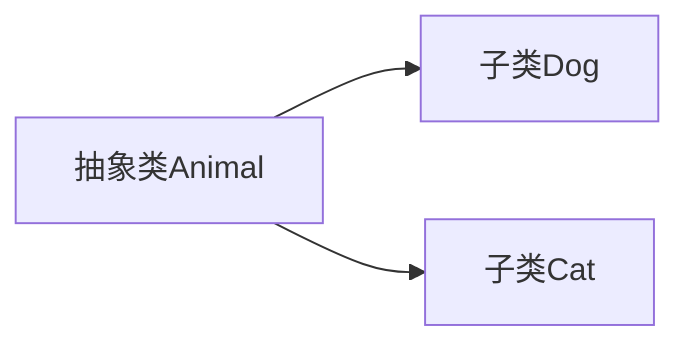

# 7.1 抽象类

> [!abstract] 核心问题
> 什么是抽象类？抽象类的特点是什么？如何使用抽象类？

## 一、抽象类的概念

### 1. 定义

抽象类是一种不能被实例化的类，用于定义子类的共同特征。

### 2. 抽象类的特点

| 特点 | 说明 |
|-----|------|
| 不能实例化 | 不能使用new关键字创建对象 |
| 可以有抽象方法 | 只有声明，没有实现 |
| 可以有具体方法 | 有完整的实现 |
| 可以有成员变量 | 可以定义属性 |
| 子类必须实现抽象方法 | 除非子类也是抽象类 |

### 3. 抽象类的作用



## 二、定义抽象类

### 1. 使用abstract关键字

```java
public abstract class Animal {
    protected String name;
    
    // 具体方法
    public void setName(String name) {
        this.name = name;
    }
    
    public String getName() {
        return name;
    }
    
    // 抽象方法
    public abstract void sound();
}
```

### 2. 抽象方法

```java
public abstract void sound();
```

特点：
- 只有方法声明，没有方法体
- 子类必须实现抽象方法
- 抽象方法只能在抽象类中定义

## 三、实现抽象类

### 1. 子类实现抽象方法

```java
public class Dog extends Animal {
    @Override
    public void sound() {
        System.out.println("Woof");
    }
}

public class Cat extends Animal {
    @Override
    public void sound() {
        System.out.println("Meow");
    }
}
```

### 2. 使用抽象类

```java
Animal dog = new Dog();
Animal cat = new Cat();

dog.setName("旺财");
cat.setName("咪咪");

dog.sound();  // Woof
cat.sound();  // Meow
```

### 3. 抽象类作为参数

```java
public void makeSound(Animal animal) {
    animal.sound();
}

makeSound(new Dog());  // Woof
makeSound(new Cat());  // Meow
```

## 四、抽象类的应用场景

### 1. 模板方法模式

```java
public abstract class Game {
    public void play() {
        initialize();
        start();
        end();
    }
    
    public abstract void initialize();
    public abstract void start();
    public abstract void end();
}

public class ChessGame extends Game {
    @Override
    public void initialize() {
        System.out.println("Initialize chess game");
    }
    
    @Override
    public void start() {
        System.out.println("Start chess game");
    }
    
    @Override
    public void end() {
        System.out.println("End chess game");
    }
}
```

### 2. 定义接口规范

```java
public abstract class Shape {
    public abstract double getArea();
    public abstract double getPerimeter();
}
```

## 五、抽象类与普通类的区别

| 对比项 | 抽象类 | 普通类 |
|-------|-------|-------|
| 实例化 | 不能 | 可以 |
| 抽象方法 | 可以有 | 不能有 |
| 继承 | 子类必须实现抽象方法 | 可选重写 |
| 用途 | 定义模板 | 创建对象 |

> [!warning] 易错点
> 抽象类不能被实例化！但是可以作为引用类型使用。抽象方法必须在子类中实现，除非子类也是抽象类。

---

**导航**：[[MOC - 第7章.md|返回章节导航]] · 下一节 [[7.2-接口.md]]