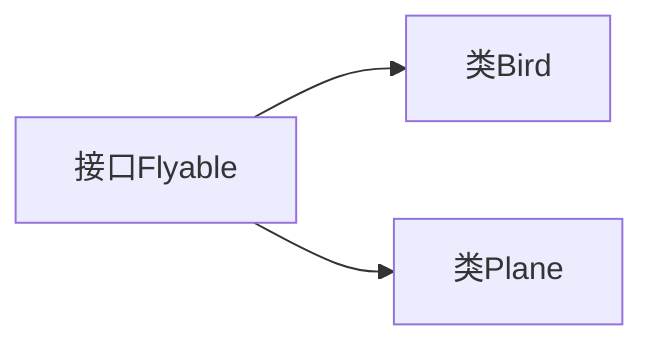

# 7.2 接口

> [!abstract] 核心问题
> 什么是接口？接口的特点是什么？如何实现和使用接口？

## 一、接口的概念

### 1. 定义

接口是一种特殊的抽象类型，只包含抽象方法、常量、默认方法和静态方法。

### 2. 接口的特点

| 特点 | 说明 |
|-----|------|
| 不能实例化 | 不能使用new关键字创建对象 |
| 所有方法默认是public abstract | 可以省略修饰符 |
| 所有常量默认是public static final | 可以省略修饰符 |
| 可以继承多个接口 | 支持多继承 |
| 类可以实现多个接口 | 弥补单继承的不足 |

### 3. 接口的作用



## 二、定义接口

### 1. 使用interface关键字

```java
public interface Flyable {
    // 常量
    int MAX_HEIGHT = 10000;
    
    // 抽象方法
    void fly();
    
    // 默认方法（Java 8+）
    default void land() {
        System.out.println("Landing...");
    }
    
    // 静态方法（Java 8+）
    static void showInfo() {
        System.out.println("Flyable interface");
    }
}
```

### 2. 接口成员

| 成员类型 | 修饰符 | 示例 |
|---------|-------|------|
| 常量 | public static final | `int MAX = 100;` |
| 抽象方法 | public abstract | `void method();` |
| 默认方法 | default | `default void method() {}` |
| 静态方法 | static | `static void method() {}` |

## 三、实现接口

### 1. 使用implements关键字

```java
public class Bird implements Flyable {
    @Override
    public void fly() {
        System.out.println("Bird is flying");
    }
}

public class Plane implements Flyable {
    @Override
    public void fly() {
        System.out.println("Plane is flying");
    }
    
    @Override
    public void land() {
        System.out.println("Plane is landing");
    }
}
```

### 2. 实现多个接口

```java
public interface Runnable {
    void run();
}

public class Duck implements Flyable, Runnable {
    @Override
    public void fly() {
        System.out.println("Duck is flying");
    }
    
    @Override
    public void run() {
        System.out.println("Duck is running");
    }
}
```

### 3. 使用接口

```java
Flyable bird = new Bird();
Flyable plane = new Plane();

bird.fly();   // Bird is flying
plane.fly();  // Plane is flying

bird.land();  // Landing...
plane.land(); // Plane is landing
```

## 四、接口继承

### 1. 接口可以继承接口

```java
public interface Animal {
    void eat();
}

public interface Mammal extends Animal {
    void giveBirth();
}

public class Dog implements Mammal {
    @Override
    public void eat() {
        System.out.println("Dog is eating");
    }
    
    @Override
    public void giveBirth() {
        System.out.println("Dog gives birth");
    }
}
```

### 2. 多重继承

```java
public interface A {
    void methodA();
}

public interface B {
    void methodB();
}

public interface C extends A, B {
    void methodC();
}
```

## 五、抽象类与接口的区别

### 1. 对比表

| 对比项 | 抽象类 | 接口 |
|-------|-------|------|
| 继承 | 单继承 | 多继承 |
| 方法 | 可以有具体方法 | 只能有抽象方法（Java 8前） |
| 成员变量 | 可以有实例变量 | 只能有常量 |
| 构造方法 | 可以有 | 不能有 |
| is-a关系 | 是一种 | 具有某种能力 |

### 2. 选择建议

| 场景 | 选择 |
|-----|------|
| 定义模板 | 抽象类 |
| 定义能力 | 接口 |
| 代码复用 | 抽象类 |
| 解耦 | 接口 |

> [!warning] 易错点
> 接口中的方法默认是public abstract！实现接口时，方法必须是public的。

---

**导航**：上一节 [[7.1-抽象类.md]] · [[MOC - 第7章.md|返回章节导航]] · 下一节 [[7.3-内部类.md]]