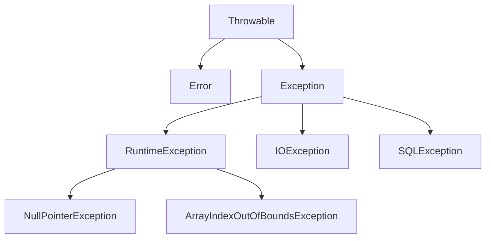

# 8.1 异常概述

> [!abstract] 核心问题
> 什么是异常？异常的分类是什么？异常体系是怎样的？

## 一、异常的概念

### 1. 定义

异常是程序运行过程中发生的不正常情况。

### 2. 异常的特点

| 特点 | 说明 |
|-----|------|
| 不可预测 | 发生时间不确定 |
| 可处理 | 可以通过代码捕获和处理 |
| 可传递 | 异常可以在方法调用链中传递 |

### 3. 异常处理的意义


## 二、异常分类

### 1. Checked异常（受检异常）

必须在代码中显式处理的异常。

| 异常类型 | 示例 |
|---------|------|
| IOException | 文件读写异常 |
| SQLException | 数据库操作异常 |
| ClassNotFoundException | 类未找到异常 |

### 2. Unchecked异常（非受检异常）

不需要显式处理的异常。

| 异常类型 | 示例 |
|---------|------|
| RuntimeException | 运行时异常 |
| NullPointerException | 空指针异常 |
| ArrayIndexOutOfBoundsException | 数组越界异常 |
| IllegalArgumentException | 非法参数异常 |

### 3. 错误（Error）

严重的系统错误，通常不能处理。

| 错误类型 | 示例 |
|---------|------|
| OutOfMemoryError | 内存溢出 |
| StackOverflowError | 栈溢出 |
| NoClassDefFoundError | 类定义未找到 |

## 三、异常体系

### 1. 层次结构



### 2. 继承关系

| 类 | 说明 |
|-----|------|
| `Throwable` | 所有异常和错误的父类 |
| `Error` | 系统错误 |
| `Exception` | 可处理的异常 |
| `RuntimeException` | 运行时异常 |

## 四、常见异常

### 1. RuntimeException子类

| 异常 | 原因 | 示例 |
|-----|------|------|
| `NullPointerException` | 访问null对象的成员 | `obj.method()` |
| `ArrayIndexOutOfBoundsException` | 数组下标越界 | `arr[10]` |
| `IllegalArgumentException` | 参数不合法 | `new ArrayList(-1)` |
| `ArithmeticException` | 算术运算错误 | `5 / 0` |
| `ClassCastException` | 类型转换错误 | `(String) obj` |

### 2. Checked异常

| 异常 | 原因 | 示例 |
|-----|------|------|
| `IOException` | I/O操作失败 | 文件读写 |
| `SQLException` | 数据库操作失败 | SQL执行 |
| `ClassNotFoundException` | 类找不到 | `Class.forName()` |

## 五、异常处理原则

### 1. 尽早捕获

```java
public void readFile(String path) {
    try {
        // 可能抛出异常的代码
        FileReader reader = new FileReader(path);
    } catch (FileNotFoundException e) {
        // 处理异常
        System.out.println("文件不存在");
    }
}
```

### 2. 精确捕获

```java
try {
    // 代码
} catch (FileNotFoundException e) {
    // 处理文件不存在
} catch (IOException e) {
    // 处理其他IO异常
}
```

### 3. 提供有用信息

```java
catch (Exception e) {
    System.out.println("错误信息：" + e.getMessage());
    e.printStackTrace();
}
```

> [!warning] 易错点
> RuntimeException是Unchecked异常，不需要显式处理！但是应该尽可能避免发生。

---

**导航**：[[MOC - 第8章.md|返回章节导航]] · 下一节 [[8.2-异常处理.md]]