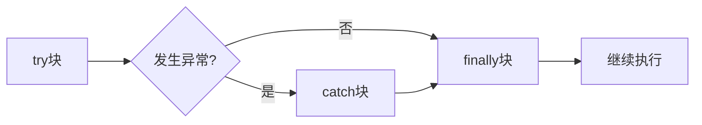

# 8.2 异常处理

> [!abstract] 核心问题
> 如何使用try-catch-finally处理异常？throws和throw的区别是什么？

## 一、try-catch语句

### 1. 基本形式

```java
try {
    // 可能抛出异常的代码
} catch (异常类型 e) {
    // 异常处理代码
}
```

### 2. 示例

```java
try {
    int[] arr = {1, 2, 3};
    System.out.println(arr[5]);  // 抛出ArrayIndexOutOfBoundsException
} catch (ArrayIndexOutOfBoundsException e) {
    System.out.println("数组下标越界");
}
```

### 3. 多catch语句

```java
try {
    // 可能抛出多种异常的代码
} catch (FileNotFoundException e) {
    System.out.println("文件不存在");
} catch (IOException e) {
    System.out.println("IO异常");
} catch (Exception e) {
    System.out.println("其他异常");
}
```

### 4. 捕获顺序

- 子类异常必须在父类异常之前捕获
- 否则子类异常永远不会被捕获

```java
// 正确
try {
    // 代码
} catch (FileNotFoundException e) {
    // 先捕获子类
} catch (IOException e) {
    // 再捕获父类
}

// 错误：FileNotFoundException永远不会被捕获
try {
    // 代码
} catch (IOException e) {
    // 先捕获父类
} catch (FileNotFoundException e) {
    // 永远不会执行
}
```

## 二、finally块

### 1. 基本形式

```java
try {
    // 可能抛出异常的代码
} catch (Exception e) {
    // 异常处理代码
} finally {
    // 无论是否发生异常都会执行的代码
}
```

### 2. 执行顺序



### 3. 示例

```java
try {
    System.out.println("try");
    int a = 1 / 0;  // 抛出异常
} catch (ArithmeticException e) {
    System.out.println("catch");
} finally {
    System.out.println("finally");  // 总是执行
}
```

### 4. finally的作用

| 场景 | 用途 |
|-----|------|
| 关闭资源 | 关闭文件、数据库连接 |
| 清理操作 | 释放内存、删除临时文件 |
| 记录日志 | 记录操作日志 |

```java
FileReader reader = null;
try {
    reader = new FileReader("file.txt");
    // 读取文件
} catch (IOException e) {
    System.out.println("读取失败");
} finally {
    if (reader != null) {
        try {
            reader.close();
        } catch (IOException e) {
            e.printStackTrace();
        }
    }
}
```

## 三、throws关键字

### 1. 声明异常

```java
public void readFile(String path) throws IOException {
    FileReader reader = new FileReader(path);
}
```

### 2. 传递异常

```java
public void method1() throws IOException {
    readFile("file.txt");
}

public void method2() throws IOException {
    method1();  // 异常继续向上传递
}
```

### 3. 注意事项

- throws声明异常，不处理异常
- 调用者必须处理或继续声明异常
- Unchecked异常不需要声明

## 四、throw关键字

### 1. 抛出异常

```java
public void checkAge(int age) {
    if (age < 0) {
        throw new IllegalArgumentException("年龄不能为负数");
    }
}
```

### 2. 示例

```java
public class Calculator {
    public int divide(int a, int b) {
        if (b == 0) {
            throw new ArithmeticException("除数不能为0");
        }
        return a / b;
    }
}
```

### 3. throws vs throw

| 对比项 | throws | throw |
|-------|-------|-------|
| 位置 | 方法声明处 | 方法体内 |
| 作用 | 声明异常 | 抛出异常 |
| 数量 | 可以多个 | 只能一个 |

## 五、try-with-resources

### 1. 自动资源管理（Java 7+）

```java
try (FileReader reader = new FileReader("file.txt")) {
    // 读取文件
} catch (IOException e) {
    System.out.println("读取失败");
}
// 资源自动关闭，不需要finally块
```

### 2. 多个资源

```java
try (FileReader reader = new FileReader("input.txt");
     FileWriter writer = new FileWriter("output.txt")) {
    // 读写操作
} catch (IOException e) {
    e.printStackTrace();
}
```

> [!warning] 易错点
> finally块中的代码总是执行！即使catch块中有return语句，finally块也会执行。

---

**导航**：上一节 [[8.1-异常概述.md]] · [[MOC - 第8章.md|返回章节导航]] · 下一节 [[8.3-自定义异常.md]]