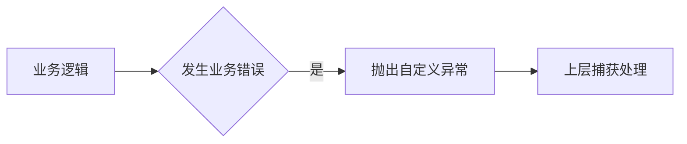

# 8.3 自定义异常

> [!abstract] 核心问题
> 如何自定义异常？自定义异常的使用场景是什么？

## 一、自定义异常的概念

### 1. 定义

自定义异常是用户根据业务需求定义的异常类。

### 2. 自定义异常的优点

| 优点 | 说明 |
|-----|------|
| 业务语义 | 更清晰地表达业务错误 |
| 分层处理 | 不同业务异常可以分开处理 |
| 可扩展性 | 可以添加自定义属性和方法 |

### 3. 自定义异常的作用



## 二、定义自定义异常

### 1. 继承Exception类（Checked异常）

```java
public class BusinessException extends Exception {
    public BusinessException() {
        super();
    }
    
    public BusinessException(String message) {
        super(message);
    }
    
    public BusinessException(String message, Throwable cause) {
        super(message, cause);
    }
}
```

### 2. 继承RuntimeException类（Unchecked异常）

```java
public class ValidationException extends RuntimeException {
    private int errorCode;
    
    public ValidationException(String message) {
        super(message);
    }
    
    public ValidationException(String message, int errorCode) {
        super(message);
        this.errorCode = errorCode;
    }
    
    public int getErrorCode() {
        return errorCode;
    }
}
```

### 3. 添加自定义属性

```java
public class UserNotFoundException extends RuntimeException {
    private String userId;
    
    public UserNotFoundException(String userId) {
        super("用户不存在: " + userId);
        this.userId = userId;
    }
    
    public String getUserId() {
        return userId;
    }
}
```

## 三、使用自定义异常

### 1. 抛出自定义异常

```java
public class UserService {
    public User getUser(String userId) {
        User user = userDao.findById(userId);
        if (user == null) {
            throw new UserNotFoundException(userId);
        }
        return user;
    }
}
```

### 2. 捕获自定义异常

```java
public class Controller {
    public void handleRequest(String userId) {
        try {
            UserService service = new UserService();
            User user = service.getUser(userId);
            System.out.println("用户信息: " + user);
        } catch (UserNotFoundException e) {
            System.out.println("错误: " + e.getMessage());
            System.out.println("用户ID: " + e.getUserId());
        }
    }
}
```

### 3. 多层异常处理

```java
public void process() {
    try {
        service.doSomething();
    } catch (BusinessException e) {
        // 处理业务异常
        log.error("业务错误", e);
        throw new ServiceException("服务错误", e);
    }
}
```

## 四、自定义异常的应用场景

### 1. 参数校验

```java
public class ValidationException extends RuntimeException {
    public ValidationException(String field, String message) {
        super(field + ": " + message);
    }
}

public void validate(User user) {
    if (user.getName() == null || user.getName().isEmpty()) {
        throw new ValidationException("name", "姓名不能为空");
    }
    if (user.getAge() < 0) {
        throw new ValidationException("age", "年龄不能为负数");
    }
}
```

### 2. 业务规则

```java
public class InsufficientBalanceException extends RuntimeException {
    private double balance;
    private double required;
    
    public InsufficientBalanceException(double balance, double required) {
        super("余额不足: 当前余额" + balance + ", 需要" + required);
        this.balance = balance;
        this.required = required;
    }
}

public void withdraw(double amount) {
    if (balance < amount) {
        throw new InsufficientBalanceException(balance, amount);
    }
    balance -= amount;
}
```

### 3. 资源操作

```java
public class ResourceNotFoundException extends RuntimeException {
    private String resourceType;
    private String resourceId;
    
    public ResourceNotFoundException(String resourceType, String resourceId) {
        super(resourceType + "不存在: " + resourceId);
        this.resourceType = resourceType;
        this.resourceId = resourceId;
    }
}
```

## 五、异常处理最佳实践

### 1. 选择合适的异常类型

| 场景 | 异常类型 |
|-----|---------|
| 业务错误 | 自定义Checked异常 |
| 参数错误 | 自定义RuntimeException |
| 系统错误 | 使用现有异常 |

### 2. 提供详细信息

```java
throw new BusinessException("订单创建失败: 用户不存在, 用户ID: " + userId);
```

### 3. 保留异常链

```java
try {
    // 代码
} catch (SQLException e) {
    throw new DatabaseException("数据库操作失败", e);
}
```

> [!warning] 易错点
> 不要过度使用自定义异常！只有在现有异常不能表达业务语义时才需要自定义。

---

**导航**：上一节 [[8.2-异常处理.md]] · [[MOC - 第8章.md|返回章节导航]]