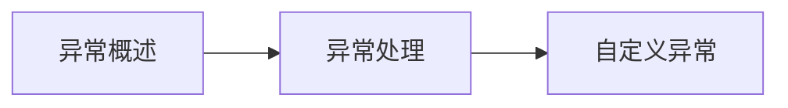

# 第8章-异常处理机制

> [!abstract] 本章定位
> 本章介绍Java的异常处理机制，包括异常分类、异常处理方式和自定义异常。

## 学习主线

## 章节内容

- [[8.1-异常概述.md]]：异常的概念、异常分类、异常体系
- [[8.2-异常处理.md]]：try-catch-finally、throws、throw
- [[8.3-自定义异常.md]]：自定义异常类的定义和使用

## 考点汇总

> [!important] 核心考点
> 1. 异常的分类：Checked异常和Unchecked异常
> 2. try-catch-finally的执行顺序
> 3. throws和throw的区别
> 4. 自定义异常的定义和使用
> 5. finally块的作用和注意事项

## 前后章节依赖

| 方向 | 章节 | 依赖关系 |
|-----|------|---------|
| 先修 | 第7章 | 接口和抽象类是异常体系的基础 |
| 后续 | 第9章 | 集合框架中的异常处理 |

## 复习自测

> [!question] 自测题
> 1. 什么是异常？异常的分类是什么？
> 2. Checked异常和Unchecked异常的区别是什么？
> 3. try-catch-finally的执行顺序是什么？
> 4. throws和throw的区别是什么？
> 5. 如何自定义异常？