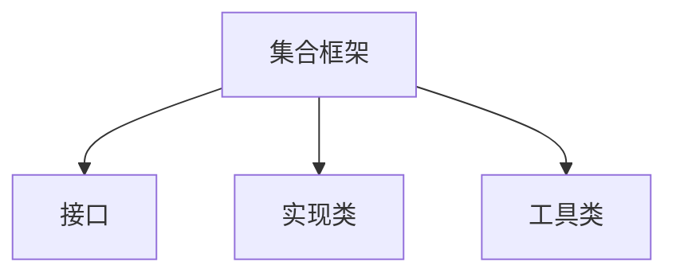
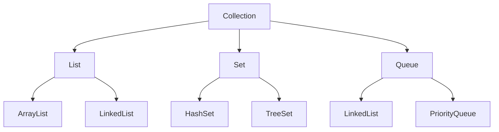

# 9.2 集合框架概述

> [!abstract] 核心问题
> 什么是集合框架？Collection接口、List接口、Set接口的关系是什么？

## 一、集合框架的概念

### 1. 定义

集合框架是Java提供的一组用于存储和操作对象的类和接口。

### 2. 集合框架的组成



### 3. 集合框架的优点

| 优点 | 说明 |
|-----|------|
| 封装数据结构 | 不需要自己实现数据结构 |
| 统一接口 | 不同实现类使用相同的接口 |
| 高性能 | 经过优化的实现 |
| 类型安全 | 泛型支持 |

## 二、集合框架体系

### 1. 层次结构



### 2. 核心接口

| 接口 | 特点 | 实现类 |
|-----|------|-------|
| `Collection` | 所有集合的根接口 | - |
| `List` | 有序、可重复 | ArrayList、LinkedList |
| `Set` | 无序、不可重复 | HashSet、TreeSet |
| `Queue` | 队列 | LinkedList、PriorityQueue |
| `Map` | 键值对 | HashMap、TreeMap |

## 三、Collection接口

### 1. 常用方法

| 方法 | 说明 |
|-----|------|
| `add(E e)` | 添加元素 |
| `remove(Object o)` | 移除元素 |
| `contains(Object o)` | 判断是否包含 |
| `size()` | 返回元素个数 |
| `isEmpty()` | 判断是否为空 |
| `clear()` | 清空集合 |
| `iterator()` | 返回迭代器 |

### 2. 示例

```java
Collection<String> collection = new ArrayList<>();
collection.add("apple");
collection.add("banana");
collection.add("cherry");

System.out.println(collection.size());  // 3
System.out.println(collection.contains("apple"));  // true
collection.remove("banana");
```

## 四、List接口

### 1. 特点

- 有序：元素按插入顺序排列
- 可重复：可以包含相同的元素
- 可通过索引访问

### 2. 常用方法

| 方法 | 说明 |
|-----|------|
| `get(int index)` | 获取指定位置的元素 |
| `set(int index, E element)` | 设置指定位置的元素 |
| `add(int index, E element)` | 在指定位置插入元素 |
| `remove(int index)` | 移除指定位置的元素 |
| `indexOf(Object o)` | 返回元素的索引 |
| `lastIndexOf(Object o)` | 返回元素最后出现的索引 |
| `subList(int fromIndex, int toIndex)` | 返回子列表 |

### 3. 示例

```java
List<String> list = new ArrayList<>();
list.add("apple");
list.add("banana");
list.add("cherry");

System.out.println(list.get(0));  // apple
list.set(1, "blueberry");
list.add(1, "blackberry");
```

## 五、Set接口

### 1. 特点

- 无序：元素不按插入顺序排列
- 不可重复：不能包含相同的元素
- 没有索引

### 2. 常用方法

| 方法 | 说明 |
|-----|------|
| `add(E e)` | 添加元素（重复元素不会添加） |
| `remove(Object o)` | 移除元素 |
| `contains(Object o)` | 判断是否包含 |
| `size()` | 返回元素个数 |

### 3. 示例

```java
Set<String> set = new HashSet<>();
set.add("apple");
set.add("banana");
set.add("apple");  // 重复元素，不会添加

System.out.println(set.size());  // 2
System.out.println(set.contains("apple"));  // true
```

## 六、List vs Set

| 对比项 | List | Set |
|-------|------|-----|
| 有序性 | 有序 | 无序 |
| 可重复性 | 可重复 | 不可重复 |
| 索引访问 | 支持 | 不支持 |
| 常用实现 | ArrayList、LinkedList | HashSet、TreeSet |
| 适用场景 | 需要顺序访问 | 需要去重 |

## 七、Map接口

### 1. 特点

- 键值对结构
- 键唯一，值可以重复
- 通过键访问值

### 2. 常用方法

| 方法 | 说明 |
|-----|------|
| `put(K key, V value)` | 添加键值对 |
| `get(Object key)` | 获取值 |
| `remove(Object key)` | 移除键值对 |
| `containsKey(Object key)` | 判断键是否存在 |
| `containsValue(Object value)` | 判断值是否存在 |
| `size()` | 返回键值对个数 |
| `keySet()` | 返回所有键 |
| `values()` | 返回所有值 |
| `entrySet()` | 返回所有键值对 |

### 3. 示例

```java
Map<String, Integer> map = new HashMap<>();
map.put("apple", 10);
map.put("banana", 20);
map.put("cherry", 15);

System.out.println(map.get("apple"));  // 10
System.out.println(map.containsKey("banana"));  // true
```

---

**导航**：上一节 [[9.1-常用工具类.md]] · [[MOC - 第9章.md|返回章节导航]] · 下一节 [[9.3-常用集合实现类.md]]