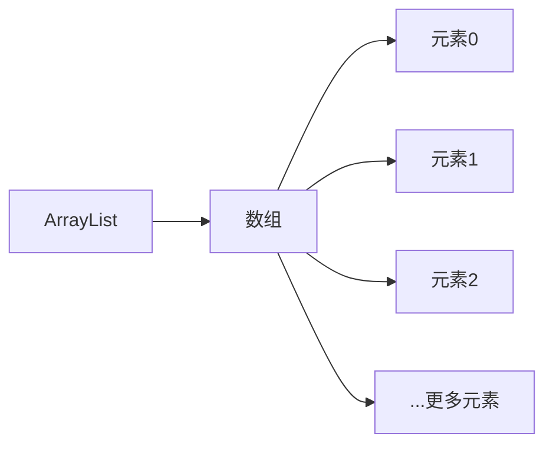
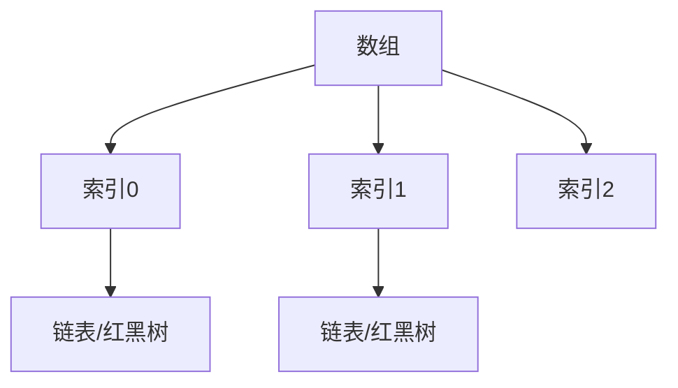

# 9.3 常用集合实现类

> [!abstract] 核心问题
> ArrayList、LinkedList、HashSet、HashMap的特点是什么？如何选择合适的集合实现类？

## 一、ArrayList

### 1. 特点

- 底层基于数组实现
- 随机访问速度快
- 插入和删除速度慢（需要移动元素）
- 支持自动扩容

### 2. 内部结构



### 3. 常用操作

```java
List<String> list = new ArrayList<>();
list.add("apple");      // O(1)
list.get(0);            // O(1)
list.remove(0);         // O(n)
list.contains("apple"); // O(n)
```

### 4. 扩容机制

```java
// 默认容量10
ArrayList<String> list = new ArrayList<>();

// 添加第11个元素时，容量扩容为15（10 * 1.5）
for (int i = 0; i < 11; i++) {
    list.add("element" + i);
}
```

## 二、LinkedList

### 1. 特点

- 底层基于双向链表实现
- 随机访问速度慢（需要遍历）
- 插入和删除速度快（只需要修改指针）
- 实现了List和Queue接口

### 2. 内部结构


### 3. 常用操作

```java
List<String> list = new LinkedList<>();
list.add("apple");      // O(1)
list.get(0);            // O(n)
list.remove(0);         // O(1)
list.contains("apple"); // O(n)
```

### 4. 作为Queue使用

```java
Queue<String> queue = new LinkedList<>();
queue.add("apple");     // 入队
queue.poll();           // 出队
queue.peek();           // 查看队头
```

## 三、ArrayList vs LinkedList

| 对比项 | ArrayList | LinkedList |
|-------|-----------|------------|
| 底层实现 | 数组 | 双向链表 |
| 随机访问 | O(1) | O(n) |
| 插入删除 | O(n) | O(1) |
| 内存占用 | 连续内存 | 每个节点额外开销 |
| 适用场景 | 读多写少 | 写多读少 |

## 四、HashSet

### 1. 特点

- 底层基于HashMap实现
- 无序：元素不按插入顺序排列
- 不可重复：基于equals和hashCode判断
- 允许null元素

### 2. 内部结构


### 3. 常用操作

```java
Set<String> set = new HashSet<>();
set.add("apple");      // O(1)
set.remove("apple");   // O(1)
set.contains("apple"); // O(1)
set.size();            // O(1)
```

### 4. 去重原理

```java
// 添加元素时，先比较hashCode，再比较equals
public class Person {
    private String name;
    private int age;
    
    @Override
    public boolean equals(Object obj) {
        // 比较内容
    }
    
    @Override
    public int hashCode() {
        // 返回哈希码
    }
}
```

## 五、TreeSet

### 1. 特点

- 底层基于TreeMap实现
- 有序：元素按自然顺序或自定义顺序排列
- 不可重复
- 不允许null元素

### 2. 排序方式

```java
// 自然排序
Set<String> set1 = new TreeSet<>();
set1.add("banana");
set1.add("apple");
set1.add("cherry");
// 输出：[apple, banana, cherry]

// 自定义排序
Set<String> set2 = new TreeSet<>(Comparator.reverseOrder());
set2.add("banana");
set2.add("apple");
set2.add("cherry");
// 输出：[cherry, banana, apple]
```

### 3. 常用操作

```java
Set<String> set = new TreeSet<>();
set.add("apple");
set.add("banana");

set.first();  // apple（第一个元素）
set.last();   // banana（最后一个元素）
set.headSet("banana");  // [apple]（小于banana的元素）
set.tailSet("banana");  // [banana]（大于等于banana的元素）
```

## 六、HashMap

### 1. 特点

- 底层基于数组+链表/红黑树实现
- 无序：键值对不按插入顺序排列
- 键唯一：基于equals和hashCode判断
- 允许null键和null值

### 2. 内部结构



### 3. 哈希冲突

当两个元素的hashCode相同时，会产生哈希冲突。

```java
// 解决方式：链表或红黑树
// Java 8+：当链表长度超过8且数组长度超过64时，转为红黑树
```

### 4. 常用操作

```java
Map<String, Integer> map = new HashMap<>();
map.put("apple", 10);   // O(1)
map.get("apple");       // O(1)
map.remove("apple");    // O(1)
map.containsKey("apple"); // O(1)
map.containsValue(10);  // O(n)
```

### 5. 遍历方式

```java
// 遍历键
for (String key : map.keySet()) {
    System.out.println(key);
}

// 遍历值
for (Integer value : map.values()) {
    System.out.println(value);
}

// 遍历键值对
for (Map.Entry<String, Integer> entry : map.entrySet()) {
    System.out.println(entry.getKey() + ": " + entry.getValue());
}
```

## 七、集合选择指南

| 场景 | 推荐集合 |
|-----|---------|
| 读多写少的列表 | ArrayList |
| 写多读少的列表 | LinkedList |
| 需要去重的无序集合 | HashSet |
| 需要排序的集合 | TreeSet |
| 键值对存储 | HashMap |
| 有序键值对 | TreeMap |

> [!warning] 易错点
> HashMap不是线程安全的！多线程环境下应该使用ConcurrentHashMap。

---

**导航**：上一节 [[9.2-集合框架概述.md]] · [[MOC - 第9章.md|返回章节导航]]