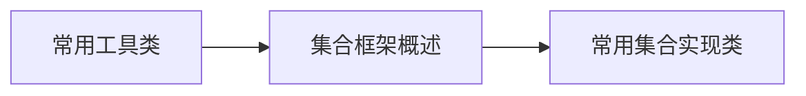

# 第9章-常用工具类与集合基础

> [!abstract] 本章定位
> 本章介绍Java的常用工具类和集合框架，包括Object类、包装类、集合接口和实现类。

## 学习主线

## 章节内容

- [[9.1-常用工具类.md]]：Object类、包装类、Math类、Date类
- [[9.2-集合框架概述.md]]：Collection接口、List接口、Set接口
- [[9.3-常用集合实现类.md]]：ArrayList、LinkedList、HashSet、HashMap

## 考点汇总

> [!important] 核心考点
> 1. Object类的常用方法：equals、hashCode、toString、clone
> 2. 包装类的自动装箱和拆箱
> 3. Collection接口的常用方法
> 4. List和Set的区别
> 5. ArrayList和LinkedList的区别
> 6. HashMap的底层实现原理

## 前后章节依赖

| 方向 | 章节 | 依赖关系 |
|-----|------|---------|
| 先修 | 第8章 | 异常处理用于集合操作 |
| 后续 | 第10章 | I/O流可以与集合配合使用 |

## 复习自测

> [!question] 自测题
> 1. Object类有哪些常用方法？
> 2. 什么是自动装箱和拆箱？
> 3. Collection接口的常用方法有哪些？
> 4. List和Set的区别是什么？
> 5. ArrayList和LinkedList的区别是什么？
> 6. HashMap的底层实现原理是什么？