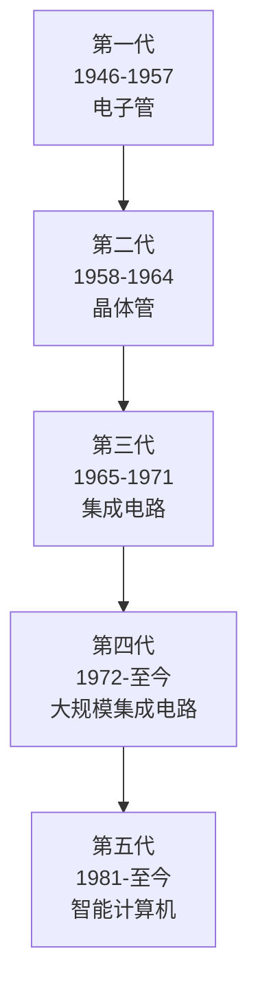

# 1.1 计算机的发展与分类

> [!abstract] 核心问题
> 计算机是如何从早期计算工具演变而来的？不同类型的计算机各有什么特点和用途？

## 一、计算机发展历程

### 1. 计算工具的演进

| 阶段 | 代表工具 | 主要特点 |
|-----|---------|---------|
| **手工计算** | 算盘、算筹 | 依赖人力，速度慢 |
| **机械计算** | 帕斯卡加法器、差分机 | 机械传动，自动执行 |
| **机电计算** | 哈佛马克I号 | 继电器控制，十进制 |
| **电子计算** | ENIAC | 电子管，二进制 |

### 2. 电子计算机的五代划分

**第一代（1946-1957）——电子管时代**
- 标志：ENIAC（世界第一台电子计算机）
- 特点：体积庞大、功耗高、速度慢（数千次/秒）、使用机器语言

**第二代（1958-1964）——晶体管时代**
- 特点：体积缩小、功耗降低、速度提升（百万次/秒）
- 软件：出现高级语言（FORTRAN、COBOL）、操作系统雏形

**第三代（1965-1971）——集成电路时代**
- 特点：中小规模集成电路、速度进一步提升
- 应用：分时系统、小型计算机普及

**第四代（1972-至今）——大规模集成电路时代**
- 特点：LSI/VLSI、微型计算机出现、个人电脑普及
- 应用：互联网、多媒体、移动计算

**第五代（1981-至今）——智能计算机时代**
- 特点：人工智能、神经网络、量子计算研究
- 方向：自然语言处理、机器学习、自主决策

### 3. 我国计算机发展

- **1958年**：研制成功第一台电子管计算机（103机）
- **1965年**：研制成功第一台晶体管计算机（109乙机）
- **1977年**：研制成功第一台微型计算机（DJS-050）
- **2020年**："九章"量子计算原型机实现"量子优越性"

## 二、计算机分类

### 1. 按规模与性能分类

| 类型 | 特点 | 典型应用 |
|-----|------|---------|
| **超级计算机** | 运算速度最快、存储容量最大 | 气象预报、核模拟、基因分析 |
| **大型计算机** | 高可靠性、高吞吐量 | 银行交易、企业级数据库 |
| **中型计算机** | 介于大型机与小型机之间 | 部门级服务器、专用系统 |
| **小型计算机** | 规模较小、价格适中 | 小型企业、实验室 |
| **微型计算机** | 体积小、价格低、普及广 | 个人电脑、工作站 |

### 2. 按用途分类

- **通用计算机**：适用于多种任务（个人电脑、服务器）
- **专用计算机**：专为特定任务设计（嵌入式系统、工业控制）

### 3. 按处理数据类型分类

- **数字计算机**：处理离散数字信号（主流计算机）
- **模拟计算机**：处理连续模拟信号（专用科学计算）
- **混合计算机**：结合数字与模拟处理（特定应用领域）

## 三、计算机性能指标

### 1. 核心性能指标

| 指标 | 说明 | 单位 |
|-----|------|-----|
| **CPU时钟频率** | CPU每秒执行的时钟周期数 | GHz（千兆赫） |
| **MIPS** | 每秒百万条指令数 | 百万条/秒 |
| **FLOPS** | 每秒浮点运算次数 | GFLOPS/TFLOPS |
| **内存容量** | 计算机能同时存储的数据量 | GB（吉字节） |
| **存储容量** | 外部存储设备的容量 | TB（太字节） |

### 2. 综合性能评估

- **基准测试**：通过标准程序测试系统性能
- **SPEC基准**：标准化性能评估公司制定的测试标准
- **能效比**：性能与功耗的比值，衡量绿色计算能力

## 四、易错点提示

> [!warning] 常见误区
> - **"CPU主频越高，电脑越快"**：不完全正确。CPU架构、缓存、内存带宽、软件优化等都会影响实际性能。
> - **"超级计算机就是最大的计算机"**：超级计算机强调的是高性能计算能力，不一定体积最大。
> - **"微型计算机就是性能最差的"**：微型计算机指的是体积和结构，现代高性能工作站也属于微型计算机范畴。

## 五、示例与练习

### 示例

**例1**：一台计算机的CPU主频为3.0GHz，内存容量为8GB，硬盘容量为1TB。解释这些参数的含义。

**解析**：
- CPU主频3.0GHz：CPU每秒执行30亿个时钟周期
- 内存8GB：可同时存储约80亿字节的数据
- 硬盘1TB：可存储约1万亿字节的数据

### 练习题

1. 简述电子计算机的五代发展，各代的主要特征是什么？
2. 按规模分类，计算机分为哪几类？各有什么应用场景？
3. 除了CPU主频，还有哪些因素影响计算机性能？

**导航**：[[MOC - 大学计算机基础A|返回课程地图]] · 下一节 [[1.2 信息与数据表示]]