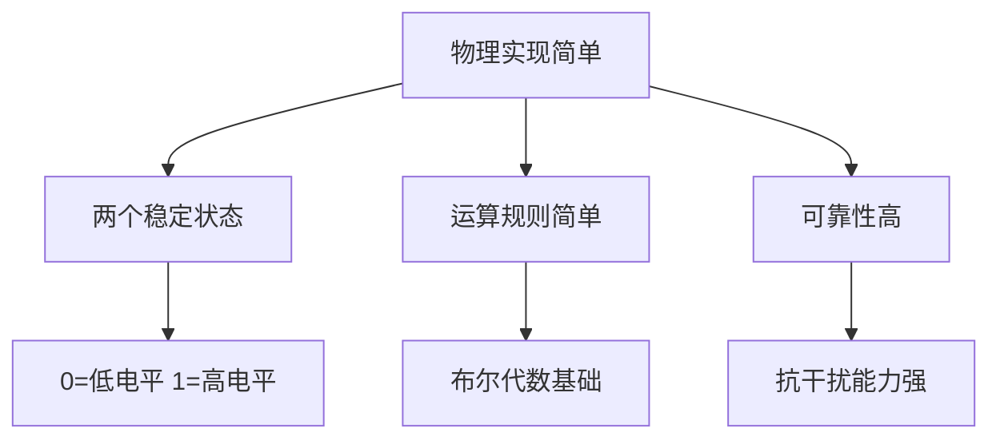

# 1.2 信息与数据表示

> [!abstract] 核心问题
> 计算机为什么使用二进制？如何将现实世界的信息转换为计算机能理解的形式？

## 一、信息与数据

### 1. 基本概念

- **数据（Data）**：原始、未处理的事实和符号（数字、文字、图像等）
- **信息（Information）**：经过处理后具有意义的数据
- **知识（Knowledge）**：对信息的理解和应用

### 2. 信息的特征

| 特征 | 说明 | 示例 |
|-----|------|-----|
| **客观性** | 信息是客观存在的 | 温度、时间 |
| **时效性** | 信息的价值随时间变化 | 新闻、股票价格 |
| **传递性** | 信息可以在空间传播 | 网络通信 |
| **共享性** | 信息可被多人同时使用 | 电子书、在线课程 |
| **可加工性** | 信息可以被处理和转换 | 数据分析、图像压缩 |

## 二、二进制原理

### 1. 为什么使用二进制



**三大优势**：
1. **物理实现简单**：电子元件只有导通和截止两种状态
2. **运算规则简单**：只有0和1，逻辑运算规则简洁
3. **可靠性高**：两种状态差异明显，抗干扰能力强

### 2. 二进制与十进制转换

**十进制转二进制（除2取余法）**：

**例**：将十进制数25转换为二进制

```
25 ÷ 2 = 12 ... 1（最低位）
12 ÷ 2 = 6 ... 0
6 ÷ 2 = 3 ... 0
3 ÷ 2 = 1 ... 1
1 ÷ 2 = 0 ... 1（最高位）
```

结果：25₁₀ = 11001₂

**二进制转十进制（按权展开法）**：

**例**：将二进制数11001转换为十进制

```
1 × 2⁴ + 1 × 2³ + 0 × 2² + 0 × 2¹ + 1 × 2⁰
= 16 + 8 + 0 + 0 + 1
= 25
```

### 3. 常用进制对照表

| 十进制 | 二进制 | 八进制 | 十六进制 |
|-------|-------|-------|---------|
| 0 | 0000 | 0 | 0 |
| 1 | 0001 | 1 | 1 |
| 2 | 0010 | 2 | 2 |
| 3 | 0011 | 3 | 3 |
| 4 | 0100 | 4 | 4 |
| 5 | 0101 | 5 | 5 |
| 6 | 0110 | 6 | 6 |
| 7 | 0111 | 7 | 7 |
| 8 | 1000 | 10 | 8 |
| 9 | 1001 | 11 | 9 |
| 10 | 1010 | 12 | A |
| 11 | 1011 | 13 | B |
| 12 | 1100 | 14 | C |
| 13 | 1101 | 15 | D |
| 14 | 1110 | 16 | E |
| 15 | 1111 | 17 | F |

## 三、数值编码

### 1. 原码

- **定义**：最高位为符号位（0表示正数，1表示负数），其余位为数值位
- **范围**：n位二进制，范围为 -(2ⁿ⁻¹-1) ~ +(2ⁿ⁻¹-1)
- **缺点**：正零和负零表示不一致，减法运算复杂

### 2. 反码

- **定义**：正数的反码与原码相同；负数的反码是对原码除符号位外取反
- **特点**：仍存在正零和负零的问题

### 3. 补码（常用）

- **定义**：正数的补码与原码相同；负数的补码是反码加1
- **优势**：可以将减法转换为加法，消除了正零和负零的区别

**补码计算示例**：

计算 5 - 3 = 5 + (-3)

```
[5]补 = 0000 0101
[-3]补 = 1111 1101
相加： 0000 0101 + 1111 1101 = 1 0000 0010
舍弃进位，结果：0000 0010 = 2（正确）
```

### 4. 移码

- **定义**：将补码的符号位取反
- **应用**：用于浮点数的阶码表示，便于比较大小

## 四、字符编码

### 1. ASCII码

- **定义**：美国信息交换标准代码（American Standard Code for Information Interchange）
- **范围**：7位编码，共128个字符
- **组成**：
  - 控制字符（0-31）：换行、回车、退格等
  - 可打印字符（32-127）：数字、字母、标点符号

### 2. GB2312与GBK

- **GB2312**：中国国家标准简体汉字编码，收录6763个汉字
- **GBK**：GB2312的扩展，收录21003个汉字，兼容GB2312

### 3. Unicode（统一码）

- **定义**：国际通用字符集，收录全球几乎所有语言的字符
- **编码方式**：
  - **UTF-8**：变长编码，1-4字节，兼容ASCII
  - **UTF-16**：定长编码，2或4字节
  - **UTF-32**：定长编码，4字节

### 4. 编码对比

| 编码 | 字节数 | 字符数 | 兼容性 |
|-----|-------|-------|-------|
| ASCII | 1 | 128 | - |
| GB2312 | 2 | 6763 | - |
| GBK | 1-2 | 21003 | 兼容ASCII、GB2312 |
| UTF-8 | 1-4 | 超百万 | 兼容ASCII |

## 五、易错点提示

> [!warning] 常见误区
> - **"二进制只有0和1，所以只能表示两个数"**：错误。二进制通过位数组合可以表示任意大小的数，n位二进制可表示2ⁿ个数。
> - **"补码只是为了表示负数"**：补码的核心价值是将减法转换为加法，简化计算机运算电路设计。
> - **"UTF-8和Unicode是一回事"**：Unicode是字符集，UTF-8是Unicode的一种编码方式。

## 六、示例与练习

### 示例

**例1**：计算十进制数-6的8位二进制补码

**解析**：
1. 6的原码：0000 0110
2. 6的反码：0000 0110（正数的反码与原码相同）
3. -6的反码：1111 1001（除符号位外取反）
4. -6的补码：1111 1010（反码加1）

**例2**：解释"中文编码混乱"问题

**解析**：不同编码标准（GB2312、GBK、UTF-8）对同一汉字的二进制表示不同。如果文件保存时使用GBK编码，而打开时按UTF-8解码，就会出现乱码。

### 练习题

1. 将十进制数37转换为二进制、八进制、十六进制。
2. 计算8位二进制补码表示的范围。
3. 为什么补码能将减法转换为加法？举例说明。
4. ASCII码和Unicode码有什么区别？为什么需要Unicode？

**导航**：上一节 [[1.1 计算机的发展与分类]] · [[MOC - 大学计算机基础A|返回课程地图]] · 下一节 [[1.3 计算机系统组成]]