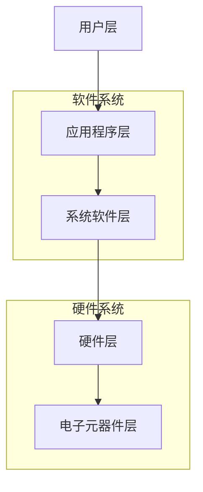
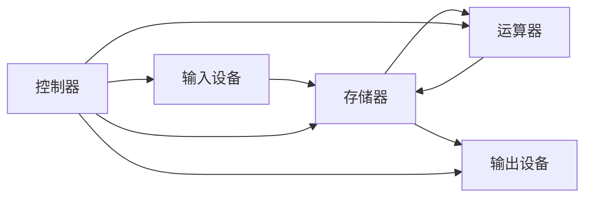
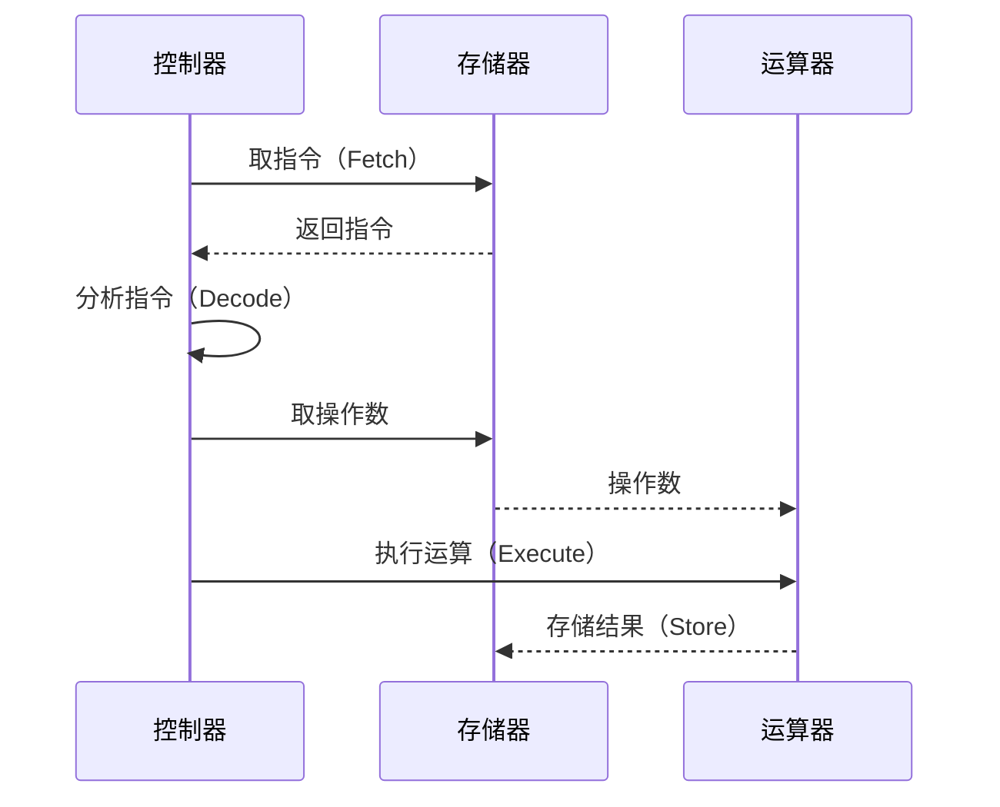
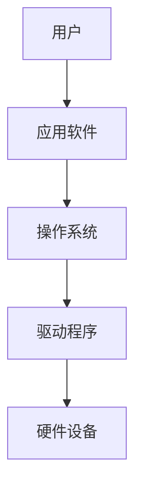

# 1.3 计算机系统组成

> [!abstract] 核心问题
> 计算机系统由哪些部分组成？各部分之间如何协同工作？

## 一、计算机系统层次结构

## 二、冯·诺依曼结构

### 1. 基本原理

冯·诺依曼（John von Neumann）于1945年提出的计算机体系结构，核心思想包括：

| 原理 | 说明 |
|-----|------|
| **存储程序** | 程序和数据存储在同一存储器中 |
| **指令执行** | 计算机自动逐条执行指令 |
| **二进制** | 使用二进制表示数据和指令 |
| **五大部件** | 运算器、控制器、存储器、输入设备、输出设备 |

### 2. 五大基本部件

| 部件 | 功能 | 核心组件 |
|-----|------|---------|
| **运算器** | 执行算术和逻辑运算 | ALU（算术逻辑单元） |
| **控制器** | 控制指令执行流程 | CU（控制单元） |
| **存储器** | 存储程序和数据 | RAM、ROM |
| **输入设备** | 将外部信息输入计算机 | 键盘、鼠标、扫描仪 |
| **输出设备** | 将处理结果输出 | 显示器、打印机、音箱 |

### 3. 指令执行过程

**取指-执行周期**：
1. **取指令**：从存储器中取出下一条指令
2. **分析指令**：解释指令的含义和操作类型
3. **执行指令**：执行指令规定的操作
4. **存储结果**：将结果保存到存储器

## 三、硬件系统组成

### 1. 主机系统

**中央处理器（CPU）**：
- 包含运算器和控制器
- 是计算机的"大脑"，执行程序指令

**内存储器（内存）**：
- 临时存储程序和数据
- 速度快但断电丢失数据
- 分为RAM（随机存取存储器）和ROM（只读存储器）

**主板**：
- 连接所有硬件组件的电路板
- 包含CPU插槽、内存插槽、扩展槽、芯片组等

### 2. 外部设备

**输入设备**：
- **键盘**：输入文字和命令
- **鼠标**：图形界面交互
- **扫描仪**：图像输入
- **摄像头**：视频输入
- **麦克风**：音频输入

**输出设备**：
- **显示器**：显示文字和图像
- **打印机**：打印文档
- **音箱**：音频输出
- **投影仪**：大屏幕显示

**外存储器**：
- **硬盘（HDD）**：大容量存储，机械结构
- **固态硬盘（SSD）**：高速存储，无机械部件
- **U盘**：便携存储
- **光盘**：CD、DVD、蓝光光盘

### 3. 总线系统

| 总线类型 | 功能 | 特点 |
|---------|------|------|
| **地址总线** | 传输内存地址 | 单向，宽度决定寻址范围 |
| **数据总线** | 传输数据 | 双向，宽度决定数据传输量 |
| **控制总线** | 传输控制信号 | 协调各部件工作 |

## 四、软件系统组成

### 1. 系统软件

**操作系统（OS）**：
- 管理计算机资源
- 提供用户界面
- 运行应用程序

**语言处理程序**：
- **编译器**：将高级语言编译为机器语言
- **解释器**：逐行解释执行高级语言
- **汇编器**：将汇编语言转换为机器语言

**实用工具软件**：
- 系统维护、文件管理、数据备份等

### 2. 应用软件

**通用软件**：
- 办公软件（Word、Excel、PowerPoint）
- 浏览器、邮件客户端
- 多媒体播放器

**专用软件**：
- 行业软件（CAD、MATLAB）
- 游戏软件
- 企业管理软件

### 3. 软件与硬件的关系

**层次关系**：用户 → 应用软件 → 操作系统 → 驱动程序 → 硬件

## 五、易错点提示

> [!warning] 常见误区
> - **"CPU就是计算机"**：CPU只是计算机的核心部件，还需要内存、存储、输入输出设备等协同工作。
> - **"内存越大越好"**：内存需要与CPU性能、软件需求匹配，过大的内存在某些情况下会造成浪费。
> - **"软件可以脱离硬件运行"**：所有软件最终都需要通过硬件执行，软件是硬件功能的延伸和扩展。
> - **"存储程序原理是现代计算机特有的"**：存储程序原理是冯·诺依曼结构的核心，现代计算机普遍采用这一原理。

## 六、示例与练习

### 示例

**例1**：分析使用Word编辑文档的完整流程

**解析**：
1. 用户通过键盘输入文字（输入设备）
2. 文字数据存储到内存（存储器）
3. Word软件处理文字（应用软件）
4. 操作系统管理资源（系统软件）
5. 显示器显示文档内容（输出设备）
6. 保存时写入硬盘（外存储器）

### 练习题

1. 冯·诺依曼结构的五大部件是什么？各有什么功能？
2. 简述指令执行的取指-执行周期。
3. 内存和外存有什么区别？为什么计算机需要两者？
4. 系统软件和应用软件有什么区别？各举三个例子。

**导航**：上一节 [[1.2 信息与数据表示]] · [[MOC - 大学计算机基础A|返回课程地图]] · 下一章 [[2.1 中央处理器 CPU]]