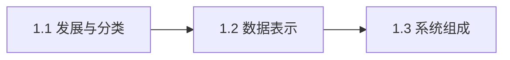

# 第1章：计算机基础知识概述

> [!abstract] 章节定位
> 本章介绍计算机的发展历程、分类体系、信息表示原理以及计算机系统的整体组成，建立对计算机的基本认知框架。

## 知识点导航

- [[1.1 计算机的发展与分类]]：计算机发展历程、分类体系、性能指标
- [[1.2 信息与数据表示]]：二进制原理、数值编码、字符编码
- [[1.3 计算机系统组成]]：硬件与软件的关系、冯·诺依曼结构

## 本章重点

| 知识点 | 核心内容 | 掌握程度 |
|-------|---------|---------|
| 1.1 发展与分类 | 计算机发展阶段、分类标准 | 理解 |
| 1.2 数据表示 | 二进制、编码方式 | 掌握 |
| 1.3 系统组成 | 硬件软件关系、冯·诺依曼 | 理解 |

## 学习路径

