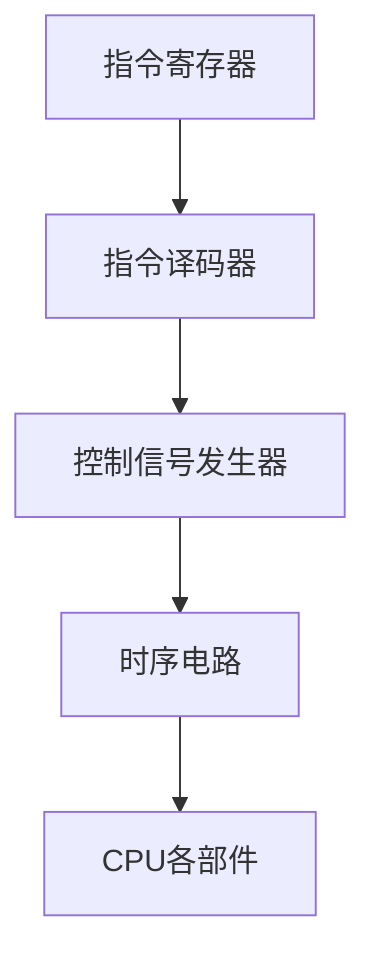
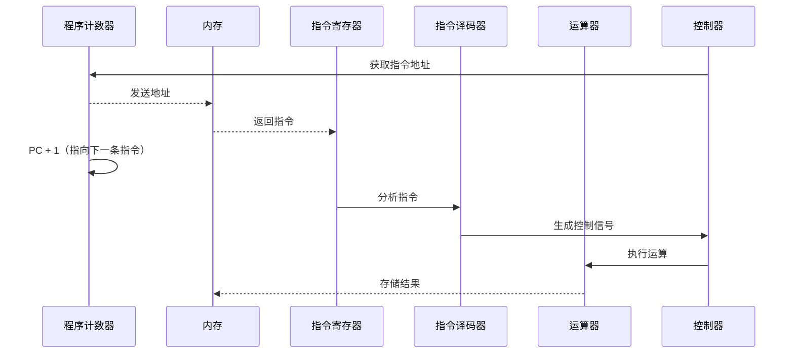
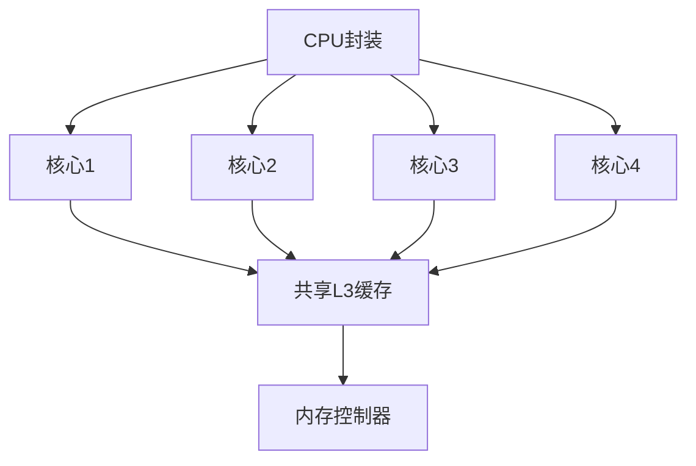

# 2.1 中央处理器 CPU

> [!abstract] 核心问题
> CPU是计算机的"大脑"，它如何执行指令？多核技术如何提升性能？

## 一、CPU概述

**中央处理器（Central Processing Unit, CPU）**是计算机系统的核心部件，负责执行程序指令和处理数据。

### 1. CPU的作用

| 功能 | 说明 |
|-----|------|
| **指令执行** | 从内存中读取指令并执行 |
| **数据处理** | 执行算术运算和逻辑运算 |
| **控制协调** | 控制计算机各部件协同工作 |
| **状态管理** | 维护程序执行的状态信息 |

### 2. CPU性能指标

| 指标 | 说明 | 影响 |
|-----|------|-----|
| **时钟频率** | CPU每秒执行的时钟周期数 | 频率越高，理论执行速度越快 |
| **核心数** | CPU包含的独立处理单元数量 | 多核可并行执行多个任务 |
| **缓存容量** | CPU内部高速缓存的大小 | 缓存越大，访问速度越快 |
| **指令集** | CPU支持的指令类型和数量 | 指令集越丰富，功能越强 |
| **制造工艺** | CPU芯片的制程工艺 | 工艺越先进，功耗越低 |

## 二、CPU结构

### 1. 运算器（ALU）

**算术逻辑单元（Arithmetic Logic Unit）**负责执行算术运算和逻辑运算：

| 运算类型 | 示例 |
|---------|------|
| **算术运算** | 加、减、乘、除 |
| **逻辑运算** | 与、或、非、异或 |
| **移位运算** | 左移、右移、循环移位 |
| **比较运算** | 大于、小于、等于 |

### 2. 控制器（CU）

**控制单元（Control Unit）**负责控制指令的执行流程：

**工作流程**：
1. 从指令寄存器中读取指令
2. 指令译码器分析指令类型
3. 控制信号发生器生成控制信号
4. 时序电路协调各部件按顺序执行

### 3. 寄存器

寄存器是CPU内部的高速存储单元，用于临时存储数据和指令：

| 寄存器类型 | 作用 |
|-----------|------|
| **指令寄存器（IR）** | 存储当前正在执行的指令 |
| **程序计数器（PC）** | 存储下一条要执行的指令地址 |
| **地址寄存器（AR）** | 存储要访问的内存地址 |
| **数据寄存器（DR）** | 存储从内存读取或要写入内存的数据 |
| **通用寄存器** | 临时存储运算数据和结果 |
| **状态寄存器** | 存储运算结果的状态标志（零标志、进位标志等） |

## 三、指令执行过程

### 1. 取指-执行周期

### 2. 指令类型

| 指令类型 | 功能 | 示例 |
|---------|------|-----|
| **数据传输指令** | 在寄存器和内存之间传输数据 | MOV、LOAD、STORE |
| **算术运算指令** | 执行算术运算 | ADD、SUB、MUL、DIV |
| **逻辑运算指令** | 执行逻辑运算 | AND、OR、NOT、XOR |
| **控制转移指令** | 改变程序执行顺序 | JMP、JZ、CALL、RET |
| **输入输出指令** | 与外部设备通信 | IN、OUT |

## 四、多核技术

### 1. 多核CPU结构

### 2. 多核与多线程

| 概念 | 说明 |
|-----|------|
| **多核** | 一个CPU芯片包含多个独立的核心，每个核心可以独立执行程序 |
| **多线程** | 一个核心可以同时执行多个线程，通过时间片轮转实现 |
| **超线程** | Intel的多线程技术，允许一个物理核心模拟两个逻辑核心 |

### 3. 并行处理

**数据级并行**：同一指令对多个数据同时执行（SIMD）
**任务级并行**：多个核心同时执行不同的任务
**指令级并行**：同一时间执行多条不同的指令（超标量）

## 五、主流CPU厂商

### 1. Intel

- **产品系列**：Core i3/i5/i7/i9、Xeon、Atom
- **特点**：兼容性好、性能稳定、市场份额大

### 2. AMD

- **产品系列**：Ryzen、Threadripper、EPYC
- **特点**：多核性能强、性价比高

### 3. ARM

- **产品系列**：Cortex-A、Cortex-M、Cortex-R
- **特点**：功耗低、适用于移动设备和嵌入式系统

## 六、易错点提示

> [!warning] 常见误区
> - **"CPU主频越高，性能一定越好"**：CPU性能还取决于架构、缓存、核心数等因素。不同架构的CPU不能仅通过主频比较。
> - **"多核CPU可以让所有程序运行更快"**：只有支持并行计算的程序才能充分利用多核优势。单线程程序在多核CPU上运行速度不会显著提升。
> - **"超线程就是多核"**：超线程是在单个物理核心上模拟两个逻辑核心，性能提升有限，远不如真正的多核。
> - **"CPU温度越高，性能越好"**：CPU温度过高会导致降频甚至损坏，适当的散热是保证性能的前提。

## 七、示例与练习

### 示例

**例1**：分析双核CPU执行两个程序的过程

**解析**：
1. 操作系统将程序A分配给核心1，程序B分配给核心2
2. 两个核心同时执行各自的指令，互不干扰
3. 如果程序A需要等待I/O操作，核心1可以切换到其他任务
4. 多核CPU通过任务并行提升整体系统吞吐量

### 练习题

1. CPU由哪些部分组成？各部分的功能是什么？
2. 简述指令执行的取指-执行周期。
3. 什么是多核技术？多核CPU如何提升性能？
4. 寄存器和内存有什么区别？为什么CPU需要寄存器？

**导航**：上一章 [[1.3 计算机系统组成]] · [[MOC - 大学计算机基础A|返回课程地图]] · 下一节 [[2.2 存储器系统]]